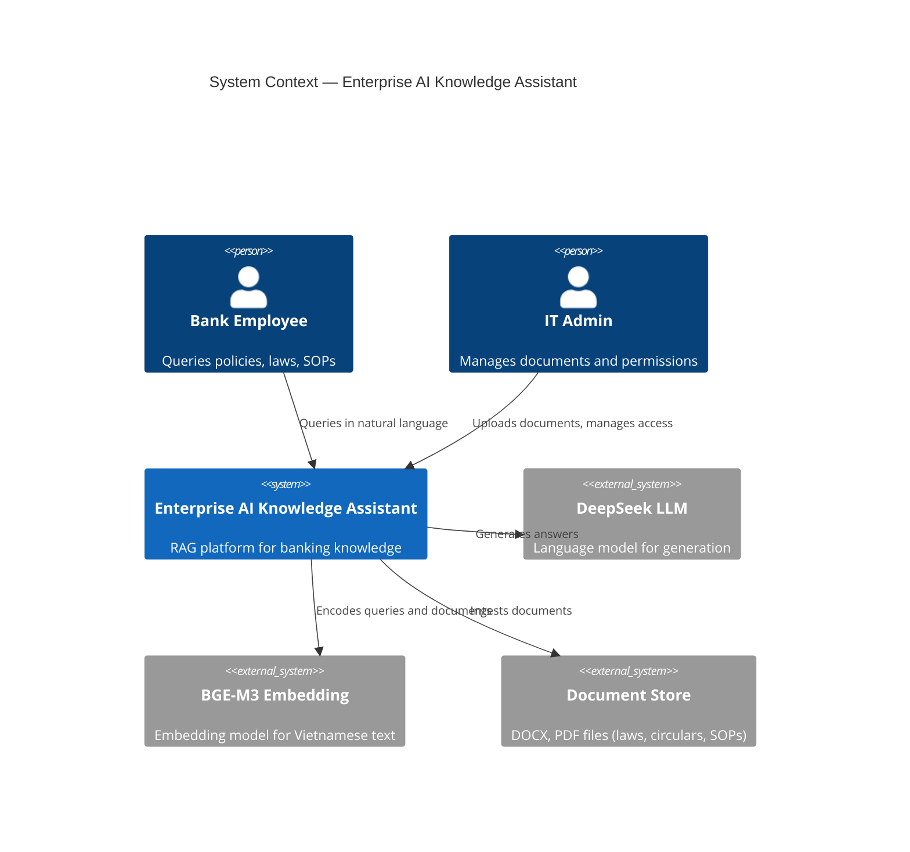

# 00 — Project Overview

## Purpose

Enterprise AI Knowledge Assistant là nền tảng RAG (Retrieval-Augmented Generation) cấp doanh nghiệp dành cho lĩnh vực ngân hàng Việt Nam.

Nền tảng cho phép nhân viên ngân hàng tra cứu, đối chiếu và hiểu biết văn bản pháp lý, chính sách nội bộ, sản phẩm và quy trình thông qua ngôn ngữ tự nhiên tiếng Việt.

---

## Problem Statement

Nhân viên ngân hàng hàng ngày phải làm việc với:
- Hàng trăm Thông tư, Nghị định của NHNN (cập nhật liên tục)
- Chính sách nội bộ, SOP theo từng phòng ban
- Tài liệu sản phẩm, FAQ nghiệp vụ

Vấn đề cốt lõi:
1. **Thông tin phân tán** — tài liệu nằm ở nhiều kho khác nhau
2. **Xung đột văn bản** — cùng một điều khoản có nhiều phiên bản (thông tư mới thay thông tư cũ)
3. **Tìm kiếm kém hiệu quả** — keyword search không hiểu ngữ nghĩa pháp lý
4. **Không truy vết nguồn** — câu trả lời thiếu citation cụ thể

---

## Goals

| Priority | Goal |
|---|---|
| P0 | Tra cứu văn bản pháp lý NHNN chính xác, có citation |
| P0 | Hybrid Retrieval (BM25 + Vector + Metadata) |
| P0 | Phát hiện xung đột và phân giải phiên bản văn bản |
| P1 | Đồ thị quan hệ giữa các văn bản (tham chiếu, thay thế, sửa đổi) |
| P1 | Authority Ranking theo cấp độ văn bản pháp lý |
| P2 | Multi-document synthesis và Timeline Builder |

---

## Stakeholders

| Role | Responsibility |
|---|---|
| Nhân viên nghiệp vụ | End user — tra cứu pháp lý, chính sách |
| Compliance Officer | Kiểm tra tính tuân thủ |
| IT/Admin | Quản lý tài liệu, phân quyền |
| Legal Team | Cập nhật văn bản mới |
| Development Team | Xây dựng và vận hành hệ thống |

---

## Success Metrics

| Metric | Target |
|---|---|
| Retrieval Precision@5 | ≥ 85% |
| Answer Faithfulness | ≥ 90% (grounded in retrieved context) |
| Latency P95 (query) | ≤ 5 seconds |
| Document Ingestion throughput | ≥ 50 docs/hour |
| Conflict Detection accuracy | ≥ 80% |

---

## Scope

### In Scope
- Document ingestion pipeline (DOCX, PDF)
- Hybrid retrieval engine
- Knowledge Intelligence layer
- REST API backend
- React frontend (basic)
- Docker-based deployment

### Out of Scope (v1)
- Real-time document sync
- Mobile app
- External LLM marketplace (fixed: DeepSeek)
- Multi-language (fixed: Vietnamese)

---

## System Context Diagram

---

## Constraints

- **Single database**: PostgreSQL only — no Redis, no Neo4j, no Elasticsearch
- **Embedding**: BGE-M3 (multilingual, optimized for Vietnamese)
- **LLM**: DeepSeek (cost-effective for Vietnamese banking domain)
- **Deployment**: Docker Compose (hackathon constraint — no K8s)
- **Language**: Python 3.12, async-first

---

## Trade-offs

| Decision | Benefit | Cost |
|---|---|---|
| PostgreSQL-only | Operationally simple, no multi-DB sync | pgvector not as fast as Qdrant at scale |
| BGE-M3 | Excellent Vietnamese + legal domain | Heavier than smaller models |
| DeepSeek | Cost effective | May need fine-tuning for banking domain |
| Relationship graph in PostgreSQL | No extra infra | Graph queries slower than Neo4j |

---

## Future Extensibility

- Replace pgvector with Qdrant/Weaviate via Repository abstraction
- Add real-time document monitoring (NHNN website crawler)
- Fine-tune DeepSeek on banking corpus
- Plug in different embedding models per document type
- Add RBAC-aware retrieval (employee sees only authorized docs)
