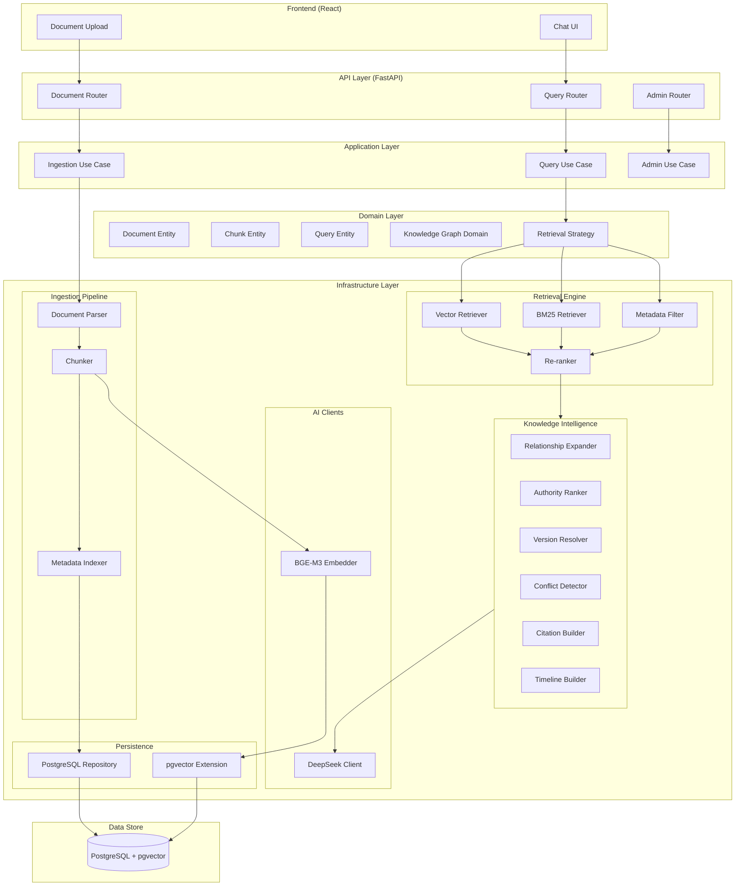
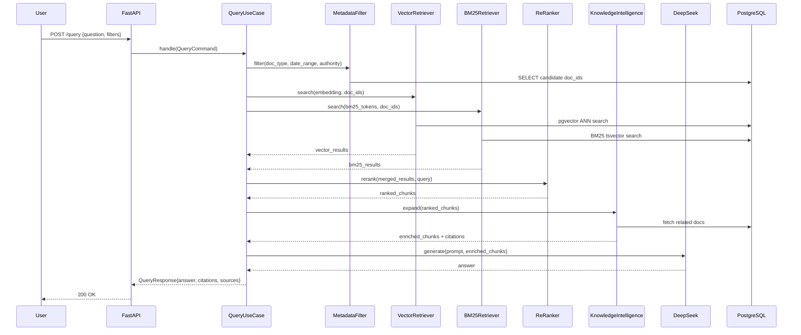
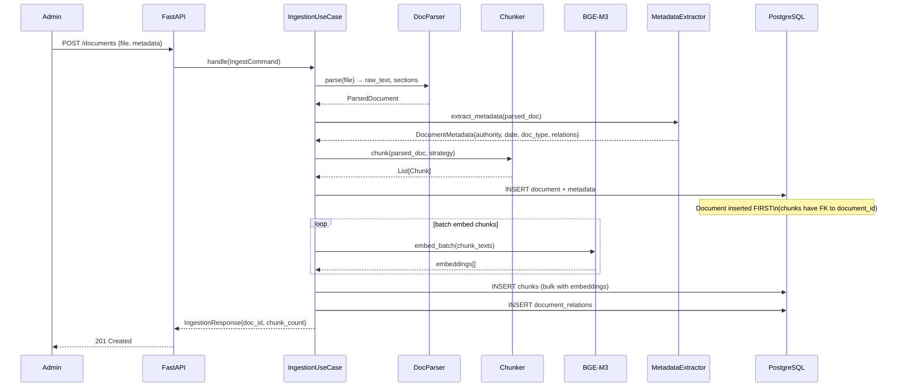

# 01 — System Architecture

## Purpose

Định nghĩa kiến trúc tổng thể của hệ thống: các tầng, component, luồng dữ liệu và ranh giới trách nhiệm.

---

## Architecture Style

**Clean Architecture** + **Layered Architecture** kết hợp:

```
┌─────────────────────────────────────────┐
│              Presentation               │  FastAPI Routers, Request/Response Models
├─────────────────────────────────────────┤
│              Application                │  Use Cases, Command/Query Handlers
├─────────────────────────────────────────┤
│                Domain                   │  Entities, Value Objects, Domain Services
├─────────────────────────────────────────┤
│            Infrastructure               │  Repositories, DB, LLM, Embedding clients
└─────────────────────────────────────────┘
```

Dependency Rule: outer layers depend on inner layers. Domain has zero external dependencies.

---

## High-Level Component Diagram



---

## Data Flow — Query Path



---

## Data Flow — Ingestion Path



---

## Component Responsibilities

| Component | Responsibility |
|---|---|
| FastAPI Routers | HTTP boundary, request validation, response serialization |
| Use Cases | Orchestrate domain logic, no business rules here |
| Domain Entities | Business rules, invariants, domain events |
| Repositories | Data access abstraction, async DB calls |
| Retrieval Engine | Hybrid search pipeline (BM25 + Vector + Filter + Rerank) |
| Knowledge Intelligence | Relationship expansion, conflict detection, citation |
| BGE-M3 Client | Encode text to dense vectors |
| DeepSeek Client | Generate natural language answers |
| Ingestion Pipeline | Parse → Chunk → Embed → Store |

---

## Constraints

- All I/O must be async (AsyncPG, async HTTP clients)
- No synchronous blocking calls in the request path
- Domain layer has zero imports from infrastructure
- Use Cases depend only on Domain and abstract Repository interfaces

---

## Trade-offs

| Choice | Benefit | Cost |
|---|---|---|
| Clean Architecture | Testable domain, swappable infra | More boilerplate |
| Async everywhere | High throughput, no thread blocking | Harder debugging |
| Single FastAPI app | Simple deployment | Harder to scale individual components |

---

## Future Extensibility

- Extract Ingestion Pipeline into separate worker/queue (Celery, ARQ)
- Add event sourcing for document version history
- Split retrieval into microservice if load demands
- Introduce CQRS for read/write separation at scale
