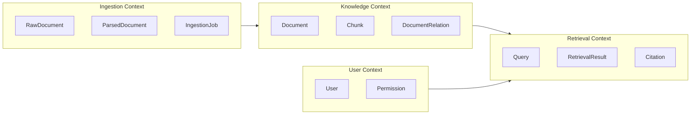
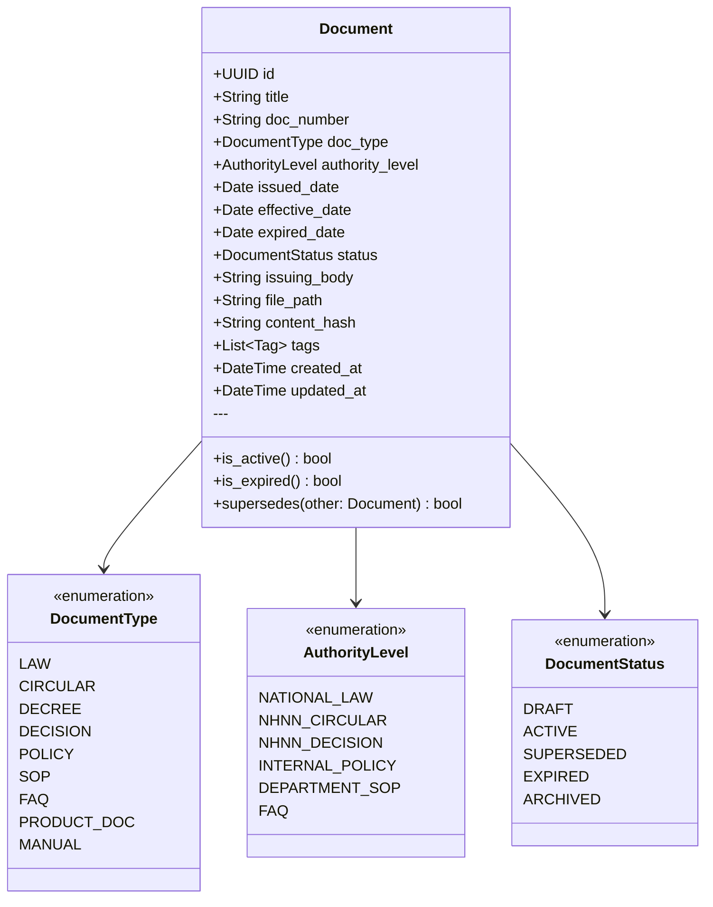
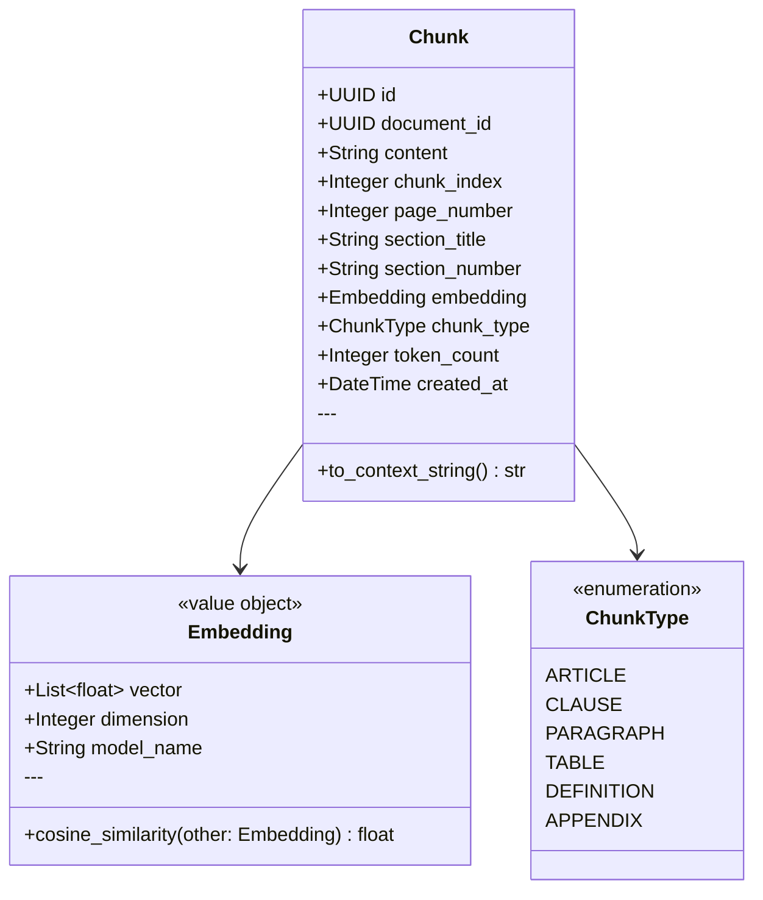
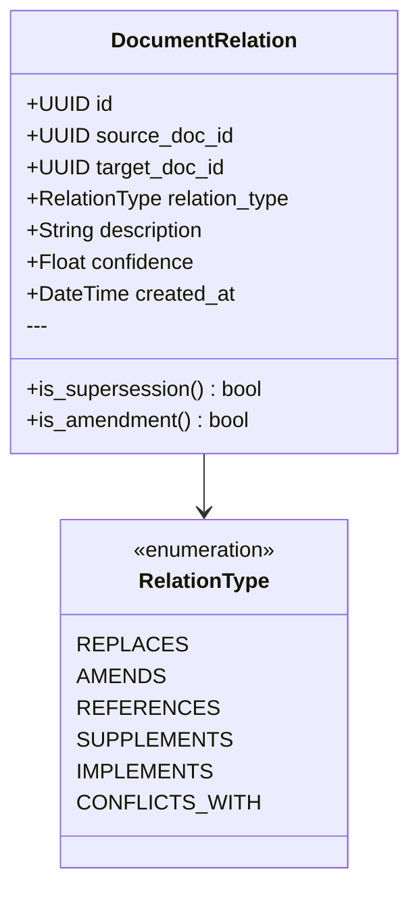
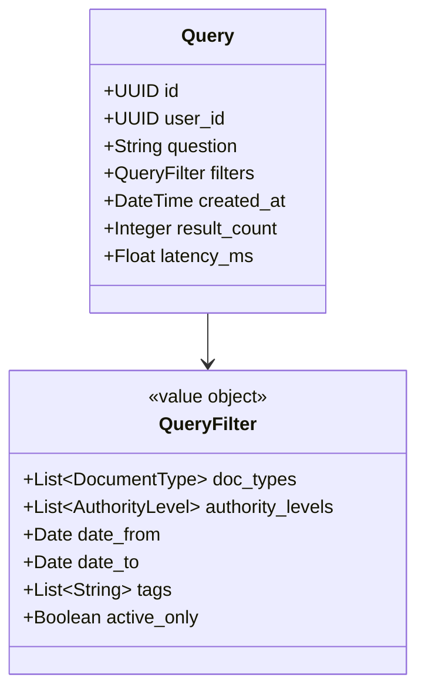
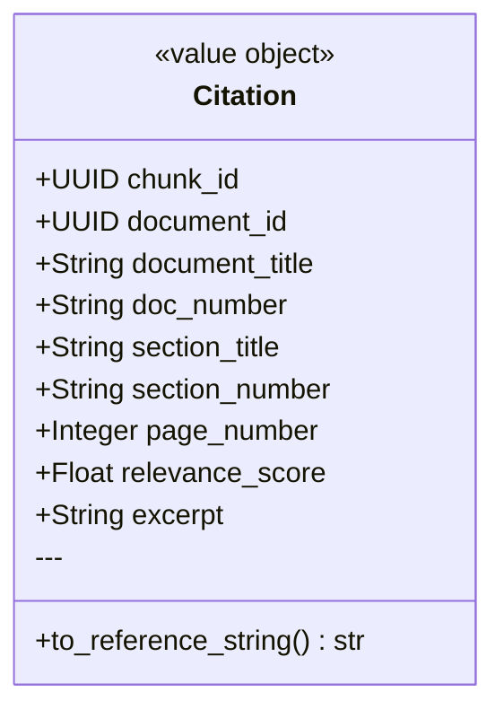
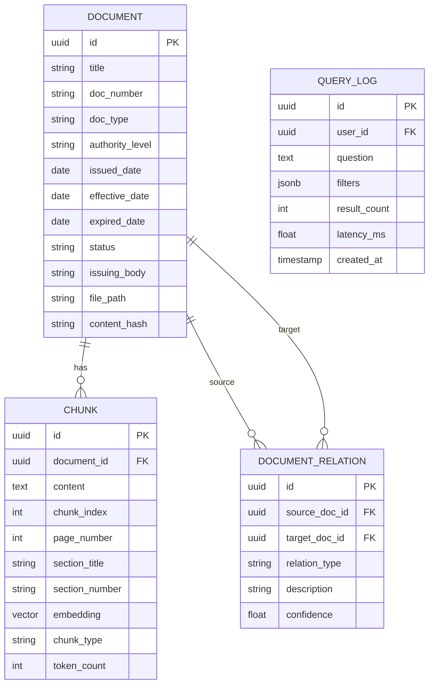

# 03 — Domain Model

## Purpose

Định nghĩa các domain entity, value object, aggregate và quan hệ giữa chúng. Domain model phản ánh nghiệp vụ pháp lý ngân hàng, không phụ thuộc vào bất kỳ framework hay database nào.

---

## Bounded Contexts



---

## Core Entities

### Document (Aggregate Root)



### Chunk



### DocumentRelation



### Query



### Citation



---

## Domain Services

### ChunkingService

Trách nhiệm: quyết định strategy chunking dựa trên document type.

```
ChunkingService.chunk(document: ParsedDocument) → List[Chunk]
  - LAW/CIRCULAR: hierarchical chunking theo Điều, Khoản, Điểm
  - SOP/MANUAL: semantic chunking by section
  - FAQ: QA-pair chunking
```

### ScoringService

Trách nhiệm: tính điểm relevance cho một chunk với một query.

```
ScoringService.score(chunk: Chunk, query: Query, bm25_score: float, vector_score: float) → float
  - Weighted combination: vector_score * 0.6 + bm25_score * 0.4
  - Boosted by authority_level
  - Penalized if document is SUPERSEDED or EXPIRED
```

---

## Domain Rules (Invariants)

1. Một `Document` chỉ có thể là `ACTIVE` nếu không có document khác với `RelationType.REPLACES` trỏ đến nó.
2. `Chunk.embedding.dimension` phải bằng 1024 (BGE-M3 output).
3. `DocumentRelation.confidence` thuộc khoảng [0.0, 1.0].
4. `Document.effective_date` không được trước `Document.issued_date`.
5. Một Chunk phải thuộc đúng một Document (không shared).

---

## Entity Relationships



---

## Constraints

- Domain entities are pure Python dataclasses/classes
- No ORM decorators in domain entities
- Domain entities must be serializable without external libs

---

## Trade-offs

| Choice | Benefit | Cost |
|---|---|---|
| Separate Chunk entity | Fine-grained retrieval | More storage, complex queries |
| DocumentRelation as entity | Explicit relationship management | Manual maintenance of relations |
| AuthorityLevel enum | Enables ranking without hardcoding | Must update when new doc types added |

---

## Future Extensibility

- Add `DocumentVersion` entity for full version history
- Add `Annotation` entity for user highlights and comments
- Add `KnowledgeGraph` aggregate wrapping document relations
- Add `RetrievalSession` entity for multi-turn conversations
