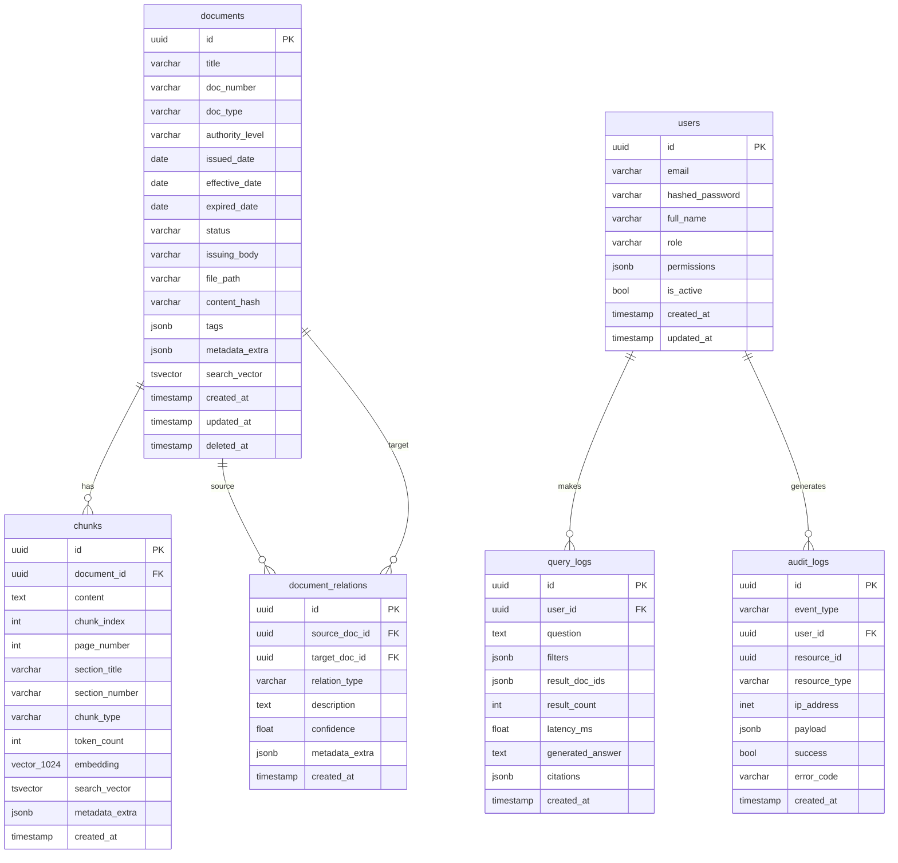

# 04 — Database Design

## Purpose

Thiết kế schema PostgreSQL đầy đủ bao gồm bảng dữ liệu, indexes, pgvector extension, và relationship graph — tất cả trong một database duy nhất.

---

## Design Principles

1. **Single database** — PostgreSQL là nguồn sự thật duy nhất
2. **pgvector** — lưu embedding trực tiếp trong PostgreSQL column
3. **tsvector** — BM25 full-text search native PostgreSQL
4. **Relationship graph** — lưu trong bảng `document_relations` thay vì Neo4j
5. **UUID primary keys** — tránh collision trong distributed writes
6. **Soft delete** — `deleted_at` thay vì xóa cứng

---

## Schema Diagram



---

## DDL — Full Schema

### Extension Setup

```sql
CREATE EXTENSION IF NOT EXISTS "uuid-ossp";
CREATE EXTENSION IF NOT EXISTS vector;
CREATE EXTENSION IF NOT EXISTS pg_trgm;
```

### Table: documents

```sql
CREATE TABLE documents (
    id              UUID PRIMARY KEY DEFAULT uuid_generate_v4(),
    title           VARCHAR(500) NOT NULL,
    doc_number      VARCHAR(100),
    doc_type        VARCHAR(50) NOT NULL,
    authority_level VARCHAR(50) NOT NULL,
    issued_date     DATE,
    effective_date  DATE,
    expired_date    DATE,
    status          VARCHAR(30) NOT NULL DEFAULT 'ACTIVE',
    issuing_body    VARCHAR(200),
    file_path       VARCHAR(500),
    content_hash    VARCHAR(64),
    tags            JSONB DEFAULT '[]',
    metadata_extra  JSONB DEFAULT '{}',
    search_vector   TSVECTOR,
    created_at      TIMESTAMP WITH TIME ZONE DEFAULT NOW(),
    updated_at      TIMESTAMP WITH TIME ZONE DEFAULT NOW(),
    deleted_at      TIMESTAMP WITH TIME ZONE,

    CONSTRAINT doc_type_check CHECK (
        doc_type IN ('LAW','CIRCULAR','DECREE','DECISION','POLICY','SOP','FAQ','PRODUCT_DOC','MANUAL')
    ),
    CONSTRAINT authority_level_check CHECK (
        authority_level IN ('NATIONAL_LAW','NHNN_CIRCULAR','NHNN_DECISION','INTERNAL_POLICY','DEPARTMENT_SOP','FAQ')
    ),
    CONSTRAINT status_check CHECK (
        status IN ('DRAFT','ACTIVE','SUPERSEDED','EXPIRED','ARCHIVED')
    )
);

CREATE INDEX idx_documents_doc_type ON documents(doc_type) WHERE deleted_at IS NULL;
CREATE INDEX idx_documents_authority_level ON documents(authority_level) WHERE deleted_at IS NULL;
CREATE INDEX idx_documents_issued_date ON documents(issued_date DESC) WHERE deleted_at IS NULL;
CREATE INDEX idx_documents_effective_date ON documents(effective_date DESC) WHERE deleted_at IS NULL;
CREATE INDEX idx_documents_status ON documents(status) WHERE deleted_at IS NULL;
CREATE INDEX idx_documents_search_vector ON documents USING GIN(search_vector);
CREATE INDEX idx_documents_doc_number ON documents(doc_number) WHERE deleted_at IS NULL;
CREATE INDEX idx_documents_tags ON documents USING GIN(tags);
```

### Table: chunks

```sql
CREATE TABLE chunks (
    id              UUID PRIMARY KEY DEFAULT uuid_generate_v4(),
    document_id     UUID NOT NULL REFERENCES documents(id) ON DELETE CASCADE,
    content         TEXT NOT NULL,
    chunk_index     INTEGER NOT NULL,
    page_number     INTEGER,
    section_title   VARCHAR(300),
    section_number  VARCHAR(50),
    chunk_type      VARCHAR(30) NOT NULL DEFAULT 'PARAGRAPH',
    token_count     INTEGER,
    embedding       VECTOR(1024),
    search_vector   TSVECTOR,
    metadata_extra  JSONB DEFAULT '{}',
    created_at      TIMESTAMP WITH TIME ZONE DEFAULT NOW(),

    CONSTRAINT chunk_type_check CHECK (
        chunk_type IN ('ARTICLE','CLAUSE','PARAGRAPH','TABLE','DEFINITION','APPENDIX')
    )
);

-- pgvector HNSW index for ANN search
CREATE INDEX idx_chunks_embedding_hnsw ON chunks
    USING hnsw (embedding vector_cosine_ops)
    WITH (m = 16, ef_construction = 64);

-- BM25 full-text search index
CREATE INDEX idx_chunks_search_vector ON chunks USING GIN(search_vector);

-- Lookup by document
CREATE INDEX idx_chunks_document_id ON chunks(document_id);
CREATE INDEX idx_chunks_document_index ON chunks(document_id, chunk_index);
```

### Table: document_relations

```sql
CREATE TABLE document_relations (
    id              UUID PRIMARY KEY DEFAULT uuid_generate_v4(),
    source_doc_id   UUID NOT NULL REFERENCES documents(id) ON DELETE CASCADE,
    target_doc_id   UUID NOT NULL REFERENCES documents(id) ON DELETE CASCADE,
    relation_type   VARCHAR(50) NOT NULL,
    description     TEXT,
    confidence      FLOAT NOT NULL DEFAULT 1.0 CHECK (confidence BETWEEN 0 AND 1),
    metadata_extra  JSONB DEFAULT '{}',
    created_at      TIMESTAMP WITH TIME ZONE DEFAULT NOW(),

    CONSTRAINT relation_type_check CHECK (
        relation_type IN ('REPLACES','AMENDS','REFERENCES','SUPPLEMENTS','IMPLEMENTS','CONFLICTS_WITH')
    ),
    CONSTRAINT no_self_relation CHECK (source_doc_id != target_doc_id)
);

CREATE INDEX idx_relations_source ON document_relations(source_doc_id);
CREATE INDEX idx_relations_target ON document_relations(target_doc_id);
CREATE INDEX idx_relations_type ON document_relations(relation_type);
```

### Table: query_logs

```sql
CREATE TABLE query_logs (
    id              UUID PRIMARY KEY DEFAULT uuid_generate_v4(),
    user_id         UUID REFERENCES users(id) ON DELETE SET NULL,
    question        TEXT NOT NULL,
    filters         JSONB DEFAULT '{}',
    result_doc_ids  JSONB DEFAULT '[]',
    result_count    INTEGER DEFAULT 0,
    latency_ms      FLOAT,
    generated_answer TEXT,
    citations       JSONB DEFAULT '[]',
    created_at      TIMESTAMP WITH TIME ZONE DEFAULT NOW()
);

CREATE INDEX idx_query_logs_user_id ON query_logs(user_id);
CREATE INDEX idx_query_logs_created_at ON query_logs(created_at DESC);
```

### Table: users

```sql
CREATE TABLE users (
    id              UUID PRIMARY KEY DEFAULT uuid_generate_v4(),
    email           VARCHAR(254) UNIQUE NOT NULL,
    hashed_password VARCHAR(255) NOT NULL,
    full_name       VARCHAR(200),
    role            VARCHAR(30) NOT NULL DEFAULT 'employee',
    permissions     JSONB DEFAULT '{}',
    is_active       BOOLEAN NOT NULL DEFAULT TRUE,
    created_at      TIMESTAMP WITH TIME ZONE DEFAULT NOW(),
    updated_at      TIMESTAMP WITH TIME ZONE DEFAULT NOW(),

    CONSTRAINT role_check CHECK (role IN ('admin','compliance','employee','legal'))
);

CREATE INDEX idx_users_email ON users(email);
CREATE INDEX idx_users_role ON users(role);
```

### Table: audit_logs

Bảng này là bắt buộc cho security compliance — mọi thao tác nhạy cảm đều được ghi lại.

```sql
CREATE TABLE audit_logs (
    id              UUID PRIMARY KEY DEFAULT uuid_generate_v4(),
    event_type      VARCHAR(50) NOT NULL,
    user_id         UUID REFERENCES users(id) ON DELETE SET NULL,
    resource_id     UUID,
    resource_type   VARCHAR(50),
    ip_address      INET,
    user_agent      VARCHAR(500),
    payload         JSONB DEFAULT '{}',
    success         BOOLEAN NOT NULL DEFAULT TRUE,
    error_code      VARCHAR(50),
    error_message   TEXT,
    created_at      TIMESTAMP WITH TIME ZONE DEFAULT NOW(),

    CONSTRAINT event_type_check CHECK (
        event_type IN (
            'LOGIN', 'LOGOUT', 'LOGIN_FAILED',
            'DOCUMENT_UPLOAD', 'DOCUMENT_DELETE', 'DOCUMENT_UPDATE',
            'QUERY', 'ADMIN_ACTION', 'USER_CREATED', 'USER_UPDATED'
        )
    )
);

CREATE INDEX idx_audit_logs_user_id ON audit_logs(user_id);
CREATE INDEX idx_audit_logs_event_type ON audit_logs(event_type);
CREATE INDEX idx_audit_logs_created_at ON audit_logs(created_at DESC);
CREATE INDEX idx_audit_logs_resource ON audit_logs(resource_type, resource_id)
    WHERE resource_id IS NOT NULL;
```

---

## Triggers

### Auto-update search_vector for documents

```sql
CREATE OR REPLACE FUNCTION documents_search_vector_update()
RETURNS TRIGGER AS $$
BEGIN
    NEW.search_vector := to_tsvector('simple',
        coalesce(NEW.title, '') || ' ' ||
        coalesce(NEW.doc_number, '') || ' ' ||
        coalesce(NEW.issuing_body, '')
    );
    RETURN NEW;
END;
$$ LANGUAGE plpgsql;

CREATE TRIGGER trg_documents_search_vector
    BEFORE INSERT OR UPDATE ON documents
    FOR EACH ROW EXECUTE FUNCTION documents_search_vector_update();
```

### Auto-update search_vector for chunks

```sql
CREATE OR REPLACE FUNCTION chunks_search_vector_update()
RETURNS TRIGGER AS $$
BEGIN
    NEW.search_vector := to_tsvector('simple', coalesce(NEW.content, ''));
    RETURN NEW;
END;
$$ LANGUAGE plpgsql;

CREATE TRIGGER trg_chunks_search_vector
    BEFORE INSERT OR UPDATE ON chunks
    FOR EACH ROW EXECUTE FUNCTION chunks_search_vector_update();
```

---

## Key Queries

### Hybrid Retrieval (Vector + BM25)

```sql
-- Step 1: Vector search (top K via HNSW)
SELECT c.id, c.content, c.document_id, c.section_title,
       1 - (c.embedding <=> $1::vector) AS vector_score
FROM chunks c
JOIN documents d ON d.id = c.document_id
WHERE d.status = 'ACTIVE'
  AND d.deleted_at IS NULL
  AND ($2::varchar IS NULL OR d.doc_type = $2)
ORDER BY c.embedding <=> $1::vector
LIMIT 50;

-- Step 2: BM25 search
SELECT c.id, c.content, c.document_id,
       ts_rank_cd(c.search_vector, plainto_tsquery('simple', $1)) AS bm25_score
FROM chunks c
JOIN documents d ON d.id = c.document_id
WHERE c.search_vector @@ plainto_tsquery('simple', $1)
  AND d.status = 'ACTIVE'
  AND d.deleted_at IS NULL
ORDER BY bm25_score DESC
LIMIT 50;
```

### Relationship Graph Traversal

```sql
-- Find all documents related to a given document (2 hops)
WITH RECURSIVE doc_graph AS (
    SELECT source_doc_id, target_doc_id, relation_type, 1 AS depth
    FROM document_relations
    WHERE source_doc_id = $1

    UNION ALL

    SELECT dr.source_doc_id, dr.target_doc_id, dr.relation_type, dg.depth + 1
    FROM document_relations dr
    JOIN doc_graph dg ON dr.source_doc_id = dg.target_doc_id
    WHERE dg.depth < 2
)
SELECT DISTINCT d.*
FROM doc_graph dg
JOIN documents d ON d.id = dg.target_doc_id
WHERE d.deleted_at IS NULL;
```

### Version Resolution

```sql
-- Find the latest active document that supersedes a given one
SELECT d.*
FROM documents d
JOIN document_relations dr ON dr.target_doc_id = $1
WHERE dr.relation_type = 'REPLACES'
  AND d.id = dr.source_doc_id
  AND d.status = 'ACTIVE'
ORDER BY d.effective_date DESC
LIMIT 1;
```

---

## Constraints

- `embedding` column must be `VECTOR(1024)` — BGE-M3 output dimension
- HNSW index parameters: `m=16, ef_construction=64` (balance between recall and build time)
- All timestamps are `WITH TIME ZONE`
- Soft deletes via `deleted_at` — never hard delete documents

---

## Trade-offs

| Decision | Benefit | Cost |
|---|---|---|
| HNSW over IVFFlat | Better recall, no training needed | Higher memory usage |
| tsvector for BM25 | Built-in, no Elasticsearch | Vietnamese tokenization not optimal |
| JSONB for metadata | Schema-flexible | No type safety |
| Recursive CTE for graph | No Neo4j needed | Slow for deep graphs (>3 hops) |

---

## Future Extensibility

- Add `document_embeddings` table for multi-embedding-model support
- Add `feedback` table for query quality ratings
- Add partition by `created_at` for large query_logs tables
- Consider `pgvector` → `qdrant` migration via Repository pattern
