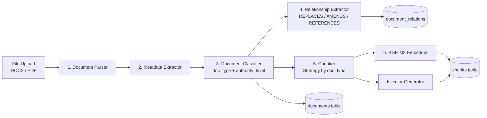
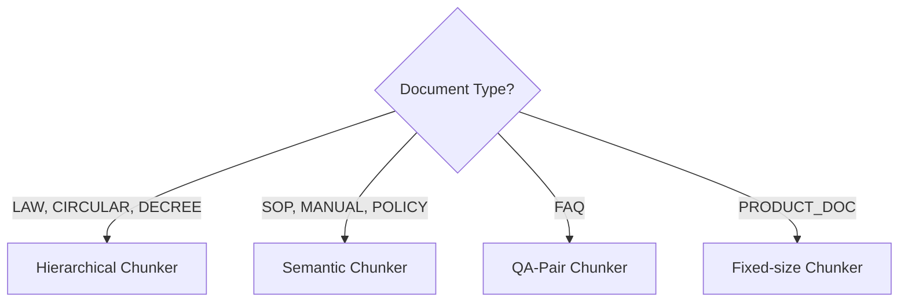
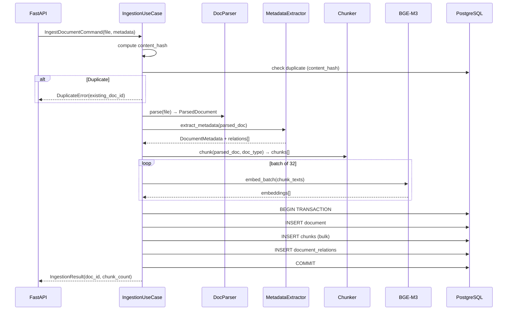

# 06 — Ingestion Design

## Purpose

Thiết kế pipeline nhập liệu tài liệu từ file thô (DOCX, PDF) thành chunks được index trong PostgreSQL + pgvector, sẵn sàng cho retrieval.

---

## Pipeline Overview



**6-Stage Pipeline** (thứ tự bắt buộc):
1. **Parser** — raw file → structured ParsedDocument
2. **MetadataExtractor** — extract fields (doc_number, dates, issuing_body)
3. **DocumentClassifier** — assign doc_type và authority_level
4. **RelationshipExtractor** — detect references to other documents
5. **Chunker** — strategy selected by doc_type (hierarchical / semantic / QA-pair)
6. **Embedder** — BGE-M3 dense vectors, batch mode

---

## Stage 1: Document Parser

### Responsibilities
- Parse DOCX/PDF thành cấu trúc phân cấp: Document → Section → Article → Clause
- Giữ nguyên số Điều, số Khoản, số Điểm của văn bản pháp lý
- Extract metadata từ header/footer của văn bản

### DOCX Parsing Strategy
Văn bản pháp lý NHNN có cấu trúc chuẩn:
```
Tiêu đề văn bản
Số hiệu: 48/2024/TT-NHNN
Ngày ban hành: 01/10/2024

Chương I — Quy định chung
  Điều 1. Phạm vi điều chỉnh
    1. Thông tư này quy định...
    2. Đối tượng áp dụng...
  Điều 2. Giải thích từ ngữ
    ...
Chương II — ...
```

Parser output:
```python
@dataclass
class ParsedSection:
    section_number: str    # "Điều 1", "Khoản 2", "Điểm a"
    section_title: str     # "Phạm vi điều chỉnh"
    content: str
    page_number: int
    level: int             # 1=Chương, 2=Điều, 3=Khoản, 4=Điểm
    children: List[ParsedSection]

@dataclass
class ParsedDocument:
    title: str
    doc_number: str
    issuing_body: str
    issued_date: date
    effective_date: date
    sections: List[ParsedSection]
    raw_text: str
```

---

## Stage 1b: Document Classifier

### Responsibilities
- Nhận output từ MetadataExtractor và assign `doc_type` + `authority_level`
- Là bước TÁCH BIỆT khỏi MetadataExtractor để dễ test và extend

### Classification Rules

```python
class DocumentClassifier:
    DOC_TYPE_KEYWORDS = {
        "THÔNG TƯ": "CIRCULAR",
        "QUYẾT ĐỊNH": "DECISION",
        "NGHỊ ĐỊNH": "DECREE",
        "LUẬT": "LAW",
        "QUY TRÌNH": "SOP",
        "QUY ĐỊNH NỘI BỘ": "POLICY",
        "CÂU HỎI THƯỜNG GẶP": "FAQ",
    }

    AUTHORITY_MAP = {
        ("CIRCULAR", "NGÂN HÀNG NHÀ NƯỚC"): "NHNN_CIRCULAR",
        ("DECISION", "NGÂN HÀNG NHÀ NƯỚC"): "NHNN_DECISION",
        ("LAW", "QUỐC HỘI"): "NATIONAL_LAW",
        ("DECREE", "CHÍNH PHỦ"): "NATIONAL_LAW",
        ("SOP", None): "DEPARTMENT_SOP",
        ("POLICY", None): "INTERNAL_POLICY",
        ("FAQ", None): "FAQ",
    }

    def classify(self, metadata: DocumentMetadata) -> ClassifiedDocument:
        doc_type = self._infer_doc_type(metadata.raw_title)
        authority_level = self._infer_authority(doc_type, metadata.issuing_body)
        return ClassifiedDocument(
            **metadata.__dict__,
            doc_type=doc_type,
            authority_level=authority_level,
        )
```

---

## Stage 4: Relationship Extractor

### Responsibilities (separated from MetadataExtractor for clarity)
- Scan document text for references to other documents
- Create `DocumentRelation` records with confidence scores

### Detection (same patterns as before, now in dedicated class)

```python
class RelationshipExtractor:
    async def extract(
        self,
        doc: ClassifiedDocument,
        existing_docs: list[DocumentSummary]
    ) -> list[PendingRelation]:
        """
        1. Apply RELATION_PATTERNS regex to full text
        2. Match extracted doc_numbers against existing_docs in DB
        3. Return PendingRelation list (stored after document INSERT)
        """
```

---

## Stage 2: Metadata Extractor

### Responsibilities
- Extract structured metadata từ văn bản pháp lý
- Detect quan hệ với văn bản khác qua keyword patterns

### Metadata Extraction Rules

| Field | Extraction Method |
|---|---|
| `doc_number` | Regex: `\d+/\d{4}/TT-NHNN` |
| `issued_date` | Regex: `ngày \d+ tháng \d+ năm \d{4}` |
| `effective_date` | Regex từ "có hiệu lực từ ngày" |
| `issuing_body` | Header: "NGÂN HÀNG NHÀ NƯỚC VIỆT NAM" |
| `doc_type` | Keyword: "THÔNG TƯ" → CIRCULAR, "QUYẾT ĐỊNH" → DECISION |
| `authority_level` | Derived from `issuing_body` + `doc_type` |

### Relation Detection Patterns

```python
RELATION_PATTERNS = {
    "REPLACES": [
        r"thay thế.*?(\d+/\d{4}/TT-NHNN)",
        r"bãi bỏ.*?(\d+/\d{4}/TT-NHNN)",
        r"hết hiệu lực.*?(\d+/\d{4}/TT-NHNN)",
    ],
    "AMENDS": [
        r"sửa đổi.*?(\d+/\d{4}/TT-NHNN)",
        r"bổ sung.*?(\d+/\d{4}/TT-NHNN)",
    ],
    "REFERENCES": [
        r"theo quy định tại.*?(\d+/\d{4}/TT-NHNN)",
        r"căn cứ.*?(\d+/\d{4}/TT-NHNN)",
    ]
}
```

---

## Stage 3: Chunker

### Strategy Selection by Document Type



### Hierarchical Chunker (for legal documents)

Chunking theo cấu trúc pháp lý — mỗi **Điều** (Article) là một chunk đơn vị.

Rules:
- Mỗi Điều → 1 chunk (giữ nguyên số Điều, title)
- Nếu Điều quá dài (> 512 tokens): chia theo Khoản
- Nếu Khoản quá dài: chia theo Điểm
- Overlap: 50 tokens giữa các chunks liên tiếp cùng Điều
- Metadata chunk: `section_number`, `section_title`, `chunk_type=ARTICLE`

```
Input:  "Điều 3. Nguyên tắc cho vay\n1. TCTD phải...\n2. Khách hàng..."
Output: Chunk{
    content: "Điều 3. Nguyên tắc cho vay\n1. TCTD phải...\n2. Khách hàng...",
    section_number: "Điều 3",
    section_title: "Nguyên tắc cho vay",
    chunk_type: "ARTICLE"
}
```

### Semantic Chunker (for SOPs, Manuals)

- Segment by paragraph breaks và heading patterns
- Target: 200-400 tokens per chunk
- Overlap: 50 tokens

### QA-Pair Chunker (for FAQs)

- One Q+A pair = one chunk
- Format: `"Q: {question}\nA: {answer}"`

---

## Stage 4: Embedding

### BGE-M3 Configuration

```python
EMBEDDING_MODEL = "BAAI/bge-m3"
EMBEDDING_DIM = 1024
MAX_SEQ_LENGTH = 8192
BATCH_SIZE = 32
```

### Embedding Strategy

- **Dense embedding** (1024-dim): cho vector search
- Model chạy locally hoặc via inference server (vLLM/Ollama)
- Batch encoding: 32 chunks/batch để tối ưu throughput

### Query Embedding

Query được embed với prefix: `"Represent this sentence for searching relevant passages: {query}"`

Document chunks được embed không có prefix.

---

## Stage 5: Storage

### Transaction Boundary

Toàn bộ ingestion pipeline chạy trong 1 database transaction:
1. INSERT document record
2. INSERT all chunks (với embeddings)
3. INSERT document_relations
4. COMMIT

Nếu bất kỳ bước nào fail → ROLLBACK toàn bộ.

### Duplicate Detection

```python
content_hash = sha256(raw_text.encode()).hexdigest()
# Check if document with same content_hash exists
# If exists: skip ingestion, return existing document_id
```

---

## Ingestion Flow Diagram



---

## Error Handling

| Error | Action |
|---|---|
| Parse fails (corrupted file) | Reject with 422, log error |
| Embedding model unavailable | Retry 3x with backoff, then fail |
| DB transaction fails | Rollback, return 500 |
| Duplicate content | Return 409 with existing doc_id |
| File too large (>50MB) | Reject with 413 |

---

## Performance Targets

| Metric | Target |
|---|---|
| Ingestion throughput | ≥ 50 docs/hour |
| Embedding latency (batch 32) | ≤ 2 seconds |
| Total per-document time | ≤ 30 seconds |
| Storage per document (avg) | ~5 MB (chunks + embeddings) |

---

## Constraints

- Embedding dimension phải là 1024 (fixed by BGE-M3)
- Chunking phải giữ `section_number` và `section_title` cho citation
- Không xóa chunks khi re-ingest — tạo document mới, mark cũ là SUPERSEDED

---

## Trade-offs

| Choice | Benefit | Cost |
|---|---|---|
| Hierarchical chunking | Preserves legal structure | More complex parser |
| Local BGE-M3 | No API cost, fast | Requires GPU/CPU resources |
| Synchronous ingestion | Simple error handling | Blocks upload response |

---

## Future Extensibility

- Add background job queue (ARQ/Celery) cho async ingestion
- Add incremental re-ingestion (only changed sections)
- Support Word Online / Google Docs via URL ingestion
- Add OCR support for scanned PDF documents
