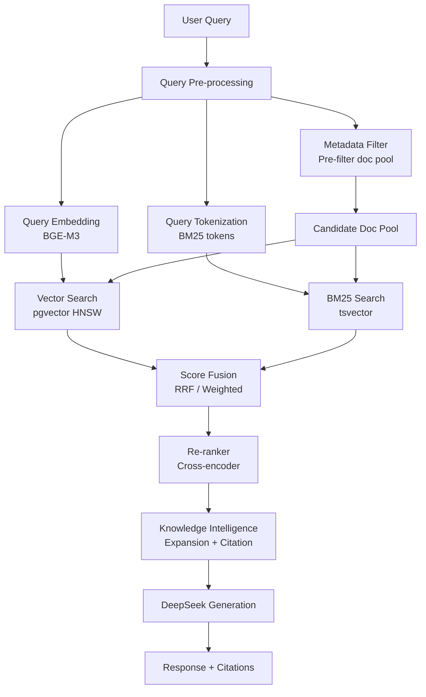
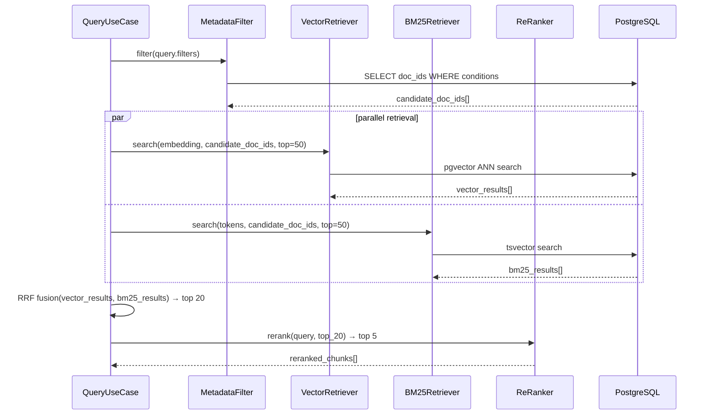

# 07 — Retrieval Design

## Purpose

Thiết kế hybrid retrieval engine: kết hợp Metadata Filter, BM25, Vector Search, và Re-ranking để đạt độ chính xác cao nhất cho truy vấn pháp lý tiếng Việt.

---

## Retrieval Architecture



---

## Stage 1: Query Pre-processing

### Query Analysis

```python
@dataclass
class ProcessedQuery:
    original: str
    normalized: str          # lowercase, remove diacritics for BM25
    embedding: List[float]   # BGE-M3 dense vector
    bm25_tokens: List[str]   # tokenized for tsvector
    inferred_doc_types: List[str]  # e.g., ["CIRCULAR"] if query mentions "thông tư"
    inferred_date_hints: Optional[DateRange]
```

### Vietnamese Query Normalization

- Lowercase
- Giữ dấu tiếng Việt cho semantic search (BGE-M3 handle được)
- Bỏ dấu cho BM25 (tsvector 'simple' dictionary không handle tốt dấu)
- Expand abbreviations: "NHNN" → "Ngân hàng Nhà nước Việt Nam"

---

## Stage 2: Metadata Filter

### Purpose

Pre-filter candidate document pool trước khi search — giảm không gian tìm kiếm từ toàn bộ collection xuống còn relevant documents.

### Filter Logic

```python
@dataclass
class MetadataFilter:
    doc_types: Optional[List[str]]
    authority_levels: Optional[List[str]]
    date_from: Optional[date]
    date_to: Optional[date]
    tags: Optional[List[str]]
    active_only: bool = True  # default: chỉ lấy ACTIVE docs

def build_filter_query(f: MetadataFilter) -> str:
    """Build SQL WHERE clause for pre-filtering"""
    conditions = ["d.deleted_at IS NULL"]
    if f.active_only:
        conditions.append("d.status = 'ACTIVE'")
    if f.doc_types:
        conditions.append(f"d.doc_type = ANY($1)")
    if f.authority_levels:
        conditions.append(f"d.authority_level = ANY($2)")
    if f.date_from:
        conditions.append(f"d.effective_date >= $3")
    if f.date_to:
        conditions.append(f"d.effective_date <= $4")
    return " AND ".join(conditions)
```

---

## Stage 3: Vector Search

### pgvector Configuration

```sql
-- HNSW index (built at ingestion)
CREATE INDEX idx_chunks_embedding_hnsw ON chunks
    USING hnsw (embedding vector_cosine_ops)
    WITH (m = 16, ef_construction = 64);

-- Query time: set ef_search per session (NOT globally via SET)
-- Must be set within the same database session before the query
-- asyncpg: await conn.execute("SET LOCAL hnsw.ef_search = 64")
-- Note: SET LOCAL scopes to current transaction — safe in async connection pool
```

### Vector Search Query

```sql
SELECT
    c.id AS chunk_id,
    c.document_id,
    c.content,
    c.section_number,
    c.section_title,
    c.chunk_type,
    c.page_number,
    1 - (c.embedding <=> $1::vector) AS vector_score
FROM chunks c
JOIN documents d ON d.id = c.document_id
WHERE d.id = ANY($2::uuid[])   -- pre-filtered doc pool
ORDER BY c.embedding <=> $1::vector
LIMIT $3;  -- top_k * 3 (over-fetch for fusion)
```

**Parameters:**
- `$1`: query embedding vector(1024)
- `$2`: candidate document IDs from metadata filter
- `$3`: over-fetch limit (e.g., top_k=5 → fetch 15)

---

## Stage 4: BM25 Search

### PostgreSQL Full-Text Search

```sql
SELECT
    c.id AS chunk_id,
    c.document_id,
    c.content,
    c.section_number,
    c.section_title,
    ts_rank_cd(c.search_vector, plainto_tsquery('simple', $1)) AS bm25_score
FROM chunks c
JOIN documents d ON d.id = c.document_id
WHERE c.search_vector @@ plainto_tsquery('simple', $1)
  AND d.id = ANY($2::uuid[])
ORDER BY bm25_score DESC
LIMIT $3;
```

### BM25 Limitation Note

PostgreSQL `ts_rank_cd` không phải BM25 thuần túy — nó là TF-IDF variant. Tuy nhiên đủ tốt cho use case này. Nếu cần BM25 chính xác, có thể dùng `pg_bm25` extension (ParadeDB).

---

## Stage 5: Score Fusion

### Reciprocal Rank Fusion (RRF)

Kết hợp vector results và BM25 results bằng RRF — robust, không cần tune weight:

```python
def reciprocal_rank_fusion(
    vector_results: List[ScoredChunk],
    bm25_results: List[ScoredChunk],
    k: int = 60
) -> List[ScoredChunk]:
    scores: Dict[str, float] = {}

    for rank, chunk in enumerate(vector_results):
        scores[chunk.id] = scores.get(chunk.id, 0) + 1 / (k + rank + 1)

    for rank, chunk in enumerate(bm25_results):
        scores[chunk.id] = scores.get(chunk.id, 0) + 1 / (k + rank + 1)

    # Merge and sort by RRF score
    all_chunks = {c.id: c for c in vector_results + bm25_results}
    return sorted(
        [all_chunks[cid] for cid in scores],
        key=lambda c: scores[c.id],
        reverse=True
    )
```

### Weighted Fusion (Alternative)

```python
final_score = 0.6 * vector_score + 0.4 * bm25_score
```

Default: **RRF** (không cần calibrate weights).

---

## Stage 6: Re-ranking

### Cross-Encoder Re-ranker

Sau khi fusion, top-N chunks được re-rank bằng cross-encoder để cải thiện precision:

```python
class ReRanker:
    async def rerank(
        self,
        query: str,
        chunks: List[ScoredChunk],
        top_n: int
    ) -> List[ScoredChunk]:
        pairs = [(query, chunk.content) for chunk in chunks]
        scores = await self.cross_encoder.score(pairs)  # batch
        for chunk, score in zip(chunks, scores):
            chunk.rerank_score = score
        return sorted(chunks, key=lambda c: c.rerank_score, reverse=True)[:top_n]
```

**Model options:**
- `BAAI/bge-reranker-v2-m3` (multilingual, recommended)
- `cross-encoder/ms-marco-MiniLM-L-6-v2` (faster, less accurate for Vietnamese)

---

## Full Retrieval Pipeline



---

## Retrieval Configuration

```python
@dataclass
class RetrievalConfig:
    vector_top_k: int = 50       # over-fetch for fusion
    bm25_top_k: int = 50         # over-fetch for fusion
    fusion_top_n: int = 20       # after RRF fusion
    rerank_top_n: int = 5        # final results
    hnsw_ef_search: int = 64     # HNSW recall parameter
    use_rrf: bool = True
    rrf_k: int = 60
```

---

## Authority Boost

Sau re-ranking, apply authority level boost:

```python
AUTHORITY_BOOST = {
    "NATIONAL_LAW": 1.20,
    "NHNN_CIRCULAR": 1.15,
    "NHNN_DECISION": 1.10,
    "INTERNAL_POLICY": 1.00,
    "DEPARTMENT_SOP": 0.95,
    "FAQ": 0.85,
}

# Penalize superseded/expired documents
STATUS_PENALTY = {
    "ACTIVE": 1.0,
    "SUPERSEDED": 0.3,
    "EXPIRED": 0.1,
}

final_score = rerank_score * authority_boost * status_penalty
```

---

## Constraints

- Vector và BM25 search phải chạy song song (asyncio.gather)
- Metadata filter phải chạy trước retrieval (không full-scan)
- Re-ranker chỉ nhận top-20 chunks (giới hạn cross-encoder latency)
- Tổng retrieval latency (không tính LLM): ≤ 2 seconds

---

## Trade-offs

| Choice | Benefit | Cost |
|---|---|---|
| RRF over weighted | No calibration needed | Slightly less optimal than tuned weights |
| HNSW over IVFFlat | No training, better recall | Higher memory usage |
| Async parallel retrieval | Reduces latency | More complex code |
| Cross-encoder reranking | Significant precision gain | +300-500ms latency |

---

## Future Extensibility

- Add MMR (Maximal Marginal Relevance) for diversity in results
- Add query expansion via LLM (HyDE - Hypothetical Document Embeddings)
- Add learned sparse retrieval (SPLADE) for better BM25 alternative
- Add user feedback loop for retrieval quality improvement
