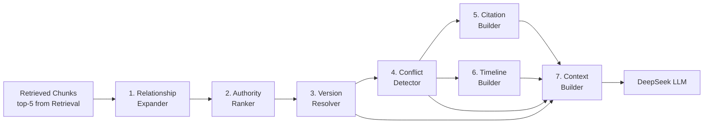

# 08 — Knowledge Intelligence

## Purpose

Tầng Knowledge Intelligence biến retrieved chunks thành câu trả lời có chất lượng cao cho domain pháp lý — bằng cách mở rộng quan hệ, xếp hạng thẩm quyền, phân giải phiên bản, phát hiện xung đột, xây dựng citation và timeline.

---

## Overview



**7-Component Pipeline** (chạy tuần tự):
1. **RelationExpander** — mở rộng chunks qua document graph (BFS, 2 hops)
2. **AuthorityRanker** — boost score theo thẩm quyền pháp lý
3. **VersionResolver** — detect SUPERSEDED, fetch phiên bản mới, tạo version_note
4. **ConflictDetector** — detect CONFLICTS_WITH từ relations + LLM semantic check
5. **CitationBuilder** — build Citation objects từ final chunks
6. **TimelineBuilder** — build version timeline (chỉ khi cần thiết)
7. **ContextBuilder** — assemble `EnrichedContext` hoàn chỉnh cho LLM

---

## Component 1: Relationship Expander

### Responsibility

Mở rộng tập retrieved chunks bằng cách fetch các tài liệu có quan hệ với documents đã tìm được.

### Algorithm

```python
async def expand(
    self,
    chunks: List[ScoredChunk],
    relation_types: List[str] = ["REFERENCES", "IMPLEMENTS"],
    max_hops: int = 2,
    max_expanded: int = 10
) -> List[ScoredChunk]:
    """
    1. Extract unique document_ids from retrieved chunks
    2. Traverse document_relations graph (BFS, max 2 hops)
    3. Fetch relevant chunks from related documents
    4. Score expanded chunks lower than original (decay factor 0.7/hop)
    """
```

### Expansion Rules

| Relation Type | Expand? | Score Decay |
|---|---|---|
| REFERENCES | Yes | × 0.7 per hop |
| IMPLEMENTS | Yes | × 0.7 per hop |
| SUPPLEMENTS | Yes | × 0.8 per hop |
| REPLACES | Fetch target, mark as historical | × 0.5 |
| CONFLICTS_WITH | Flag, fetch both sides | × 1.0 (both needed) |
| AMENDS | Yes | × 0.9 |

### SQL: Graph Traversal

```sql
WITH RECURSIVE expansion AS (
    -- Hop 0: starting documents
    SELECT id AS doc_id, 0 AS hop, 1.0 AS decay
    FROM documents
    WHERE id = ANY($1::uuid[])

    UNION ALL

    -- Hop N: expand via relations
    SELECT dr.target_doc_id, e.hop + 1, e.decay * 0.7
    FROM document_relations dr
    JOIN expansion e ON dr.source_doc_id = e.doc_id
    WHERE e.hop < $2  -- max_hops
      AND dr.relation_type = ANY($3::varchar[])
)
SELECT DISTINCT ON (doc_id) doc_id, hop, decay
FROM expansion
ORDER BY doc_id, hop ASC;
```

---

## Component 2: Authority Ranker

### Responsibility

Xếp hạng lại chunks dựa trên thẩm quyền pháp lý của document nguồn.

### Authority Hierarchy

```python
AUTHORITY_RANK = {
    "NATIONAL_LAW": 6,      # Luật
    "NHNN_CIRCULAR": 5,     # Thông tư NHNN
    "NHNN_DECISION": 4,     # Quyết định NHNN
    "INTERNAL_POLICY": 3,   # Chính sách nội bộ
    "DEPARTMENT_SOP": 2,    # Quy trình phòng ban
    "FAQ": 1,               # FAQ
}

def authority_score(chunk: ScoredChunk) -> float:
    rank = AUTHORITY_RANK.get(chunk.document.authority_level, 1)
    normalized = rank / max(AUTHORITY_RANK.values())  # 0.17 to 1.0
    return chunk.score * (1 + 0.2 * normalized)       # boost up to 20%
```

### Conflict Resolution Priority

Khi có xung đột: **authority cao hơn** → câu trả lời ưu tiên hơn.

---

## Component 3: Version Resolver

### Responsibility

Đảm bảo câu trả lời dựa trên phiên bản mới nhất đang hiệu lực của văn bản.

### Algorithm

```python
async def resolve(
    self,
    chunks: List[ScoredChunk]
) -> Tuple[List[ScoredChunk], List[VersionNote]]:
    """
    For each document in chunks:
    1. Check if document has SUPERSEDED status
    2. If yes: find the replacing document
    3. Add version note to response
    4. Optionally: fetch equivalent chunk from new version
    """
```

### Version Note Example

```json
{
  "type": "VERSION_NOTE",
  "message": "Thông tư 48/2018/TT-NHNN đã được thay thế bởi Thông tư 48/2024/TT-NHNN (hiệu lực từ 01/11/2024). Câu trả lời dưới đây dựa trên phiên bản mới nhất.",
  "superseded_doc": "48/2018/TT-NHNN",
  "current_doc": "48/2024/TT-NHNN"
}
```

### SQL: Find Latest Version

```sql
SELECT d_new.*
FROM documents d_new
JOIN document_relations dr ON dr.source_doc_id = d_new.id
WHERE dr.target_doc_id = $1
  AND dr.relation_type = 'REPLACES'
  AND d_new.status = 'ACTIVE'
ORDER BY d_new.effective_date DESC
LIMIT 1;
```

---

## Component 4: Conflict Detector

### Responsibility

Phát hiện xung đột nội dung giữa các chunks từ các văn bản khác nhau.

### Detection Strategy

#### Strategy 1: Explicit Relation Detection

```sql
-- Detect explicit conflicts from document_relations
SELECT dr.*
FROM document_relations dr
WHERE dr.relation_type = 'CONFLICTS_WITH'
  AND (
    dr.source_doc_id = ANY($1::uuid[])
    OR dr.target_doc_id = ANY($1::uuid[])
  );
```

#### Strategy 2: Semantic Conflict Detection (LLM-based)

Khi có ≥ 2 chunks từ documents về cùng chủ đề nhưng từ sources khác nhau:

```python
CONFLICT_DETECTION_PROMPT = """
Phân tích hai đoạn văn bản pháp lý sau và xác định có mâu thuẫn không:

Văn bản 1 (từ {doc1}):
{content1}

Văn bản 2 (từ {doc2}):
{content2}

Kết luận: [CÓ MÂU THUẪN / KHÔNG MÂU THUẪN]
Giải thích: [nếu có mâu thuẫn, mô tả cụ thể điểm mâu thuẫn]
"""
```

### Conflict Response

```json
{
  "conflicts_detected": true,
  "conflicts": [
    {
      "type": "REGULATORY_CONFLICT",
      "doc1": "48/2018/TT-NHNN",
      "doc2": "48/2024/TT-NHNN",
      "description": "Quy định về mức lãi suất tối đa khác nhau",
      "resolution": "Áp dụng 48/2024/TT-NHNN (ban hành sau, thẩm quyền tương đương)"
    }
  ]
}
```

---

## Component 5: Citation Builder

### Responsibility

Xây dựng citation objects chuẩn cho từng chunk được dùng trong câu trả lời.

### Citation Format

```python
@dataclass
class Citation:
    chunk_id: UUID
    document_id: UUID
    document_title: str
    doc_number: str
    section_number: str    # "Điều 3"
    section_title: str     # "Nguyên tắc cho vay"
    page_number: int
    relevance_score: float
    excerpt: str           # first 200 chars of chunk content

    def to_reference_string(self) -> str:
        return f"{self.doc_number}, {self.section_number}"
        # e.g., "48/2024/TT-NHNN, Điều 3"
```

### In-text Citation Insertion

LLM được hướng dẫn insert citation markers trong generated text:

```
"Tổ chức tín dụng phải kiểm tra mục đích vay [1] và thu nhập của khách hàng [2]..."

[1] Thông tư 48/2024/TT-NHNN, Điều 7, Khoản 1 (trang 3)
[2] Thông tư 48/2024/TT-NHNN, Điều 8, Khoản 2 (trang 4)
```

---

## Component 6: Timeline Builder

### Responsibility

Xây dựng timeline lịch sử thay đổi của văn bản / dòng văn bản.

### Algorithm

```python
async def build_timeline(
    self,
    document_id: UUID
) -> DocumentTimeline:
    """
    1. Find all documents in the same 'family' (same topic/number)
    2. Order by issued_date
    3. Map REPLACES relationships to create version chain
    4. Return timeline with status of each version
    """
```

### Timeline Output

```json
{
  "family": "48/TT-NHNN",
  "versions": [
    {
      "doc_number": "48/2014/TT-NHNN",
      "issued_date": "2014-11-25",
      "effective_date": "2015-02-01",
      "expired_date": "2019-07-01",
      "status": "SUPERSEDED",
      "key_changes": null
    },
    {
      "doc_number": "48/2018/TT-NHNN",
      "issued_date": "2018-12-31",
      "effective_date": "2019-07-01",
      "expired_date": "2024-11-01",
      "status": "SUPERSEDED",
      "key_changes": "Mở rộng phạm vi đối tượng vay, tăng mức cho vay tối đa"
    },
    {
      "doc_number": "48/2025/TT-NHNN",
      "issued_date": "2025-01-01",
      "effective_date": "2025-03-01",
      "expired_date": null,
      "status": "ACTIVE",
      "key_changes": "Cập nhật lãi suất tối đa, bổ sung quy định về cho vay online"
    }
  ]
}
```

---

## Component 7: Context Builder

### Responsibility

Assembles tất cả output của KI pipeline thành một `EnrichedContext` object duy nhất, sẵn sàng để truyền vào PromptAssembler của LLM layer.

### Interface

```python
@dataclass
class EnrichedContext:
    chunks: List[ScoredChunk]          # Final ranked chunks
    citations: List[Citation]           # Citation objects per chunk
    version_notes: List[VersionNote]    # Supersession warnings
    conflicts: List[ConflictResult]     # Detected conflicts
    timeline: Optional[DocumentTimeline]  # Version timeline (if triggered)
    total_token_estimate: int           # Pre-calculated token budget

class ContextBuilder:
    MAX_CONTEXT_TOKENS = 6000

    def build(
        self,
        chunks: List[ScoredChunk],
        citations: List[Citation],
        version_notes: List[VersionNote],
        conflicts: List[ConflictResult],
        timeline: Optional[DocumentTimeline],
    ) -> EnrichedContext:
        # Trim chunks to fit token budget
        trimmed_chunks = self._fit_to_budget(chunks)
        return EnrichedContext(
            chunks=trimmed_chunks,
            citations=[c for c in citations if c.chunk_id in {ch.id for ch in trimmed_chunks}],
            version_notes=version_notes,
            conflicts=conflicts,
            timeline=timeline,
            total_token_estimate=self._estimate_tokens(trimmed_chunks),
        )

    def _fit_to_budget(self, chunks: List[ScoredChunk]) -> List[ScoredChunk]:
        result, total = [], 0
        for chunk in chunks:
            tokens = chunk.token_count or len(chunk.content.split()) * 1.3
            if total + tokens > self.MAX_CONTEXT_TOKENS:
                break
            result.append(chunk)
            total += tokens
        return result
```

---

## Intelligence Pipeline Execution

```python
class KnowledgeIntelligenceService:
    async def enrich(
        self,
        query: ProcessedQuery,
        raw_chunks: List[ScoredChunk]
    ) -> EnrichedContext:

        # Stage 1: Relationship Expansion
        expanded = await self.relation_expander.expand(raw_chunks)

        # Stage 2: Authority Ranking
        ranked = self.authority_ranker.rank(expanded)

        # Stage 3: Version Resolution
        resolved, version_notes = await self.version_resolver.resolve(ranked)

        # Stages 4+5+6 can run in parallel
        conflicts, citations, timeline = await asyncio.gather(
            self.conflict_detector.detect(resolved),
            asyncio.coroutine(lambda: self.citation_builder.build(resolved))(),
            self.timeline_builder.build_if_needed(query, resolved),
        )

        # Stage 7: Context Assembly
        return self.context_builder.build(
            chunks=resolved,
            citations=citations,
            version_notes=version_notes,
            conflicts=conflicts,
            timeline=timeline,
        )
```

---

## Constraints

- Graph traversal max 2 hops (prevent exponential expansion)
- Max expanded chunks: 10 (original 5 + 5 expanded)
- Conflict detection via LLM chỉ khi có ≥ 2 chunks từ documents khác source
- Timeline builder chỉ trigger khi user query về "lịch sử" hoặc "phiên bản"

---

## Trade-offs

| Choice | Benefit | Cost |
|---|---|---|
| BFS graph traversal in PG | No Neo4j needed | Slow for deep graphs |
| LLM-based conflict detection | High accuracy | Adds ~500ms latency |
| Authority ranking static weights | Predictable | Doesn't adapt to query intent |

---

## Future Extensibility

- ML-based authority ranking (learn from user feedback)
- Real-time conflict detection on document ingestion
- Automated relation detection via NLP (reduce manual tagging)
- Cross-document summarization for multi-version comparison
