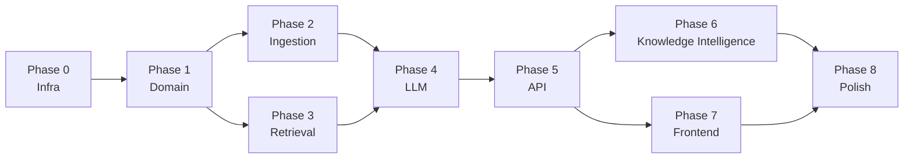

# 14 — Implementation Roadmap

## Purpose

Lộ trình triển khai chi tiết theo phases — từ infrastructure setup đến full Knowledge Intelligence, được tối ưu cho hackathon 48 giờ.

---

## Overview Timeline

```mermaid
gantt
    title VAIC-Nextlevel Implementation Roadmap (48h Hackathon)
    dateFormat HH:mm
    axisFormat %H:%M

    section Phase 0 — Setup
    Project scaffold & Docker     :p0a, 00:00, 2h
    PostgreSQL + pgvector setup   :p0b, after p0a, 1h
    Alembic migrations            :p0c, after p0b, 1h

    section Phase 1 — Core Domain
    Domain entities               :p1a, after p0c, 2h
    Repository interfaces         :p1b, after p1a, 1h
    SQLAlchemy models             :p1c, after p1b, 2h

    section Phase 2 — Ingestion
    DOCX parser                   :p2a, after p1c, 3h
    Hierarchical chunker          :p2b, after p2a, 2h
    BGE-M3 embedding client       :p2c, after p2a, 1h
    Ingestion use case            :p2d, after p2b, 2h

    section Phase 3 — Retrieval
    Metadata filter               :p3a, after p2d, 1h
    Vector retriever (pgvector)   :p3b, after p3a, 2h
    BM25 retriever (tsvector)     :p3c, after p3b, 1h
    RRF score fusion              :p3d, after p3c, 1h
    Re-ranker                     :p3e, after p3d, 2h

    section Phase 4 — LLM
    DeepSeek client               :p4a, after p3e, 1h
    Prompt assembly               :p4b, after p4a, 1h
    Query use case (end-to-end)   :p4c, after p4b, 2h

    section Phase 5 — API
    FastAPI routers               :p5a, after p4c, 2h
    Auth (JWT)                    :p5b, after p5a, 2h

    section Phase 6 — Knowledge Intelligence
    Relation expander             :p6a, after p5b, 2h
    Version resolver              :p6b, after p6a, 1h
    Conflict detector             :p6c, after p6b, 2h
    Citation builder              :p6d, after p6c, 1h

    section Phase 7 — Frontend
    React chat UI                 :p7a, after p5a, 4h
    Document upload UI            :p7b, after p7a, 2h

    section Phase 8 — Polish
    Error handling & logging      :p8a, after p6d, 2h
    Integration testing           :p8b, after p8a, 2h
    Demo data ingestion           :p8c, after p8b, 1h
```

---

## Phase 0 — Infrastructure Setup (4h)

**Goal:** Docker environment running, DB ready.

### Tasks

- [ ] Create project structure per `02-folder-structure.md`
- [ ] `docker-compose.yml` with postgres (pgvector), backend, frontend
- [ ] `pyproject.toml` with all dependencies
- [ ] `alembic init`, configure async engine
- [ ] Write and run migrations: `documents`, `chunks`, `document_relations`, `users`, `query_logs`
- [ ] Verify pgvector extension active: `SELECT * FROM pg_extension WHERE extname = 'vector'`
- [ ] `.env.example` file

**Exit criteria:** `docker compose up` → all services healthy, migrations run clean.

---

## Phase 1 — Domain Layer (3h)

**Goal:** Pure domain entities and interfaces, zero external dependencies.

### Tasks

- [ ] `Document` entity + `DocumentType`, `AuthorityLevel`, `DocumentStatus` enums
- [ ] `Chunk` entity + `Embedding` value object + `ChunkType` enum
- [ ] `DocumentRelation` entity + `RelationType` enum
- [ ] `Query` entity + `QueryFilter` value object
- [ ] `Citation` value object
- [ ] Abstract `DocumentRepository`, `ChunkRepository`, `QueryRepository`
- [ ] Domain exceptions: `DocumentNotFoundError`, `DuplicateDocumentError`
- [ ] Unit tests for entity invariants

**Exit criteria:** `mypy --strict app/domain` passes, unit tests green.

---

## Phase 2 — Ingestion Pipeline (8h)

**Goal:** Upload DOCX → chunks stored with embeddings in PostgreSQL.

### Tasks

- [ ] `DocxParser` — parse NHNN circular structure (Chương/Điều/Khoản/Điểm)
- [ ] `MetadataExtractor` — regex extract doc_number, dates, issuing_body, relations
- [ ] `HierarchicalChunker` — chunk by Article (Điều), handle oversized articles
- [ ] `BgeM3Client` — HTTP client to embedding-service, batch encode
- [ ] `PgDocumentRepository` — SQLAlchemy async CRUD
- [ ] `PgChunkRepository` — bulk insert with embeddings
- [ ] `IngestDocumentUseCase` — orchestrate parse→chunk→embed→store
- [ ] `IngestDocumentCommand` + handler
- [ ] Duplicate detection via content_hash
- [ ] `POST /api/v1/documents` endpoint

**Exit criteria:** Upload `48_2024_TT-NHNN.docx` → 200 Created, chunks in DB with non-null embeddings.

---

## Phase 3 — Hybrid Retrieval (7h)

**Goal:** Query returns ranked chunks from both vector and BM25 search.

### Tasks

- [ ] `MetadataFilter` — build SQL WHERE clause from QueryFilter
- [ ] `VectorRetriever` — pgvector ANN search with doc pool pre-filter
- [ ] `BM25Retriever` — PostgreSQL tsvector search
- [ ] `RRFusion` — Reciprocal Rank Fusion combiner
- [ ] `BgeM3Client.embed_query()` — query embedding with prefix
- [ ] `BgeRerankClient` — cross-encoder reranking via inference server
- [ ] `RetrievalConfig` dataclass
- [ ] Unit tests for RRF fusion logic
- [ ] Integration test: vector + BM25 return results for sample query

**Exit criteria:** Retrieval pipeline returns top-5 chunks for "Điều kiện vay tiêu dùng theo thông tư 48".

---

## Phase 4 — LLM Integration (4h)

**Goal:** Retrieved chunks + question → generated answer with citations.

### Tasks

- [ ] `DeepSeekClient` — async HTTP client, retry logic, timeout
- [ ] `PromptAssembler` — system prompt + context assembly + user prompt
- [ ] `SearchKnowledgeQueryHandler` — end-to-end: filter → retrieve → rerank → generate
- [ ] `QueryResponse` with `answer`, `citations`, `version_notes`
- [ ] Fallback: "Không tìm thấy thông tin" when no chunks retrieved
- [ ] Manual test: full query against ingested Thông tư 48

**Exit criteria:** POST /api/v1/query returns answer with citation to correct Điều in thông tư.

---

## Phase 5 — REST API (4h)

**Goal:** Complete, documented API with auth.

### Tasks

- [ ] `POST /api/v1/query` — full query endpoint
- [ ] `POST /api/v1/documents` — upload + ingest
- [ ] `GET /api/v1/documents` — list with filter
- [ ] `GET /api/v1/documents/{id}` — single document
- [ ] `GET /api/v1/documents/{id}/relations` — relation graph
- [ ] `GET /health` — health check
- [ ] JWT auth: `POST /auth/token`, `get_current_user` dependency
- [ ] `require_role` decorator
- [ ] Standardized error responses
- [ ] CORS middleware
- [ ] OpenAPI docs at `/docs`

**Exit criteria:** All endpoints return correct status codes, JWT auth works.

---

## Phase 6 — Knowledge Intelligence (6h)

**Goal:** Conflict detection, version resolution, relationship expansion.

### Tasks

- [ ] `RelationExpander` — BFS graph traversal in PostgreSQL (2 hops)
- [ ] `AuthorityRanker` — boost by authority_level, penalize SUPERSEDED
- [ ] `VersionResolver` — detect superseded docs, fetch replacement, add version_note
- [ ] `ConflictDetector` — check document_relations for CONFLICTS_WITH
- [ ] `CitationBuilder` — build Citation objects from chunks
- [ ] `TimelineBuilder` — build version timeline for a document family
- [ ] Wire KI into `SearchKnowledgeQueryHandler`
- [ ] `GET /api/v1/documents/{id}/timeline` endpoint

**Exit criteria:** Query about "thông tư 48" returns version note that 2018 version is superseded by 2024.

---

## Phase 7 — Frontend (6h)

**Goal:** Working React UI for demo.

### Tasks

- [ ] Chat interface — input + response display
- [ ] Citation panel — click citation to see source excerpt
- [ ] Document upload page — drag & drop DOCX/PDF
- [ ] Document list page — filter by type/status
- [ ] API client (`services/api.ts`)
- [ ] Auth flow (login page, JWT storage)
- [ ] Loading states + error handling

**Exit criteria:** Demo-ready UI can upload document and ask questions.

---

## Phase 8 — Integration & Polish (5h)

**Goal:** Production-ready for hackathon demo.

### Tasks

- [ ] Ingest all 4 Thông tư 48 (2014, 2018, 2024, 2025) with relations
- [ ] Insert document_relations: 2014→SUPERSEDED by 2018, 2018→SUPERSEDED by 2024
- [ ] End-to-end test suite (5 representative queries)
- [ ] Verify citation accuracy on sample queries
- [ ] Logging + structured error responses
- [ ] `docker compose up` → full demo works
- [ ] Demo script prepared

**Exit criteria:** 5/5 test queries return accurate, cited answers.

---

## Implementation Dependencies

---

## Parallel Work Streams

| Stream A (Backend Core) | Stream B (AI/Retrieval) | Stream C (Frontend) |
|---|---|---|
| Phase 0 Infra | — | — |
| Phase 1 Domain | — | — |
| Phase 2 Ingestion | Phase 3 Retrieval | — |
| Phase 5 API | Phase 4 LLM | Phase 7 Frontend |
| Phase 6 KI | — | — |
| Phase 8 Polish | | |

---

## Risk Register

| Risk | Likelihood | Impact | Mitigation |
|---|---|---|---|
| DeepSeek API slow/down | Medium | High | Mock LLM stub for development |
| BGE-M3 OOM on CPU | Medium | High | Reduce batch size, use smaller test model |
| DOCX parsing edge cases | High | Medium | Test with all 4 thông tư early |
| pgvector HNSW build slow | Low | Medium | Build index after bulk insert |
| 48h time crunch | High | High | Strict P0/P1/P2 prioritization |

---

## Demo Script

1. Open browser → `http://localhost`
2. Login as admin
3. Upload `48_2025_TT-NHNN.docx`
4. Ask: *"Thông tư 48 quy định về điều kiện cho vay tiêu dùng như thế nào?"*
5. Show: answer with citations, version note (old thông tư superseded)
6. Ask: *"So sánh quy định về mức cho vay tối đa giữa các phiên bản thông tư 48"*
7. Show: timeline view, conflict/change detection
8. Show document relation graph
