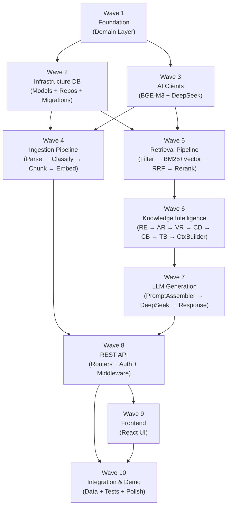

# Architecture Freeze

**Freeze Date:** 2026-07-18  
**Lead Engineer:** Van Phuc  
**Architecture Reviewer:** Principal Software Architect  
**Status:** ██ FROZEN ██  

> After this point, architecture changes must be approved and reflected in this document before implementation changes are made.

---

## 1. Validation Results

### 1.1 Module Responsibility Check

Every module has a single, defined responsibility:

| Module | Layer | Responsibility | Status |
|---|---|---|---|
| `Document` | Domain Entity | Aggregate root — legal document lifecycle, invariants | ✓ |
| `Chunk` | Domain Entity | Text segment with embedding, citation metadata | ✓ |
| `DocumentRelation` | Domain Entity | Directed relation between two documents | ✓ |
| `User` | Domain Entity | Auth principal, role carrier | ✓ |
| `Query` | Domain Entity | User query with filters, latency tracking | ✓ |
| `Citation` | Domain Value Object | Source reference for a specific chunk | ✓ |
| `Embedding` | Domain Value Object | 1024-dim float vector + model metadata | ✓ |
| `DocumentRepository` | Domain Interface | CRUD + relations + graph traversal for documents | ✓ |
| `ChunkRepository` | Domain Interface | Bulk insert + retrieval for chunks | ✓ |
| `QueryRepository` | Domain Interface | Persist + query history for queries | ✓ |
| `UserRepository` | Domain Interface | Lookup by email, persist users | ✓ |
| `ChunkingService` | Domain Service | Select chunking strategy by doc_type | ✓ |
| `ScoringService` | Domain Service | Compute final relevance score (weighted) | ✓ |
| `IngestDocumentUseCase` | Application Command | Orchestrate full ingestion pipeline | ✓ |
| `DeleteDocumentUseCase` | Application Command | Soft-delete document + mark chunks inactive | ✓ |
| `UpdateDocumentUseCase` | Application Command | Update metadata, trigger re-embed if content changed | ✓ |
| `AdminCommand` | Application Command | Reindex, stats aggregation | ✓ |
| `SearchKnowledgeQueryHandler` | Application Query | Orchestrate retrieval → KI → LLM → response | ✓ |
| `GetDocumentQueryHandler` | Application Query | Fetch document with chunks/relations | ✓ |
| `AuthenticateUserQueryHandler` | Application Query | Verify credentials, issue JWT | ✓ |
| `DocxParser` | Infrastructure/Ingestion | Parse DOCX into `ParsedDocument` hierarchy | ✓ |
| `PdfParser` | Infrastructure/Ingestion | Parse PDF into `ParsedDocument` hierarchy | ✓ |
| `MetadataExtractor` | Infrastructure/Ingestion | Extract doc_number, dates, issuing_body from text | ✓ |
| `DocumentClassifier` | Infrastructure/Ingestion | Assign `doc_type` + `authority_level` | ✓ |
| `RelationshipExtractor` | Infrastructure/Ingestion | Detect inter-document relations via regex | ✓ |
| `HierarchicalChunker` | Infrastructure/Ingestion | Chunk legal docs by Điều/Khoản/Điểm | ✓ |
| `SemanticChunker` | Infrastructure/Ingestion | Chunk SOPs/Manuals by semantic section | ✓ |
| `QAPairChunker` | Infrastructure/Ingestion | Chunk FAQs as Q+A pairs | ✓ |
| `BgeM3Client` | Infrastructure/AI | Batch encode text → 1024-dim vectors via HTTP | ✓ |
| `DeepSeekClient` | Infrastructure/AI | Generate answers via DeepSeek API (OpenAI-compat) | ✓ |
| `PromptAssembler` | Infrastructure/AI | Build system + user prompts with context | ✓ |
| `MetadataFilter` | Infrastructure/Retrieval | Build SQL WHERE clause for pre-filtering | ✓ |
| `VectorRetriever` | Infrastructure/Retrieval | ANN search via pgvector HNSW index | ✓ |
| `BM25Retriever` | Infrastructure/Retrieval | Full-text search via PostgreSQL tsvector | ✓ |
| `ReRanker` | Infrastructure/Retrieval | Cross-encoder reranking (BGE-Reranker-v2-M3) | ✓ |
| `RelationExpander` | Infrastructure/Knowledge | BFS graph traversal in PostgreSQL (max 2 hops) | ✓ |
| `AuthorityRanker` | Infrastructure/Knowledge | Boost scores by `authority_level` enum rank | ✓ |
| `VersionResolver` | Infrastructure/Knowledge | Detect SUPERSEDED docs, add version notes | ✓ |
| `ConflictDetector` | Infrastructure/Knowledge | Detect CONFLICTS_WITH + LLM semantic check | ✓ |
| `CitationBuilder` | Infrastructure/Knowledge | Build `Citation` objects from final chunks | ✓ |
| `TimelineBuilder` | Infrastructure/Knowledge | Build version chain via REPLACES relations | ✓ |
| `ContextBuilder` | Infrastructure/Knowledge | Assemble `EnrichedContext`, enforce token budget | ✓ |
| `AuditLogService` | Infrastructure/Services | Write audit events to `audit_logs` table | ✓ |
| `PgDocumentRepository` | Infrastructure/DB | SQLAlchemy async impl of `DocumentRepository` | ✓ |
| `PgChunkRepository` | Infrastructure/DB | SQLAlchemy async impl of `ChunkRepository` | ✓ |
| `PgQueryRepository` | Infrastructure/DB | SQLAlchemy async impl of `QueryRepository` | ✓ |
| `PgUserRepository` | Infrastructure/DB | SQLAlchemy async impl of `UserRepository` | ✓ |
| `QueryRouter` | Presentation | `POST /api/v1/query`, `GET /history`, `POST /suggest` | ✓ |
| `DocumentRouter` | Presentation | CRUD `/api/v1/documents` + relations + timeline | ✓ |
| `AdminRouter` | Presentation | `/api/v1/admin/*` endpoints | ✓ |

---

### 1.2 API → Module Mapping

Every API endpoint maps to an Application handler:

| Endpoint | Method | Handler / Service | Auth Required | Role |
|---|---|---|---|---|
| `/auth/token` | POST | `AuthenticateUserQueryHandler` | No | — |
| `/health` | GET | inline (main.py) | No | — |
| `/metrics` | GET | inline (main.py) | No | — |
| `/docs` | GET | FastAPI built-in | No | — |
| `/api/v1/query` | POST | `SearchKnowledgeQueryHandler` | Yes | all |
| `/api/v1/query/suggest` | POST | `PgDocumentRepository.search_titles()` | Yes | all |
| `/api/v1/query/history` | GET | `PgQueryRepository.get_by_user()` | Yes | all (own) |
| `/api/v1/documents` | POST | `IngestDocumentUseCase` | Yes | admin, legal |
| `/api/v1/documents` | GET | `PgDocumentRepository.list()` | Yes | all |
| `/api/v1/documents/{id}` | GET | `GetDocumentQueryHandler` | Yes | all |
| `/api/v1/documents/{id}` | PATCH | `UpdateDocumentUseCase` | Yes | admin, legal |
| `/api/v1/documents/{id}` | DELETE | `DeleteDocumentUseCase` | Yes | admin |
| `/api/v1/documents/{id}/relations` | GET | `PgDocumentRepository.get_relations()` | Yes | all |
| `/api/v1/documents/{id}/timeline` | GET | `TimelineBuilder.build_timeline()` | Yes | all |
| `/api/v1/documents/{id}/chunks` | GET | `PgChunkRepository.get_by_document()` | Yes | all |
| `/api/v1/admin/reindex` | POST | `AdminCommand.ReindexHandler` | Yes | admin |
| `/api/v1/admin/stats` | GET | `AdminCommand.GetStatsHandler` | Yes | admin |
| `/api/v1/admin/users` | GET | `PgUserRepository.list()` | Yes | admin |

**Resolution — `suggest` endpoint:** No separate use case needed. Delegates to `PgDocumentRepository.search_titles(partial: str)` — a simple `ILIKE` query on `documents.title`. Not worth a dedicated use case for hackathon.

---

### 1.3 Entity → Domain Mapping

Every entity and value object belongs to the domain layer:

| Entity / Value Object | Domain File | DB Table | Status |
|---|---|---|---|
| `Document` | `domain/entities/document.py` | `documents` | ✓ |
| `Chunk` | `domain/entities/chunk.py` | `chunks` | ✓ |
| `DocumentRelation` | `domain/entities/relation.py` | `document_relations` | ✓ |
| `User` | `domain/entities/user.py` | `users` | ✓ |
| `Query` | `domain/entities/query.py` | `query_logs` | ✓ |
| `Citation` | `domain/entities/` (value object in chunk.py or own file) | — | ✓ |
| `Embedding` | `domain/value_objects/embedding.py` | — (stored in `chunks.embedding`) | ✓ |
| `DocumentType` | `domain/value_objects/document_type.py` | — (stored in `documents.doc_type`) | ✓ |
| `AuthorityLevel` | `domain/value_objects/authority_level.py` | — (stored in `documents.authority_level`) | ✓ |
| `RelationType` | `domain/value_objects/relation_type.py` | — (stored in `document_relations.relation_type`) | ✓ |
| `QueryFilter` | `domain/entities/query.py` (as inner class) | — | ✓ |
| `EnrichedContext` | `infrastructure/knowledge/context_builder.py` | — (transient, not persisted) | ✓ Infra |
| `AuditEvent` | `infrastructure/services/audit_log_service.py` | `audit_logs` | ✓ Infra* |

*AuditEvent is **not** a domain entity — it is operational infrastructure. No domain repository needed; `AuditLogService` writes directly.

---

### 1.4 DB Table → Owner Mapping

Every table has exactly one owner module responsible for reading/writing:

| Table | Primary Owner | Secondary Access | Notes |
|---|---|---|---|
| `documents` | `PgDocumentRepository` | `MetadataFilter` (read-only), `RelationExpander` (read-only) | Soft-delete only |
| `chunks` | `PgChunkRepository` | `VectorRetriever`, `BM25Retriever` (read-only) | Bulk insert pattern |
| `document_relations` | `PgDocumentRepository` | `RelationExpander`, `VersionResolver`, `ConflictDetector` (read-only) | Saved within document transaction |
| `query_logs` | `PgQueryRepository` | — | Append-only |
| `users` | `PgUserRepository` | `AuthenticateUserQueryHandler` (read-only) | No soft-delete |
| `audit_logs` | `AuditLogService` | — | Append-only, never updated |

---

### 1.5 Service → Dependencies Mapping

Every service has its dependencies explicitly declared:

| Service | Depends On |
|---|---|
| `IngestDocumentUseCase` | `DocxParser`, `PdfParser`, `MetadataExtractor`, `DocumentClassifier`, `RelationshipExtractor`, `HierarchicalChunker` / `SemanticChunker` / `QAPairChunker`, `BgeM3Client`, `PgDocumentRepository`, `PgChunkRepository`, `AuditLogService` |
| `SearchKnowledgeQueryHandler` | `BgeM3Client`, `MetadataFilter`, `VectorRetriever`, `BM25Retriever`, `ReRanker`, `KnowledgeIntelligenceService`, `PromptAssembler`, `DeepSeekClient`, `PgQueryRepository`, `AuditLogService` |
| `KnowledgeIntelligenceService` | `RelationExpander`, `AuthorityRanker`, `VersionResolver`, `ConflictDetector`, `CitationBuilder`, `TimelineBuilder`, `ContextBuilder` |
| `RelationExpander` | `PgDocumentRepository` (graph traversal), `PgChunkRepository` (fetch expanded chunks) |
| `VersionResolver` | `PgDocumentRepository` (find REPLACES relations) |
| `ConflictDetector` | `PgDocumentRepository` (CONFLICTS_WITH lookup), `DeepSeekClient` (semantic check) |
| `VectorRetriever` | `PgChunkRepository`, PostgreSQL connection |
| `BM25Retriever` | `PgChunkRepository`, PostgreSQL connection |
| `ReRanker` | `BgeM3Client` (reranker endpoint) |
| `AuthenticateUserQueryHandler` | `PgUserRepository`, JWT utilities |
| `AuditLogService` | `audit_log_model`, PostgreSQL connection |

---

## 2. Frozen Architecture Decisions

These decisions are locked. Any deviation requires updating this document first.

| # | Decision | Rationale |
|---|---|---|
| A1 | **Single database: PostgreSQL + pgvector** | No Redis, Neo4j, Elasticsearch, Qdrant. All data in one store. |
| A2 | **BGE-M3 as embedding model** | `BAAI/bge-m3`, 1024-dim, runs as isolated HTTP service |
| A3 | **DeepSeek as LLM** | `deepseek-chat` via OpenAI-compatible API (`OpenAILike` wrapper) |
| A4 | **BGE-Reranker-v2-M3 as cross-encoder** | Same model family as embedding, multilingual |
| A5 | **Clean Architecture with 4 layers** | Presentation → Application → Domain ← Infrastructure |
| A6 | **Repository Pattern** | All DB access via abstract repository interfaces in domain |
| A7 | **Async I/O everywhere** | `asyncpg`, `httpx.AsyncClient`, `asyncio.gather` for parallel calls |
| A8 | **Hybrid Retrieval: Metadata Filter + BM25 + Vector + RRF + Cross-Encoder** | 6-stage retrieval pipeline, all stages required |
| A9 | **7-component Knowledge Intelligence pipeline** | RE → AR → VR → CD → CB → TB → ContextBuilder |
| A10 | **6-stage Ingestion pipeline** | Parse → Extract Metadata → Classify → Extract Relations → Chunk → Embed |
| A11 | **HNSW index for vector search** | `m=16, ef_construction=64`, `SET LOCAL hnsw.ef_search=64` per transaction |
| A12 | **RRF (k=60) as fusion algorithm** | No weight calibration needed |
| A13 | **JWT (HS256) for authentication** | Stateless, 60-min access token |
| A14 | **RBAC with 4 roles** | `admin`, `compliance`, `legal`, `employee` |
| A15 | **User-based rate limiting** | Via JWT `sub` claim, fallback to IP for `/auth/token` |
| A16 | **Soft delete for documents** | `deleted_at` timestamp, chunks cascade |
| A17 | **UUID v4 primary keys** | All tables use `uuid_generate_v4()` |
| A18 | **LlamaIndex `Settings` API** | `Settings.llm`, `Settings.embed_model` (not deprecated `ServiceContext`) |
| A19 | **structlog for structured JSON logging** | Request ID propagated via `contextvars` |
| A20 | **Docker Compose for deployment** | All 5 services: nginx, backend, frontend, postgres, embedding-service |

---

## 3. Implementation Dependency Graph

### Wave Map



---

### Wave 1 — Foundation (Domain Layer)

**No external dependencies. Fully unit-testable.**

| Module | File | Notes |
|---|---|---|
| Document entity | `domain/entities/document.py` | Aggregate root, invariants |
| Chunk entity | `domain/entities/chunk.py` | + `Embedding` value object |
| DocumentRelation entity | `domain/entities/relation.py` | |
| User entity | `domain/entities/user.py` | |
| Query entity | `domain/entities/query.py` | + `QueryFilter` value object |
| Enums | `domain/value_objects/*.py` | `DocumentType`, `AuthorityLevel`, `RelationType`, `ChunkType` |
| Repository interfaces | `domain/repositories/*.py` | 4 abstract classes |
| Domain exceptions | `domain/exceptions.py` | |
| Domain services | `domain/services/*.py` | `ChunkingService`, `ScoringService` |

**Exit criteria:** `mypy --strict app/domain` passes. Zero external imports.

---

### Wave 2 — Infrastructure Database

**Depends on: Wave 1**

| Module | File | Notes |
|---|---|---|
| Async engine setup | `infrastructure/database/base.py` | asyncpg, `AsyncSession` |
| ORM Models | `infrastructure/database/models/*.py` | 6 models (document, chunk, relation, query_log, user, audit_log) |
| Concrete repositories | `infrastructure/database/repositories/*.py` | 4 repos |
| Alembic migrations | `alembic/versions/` | All 6 tables in one migration |
| `AuditLogService` | `infrastructure/services/audit_log_service.py` | Append-only writes |

**Exit criteria:** `docker compose up postgres` → `alembic upgrade head` succeeds, all tables + indexes exist.

---

### Wave 3 — AI Clients

**Depends on: Wave 1 (for typing only). Parallel with Wave 2.**

| Module | File | Notes |
|---|---|---|
| BGE-M3 HTTP client | `infrastructure/ai/embedding/bge_m3_client.py` | `embed()`, `embed_query()`, `embed_batch()` |
| DeepSeek client | `infrastructure/ai/llm/deepseek_client.py` | `generate()`, retry logic, timeout |
| Embedding service | `docker/embedding_server.py` | FastAPI wrapper around sentence-transformers |

**Exit criteria:** `curl http://localhost:8001/embed -d '{"texts":["test"]}'` returns `{"embeddings":[[...1024 floats...]]}`.

---

### Wave 4 — Ingestion Pipeline

**Depends on: Wave 1, 2, 3**

| Module | File | Notes |
|---|---|---|
| DOCX parser | `infrastructure/ingestion/parsers/docx_parser.py` | Chương/Điều/Khoản hierarchy |
| PDF parser | `infrastructure/ingestion/parsers/pdf_parser.py` | Basic text extraction |
| Metadata extractor | `infrastructure/ingestion/metadata_extractor.py` | Regex: doc_number, dates |
| Document classifier | `infrastructure/ingestion/document_classifier.py` | doc_type + authority_level |
| Relationship extractor | `infrastructure/ingestion/relationship_extractor.py` | Regex patterns |
| Hierarchical chunker | `infrastructure/ingestion/chunkers/hierarchical_chunker.py` | Legal doc chunking |
| Semantic chunker | `infrastructure/ingestion/chunkers/semantic_chunker.py` | SOP/Manual |
| QA-pair chunker | `infrastructure/ingestion/chunkers/qa_pair_chunker.py` | FAQ |
| IngestDocumentUseCase | `application/commands/ingest_document.py` | Full pipeline orchestration |
| DeleteDocumentUseCase | `application/commands/delete_document.py` | Soft delete |
| UpdateDocumentUseCase | `application/commands/update_document.py` | Metadata update |

**Exit criteria:** Upload `48_2024_TT-NHNN.docx` → DB has document row + >50 chunk rows with non-null embeddings.

---

### Wave 5 — Retrieval Pipeline

**Depends on: Wave 1, 2, 3. Parallel with Wave 4.**

| Module | File | Notes |
|---|---|---|
| Metadata filter | `infrastructure/retrieval/metadata_filter.py` | SQL WHERE builder |
| Vector retriever | `infrastructure/retrieval/vector_retriever.py` | HNSW ANN + `SET LOCAL ef_search` |
| BM25 retriever | `infrastructure/retrieval/bm25_retriever.py` | tsvector + `ts_rank_cd` |
| RRF fusion | (inline in SearchKnowledgeQueryHandler) | Pure Python, no external dep |
| Re-ranker | `infrastructure/retrieval/reranker.py` | HTTP call to embedding-service reranker endpoint |

**Exit criteria:** Query "điều kiện vay" → returns top-5 ranked chunks from `chunks` table with `vector_score` and `bm25_score`.

---

### Wave 6 — Knowledge Intelligence

**Depends on: Wave 2, 5**

| Module | File | Notes |
|---|---|---|
| Relation expander | `infrastructure/knowledge/relation_expander.py` | Recursive CTE, max 2 hops |
| Authority ranker | `infrastructure/knowledge/authority_ranker.py` | Static boost table |
| Version resolver | `infrastructure/knowledge/version_resolver.py` | Find REPLACES chain |
| Conflict detector | `infrastructure/knowledge/conflict_detector.py` | SQL + optional LLM check |
| Citation builder | `infrastructure/knowledge/citation_builder.py` | `Citation` from chunk metadata |
| Timeline builder | `infrastructure/knowledge/timeline_builder.py` | REPLACES chain timeline |
| Context builder | `infrastructure/knowledge/context_builder.py` | Token budget + `EnrichedContext` |
| KI Service | (inline coordinator in SearchKnowledgeQueryHandler) | Orchestrates 7 components |

**Exit criteria:** Given 5 chunks from Thông tư 48 (2018 version), KI service: (1) expands to include 2024 version, (2) adds version note, (3) returns `EnrichedContext` ≤ 6000 tokens.

---

### Wave 7 — LLM Generation

**Depends on: Wave 3, 6**

| Module | File | Notes |
|---|---|---|
| Prompt assembler | `infrastructure/ai/llm/prompt_assembler.py` | System + user prompt with `CONTEXT_WRAPPER` |
| SearchKnowledgeQueryHandler | `application/queries/search_knowledge.py` | End-to-end: retrieval → KI → LLM → response |
| QueryResponse schema | `presentation/schemas/query_schema.py` | `answer`, `citations`, `version_notes` |

**Exit criteria:** `POST /api/v1/query {"question":"Điều kiện cho vay tiêu dùng?"}` → response with `answer` string + `citations` list with correct `doc_number` values.

---

### Wave 8 — REST API Layer

**Depends on: Wave 4 (commands), Wave 7 (query handler)**

| Module | File | Notes |
|---|---|---|
| Auth middleware | `presentation/middleware/auth_middleware.py` | JWT verify, inject user |
| Logging middleware | `presentation/middleware/logging_middleware.py` | request_id, structlog |
| Rate limit middleware | `presentation/middleware/rate_limit_middleware.py` | user-based slowapi |
| Query router | `presentation/routers/query_router.py` | 3 endpoints |
| Document router | `presentation/routers/document_router.py` | 7 endpoints |
| Admin router | `presentation/routers/admin_router.py` | 3 endpoints |
| Auth router | `presentation/routers/auth_router.py` | 1 endpoint |
| All schemas | `presentation/schemas/*.py` | Pydantic v2 |
| DI container | `app/dependencies.py` | Wire all layers |
| App factory | `app/main.py` | Lifespan, middleware registration |
| AuthenticateUserQuery | `application/queries/authenticate_user.py` | Verify password, mint JWT |

**Exit criteria:** All 16 endpoints return correct HTTP status codes. `/docs` accessible. Auth flow works.

---

### Wave 9 — Frontend

**Depends on: Wave 8 (API contract only)**

| Module | Notes |
|---|---|
| Chat interface | Input box, response display, citation markers |
| Citation panel | Expandable source panel per citation |
| Document upload | Multipart form, progress indicator |
| Document list | Filter by type/status |
| API client (`services/api.ts`) | Typed fetch wrappers for all endpoints |
| Auth flow | Login page, JWT in localStorage, auto-attach header |

**Exit criteria:** Can upload a DOCX, ask a question, see answer with clickable citations.

---

### Wave 10 — Integration & Demo Polish

**Depends on: Wave 8, 9**

| Task | Notes |
|---|---|
| Ingest all 4 thông tư | `48/2014`, `48/2018`, `48/2024`, `48/2025` |
| Seed document_relations | REPLACES chain: 2014→2018→2024→2025 |
| Run 5 demo queries | Verify correct citations and version notes |
| Structured logging verification | Request IDs visible in logs |
| Docker Compose full-stack test | `docker compose up` → all services healthy |
| Demo script rehearsal | Per `14-roadmap.md` demo script |

**Exit criteria:** 5/5 demo queries return cited, accurate, version-aware answers.

---

## 4. Out-of-Scope for v1

These items are explicitly deferred:

| Item | Reason |
|---|---|
| Streaming LLM response (SSE) | Sync response sufficient for hackathon |
| ABAC (attribute-based access) | RBAC sufficient for demo |
| OCR for scanned PDFs | Current docs are digital |
| Real-time document monitoring | Manual upload for hackathon |
| JWT revocation blocklist | No logout requirement for demo |
| PDF parsing (detailed) | DOCX primary format; PDF basic fallback only |
| `/api/v1/query/suggest` full implementation | `ILIKE` on title sufficient |

---

## 5. Final Architecture State

```
┌────────────────────────────────────────────────────────┐
│  ARCHITECTURE FREEZE — VAIC-Nextlevel                  │
│  Date: 2026-07-18                                      │
│                                                        │
│  Modules validated:      44                            │
│  DB tables validated:    6                             │
│  API endpoints mapped:   16                            │
│  Entities in domain:     5 entities + 7 value objects  │
│  Repository interfaces:  4                             │
│  Implementation waves:   10                            │
│                                                        │
│  Critical issues:        0 remaining                   │
│  Significant issues:     0 remaining                   │
│  Architecture review:    PASSED                        │
│                                                        │
│  ██████████████████ FROZEN ██████████████████          │
│                                                        │
│  ARCHITECTURE FROZEN                                   │
│  Implementation may begin.                             │
│                                                        │
│  Any architecture change must:                         │
│  1. Update architecture-freeze.md first                │
│  2. Update the affected architecture doc               │
│  3. Be approved by Lead Engineer                       │
└────────────────────────────────────────────────────────┘
```
