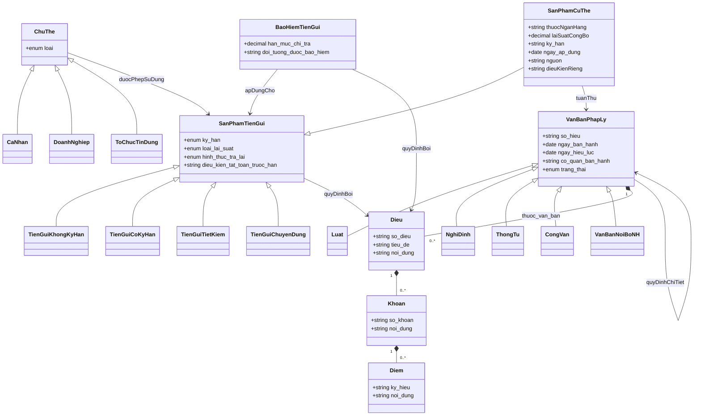

# Ontology Model — miền Tiền gửi ngân hàng (RAG Tiền Gửi SHB)

Trạng thái: **đề xuất, chưa implement**. Đã thống nhất 3 điểm xung đột với code hiện tại của
Phúc trước khi viết tài liệu này (xem mục 6 — mỗi đề xuất ghi rõ quyết định đã chốt).
Grounding: toàn bộ nhận định dưới đây dựa trên đọc trực tiếp dữ liệu trong `data/discovery/`
và code thật trong `backend/` (`document_loader.py`, `vector_store.py`, `relation_store.py`,
`migrations/0001_init.sql`, `models/schemas.py`) tại thời điểm viết — không suy đoán.

## 1. Kiểm kê dữ liệu hiện có

| Nhóm | Số file | Định dạng | Đã chuẩn hoá? |
|---|---|---|---|
| `base_docs/` (Lớp A — pháp lý, toàn văn) | 16 | 2 schema JSON khác nhau (xem 1.1) | Một phần — có ranh giới Điều, KHÔNG có Khoản/Điểm |
| `relations/` + `graph_data.json` (Lớp A — quan hệ) | 16 + 1 tổng hợp | JSON, 2 schema (4 file cũ 10 loại quan hệ, 12 file mới 4 loại) | Có, nhưng nhãn quan hệ (`can_cu/huong_dan/thay_the/khac`) chưa khớp tên ontology |
| `bank_docs/` (Lớp C — thị trường) | 19 PDF + 7 markdown + 4 JSON, 5 ngân hàng | PDF bảng số, JSON API, markdown tự do | Chưa — không có cấu trúc Điều/Khoản, đúng như ontology dự đoán |
| `catalog.json` | 1 | JSON phẳng, đã gộp metadata (bank/category/confidence) | Có |

### 1.1 Hai schema trong `base_docs/` — ảnh hưởng trực tiếp đến chunking

**Schema A** (4 file `thong_tu/48_*.json`): có sẵn `structure_json`/`extracted_json` **nhìn
có vẻ đã cấu trúc hoá nhưng thực tế không dùng được**:
- `structure_json.sections`: kiểm tra TT 48/2018/TT-NHNN → chỉ **1 section** (`kind: "header"`),
  toàn bộ 23 Điều nằm chung 1 blob text. Không có ranh giới Điều ở cấp `sections`.
- `extracted_json.relations`: rỗng (`[]`) — không dùng được cho Lớp A quan hệ.
- `extracted_json.statute_refs`: **CÓ** phát hiện vị trí từng "Điều N" (offset ký tự), nhưng
  field `clause`/`point` (Khoản/Điểm) luôn `None` — chỉ có ranh giới Điều.
- Nội dung sạch nhất nằm ở field `markdown` (plain text, có "Điều N. <tên>" làm marker rõ
  ràng, tách được bằng regex).

**Schema B** (12 file còn lại): nội dung ở `data.documentContent.content` — **HTML thô**
(có `<table>` cho phần quốc hiệu/chữ ký), cần strip tag trước khi áp bất kỳ regex Điều nào.

→ Cả 2 schema đều cho phép tách **Điều** đáng tin cậy (regex trên text sau khi làm sạch), cả
2 đều **không có sẵn** ranh giới Khoản/Điểm — phải tự xây (xem mục 6.2).

### 1.2 Gap dữ liệu (không đoán, liệt kê đúng những gì thiếu)

- Không có văn bản nào crawl từ phapdien.moj.gov.vn (Bộ pháp điển) như brief gợi ý — nguồn
  hiện tại là vbpl.vn (Cơ sở dữ liệu quốc gia về pháp luật) + API gateway của Bộ Tư pháp.
  Cấu trúc Chủ đề → Đề mục → Phần/Chương → Điều mà Bộ pháp điển tổ chức sẵn **không có** trong
  dữ liệu đã crawl — cần map thủ công nếu muốn dùng đúng phân cấp đó.
- SHB thiếu lãi suất tiền gửi doanh nghiệp (lý do cấu trúc: chỉ hiển thị trong Internet
  Banking sau đăng nhập — xem `data/discovery/bank_docs/shb/manifest.json`).
- Chưa có case "conflict" (mâu thuẫn quy định) nào xác nhận được — brief cho phép tạo case
  giả lập nếu không đủ thời gian tìm case thật.
- `superseded_clause` (Khoản/Điều cụ thể bị thay thế trong quan hệ `supersedes`) chưa có sẵn
  ở cấp Khoản cho 2 case partial-supersession đã tìm được (mục 3).

## 2. Sơ đồ ontology



## 3. Bảng mapping cụ thể (không placeholder)

### 3.1 Ví dụ đầy đủ — TT 48/2018/TT-NHNN (23 Điều, đã đọc toàn văn từ `markdown`)

| Điều | Tiêu đề | Class ontology | Ghi chú |
|---|---|---|---|
| 1 | Phạm vi điều chỉnh và đối tượng áp dụng | `VanBanPhapLy` (metadata phạm vi) | — |
| 2 | Tổ chức tín dụng nhận tiền gửi tiết kiệm | `ChuThe` → `ToChucTinDung` (5 loại: NHTM, NH hợp tác xã, TCTC vi mô, QTDND, chi nhánh NH nước ngoài) | Danh sách con của `ToChucTinDung` chi tiết hơn ontology gốc — cân nhắc thêm subclass |
| 3 | Người gửi tiền | `ChuThe` → `CaNhan` (điều kiện tuổi/năng lực hành vi) | Không có `DoanhNghiep` trong Điều này — TT 48/2018 **chỉ áp dụng cá nhân** |
| 4 | Phạm vi nhận, gửi tiền gửi tiết kiệm | `SanPhamTienGui.loai_lai_suat` (VND/ngoại tệ theo đối tượng cư trú) | — |
| 5 | Giải thích từ ngữ | Định nghĩa dùng chung — không map 1 class cụ thể, dùng làm chú thích | — |
| 6 | Hình thức tiền gửi tiết kiệm | `SanPhamTienGui` (phân loại theo kỳ hạn: không kỳ hạn / có kỳ hạn) → `TienGuiKhongKyHan`, `TienGuiCoKyHan` | Điều 6 chính là căn cứ định nghĩa 2 subclass gốc của ontology |
| 7 | Thẻ tiết kiệm | Thuộc tính bổ sung `SanPhamTienGui` (không có class riêng trong ontology gốc — **gap**: cần thêm class `ChungTuXacNhan` nếu muốn mô hình hoá đầy đủ) | — |
| 9 | Lãi suất | `SanPhamTienGui.loai_lai_suat`, `SanPhamCuThe.laiSuatCongBo` (Điều 9 là quy định KHUNG — số cụ thể nằm ở Lớp C, đúng thiết kế `tuanThu`) | Ví dụ rõ nhất cho quan hệ `SanPhamCuThe --> VanBanPhapLy : tuanThu` |
| 12, 18 | Thủ tục gửi / chi trả tại điểm giao dịch | `SanPhamTienGui` thuộc tính thủ tục (chưa có field riêng trong ontology gốc — **gap**, đề xuất thêm `thu_tuc_giao_dich: string`) | Đây là nguồn trả lời FAQ #12/17 (khách hàng/giao dịch viên) |
| 13 | Sử dụng tiền gửi tiết kiệm làm tài sản bảo đảm | `SanPhamTienGui.dieu_kien_tat_toan_truoc_han` không đúng field — **gap**: cần field riêng `dung_lam_tai_san_bao_dam: bool` | Trả lời FAQ #14/22 |
| 17 | Rút trước hạn tiền gửi tiết kiệm | `SanPhamTienGui.dieu_kien_tat_toan_truoc_han`, quan hệ `quyDinhBoi` → chính Điều 17 | Điều 17 khoản 2 dẫn chiếu "quy định của NHNN" → chính là TT 04/2022/TT-NHNN, ví dụ thật cho `quyDinhChiTiet`/`huongDanBoi` |
| 22 | Điều khoản thi hành | `VanBanPhapLy.thayThe` — Điều này TỰ KHAI BÁO quan hệ thay thế: *"thay thế Quyết định số 1160/2004/QĐ-NHNN... Quyết định số 47/2006/QĐ-NHNN..."* | Ví dụ thật, lấy trực tiếp từ text, không cần suy luận từ `relations/` |

### 3.2 Quy tắc chung cho các văn bản còn lại (áp dụng khi build parser, không liệt kê hết 16 văn bản thủ công)

| Loại văn bản | Class chính | Heuristic nhận diện Điều liên quan |
|---|---|---|
| Luật 111/2025/QH15, 06/2012/QH13 | `BaoHiemTienGui` | Điều có cụm "hạn mức chi trả", "bảo hiểm tiền gửi" |
| Luật 32/2024/QH15, 96/2025/QH15 | `VanBanPhapLy` gốc (không thuộc riêng `SanPhamTienGui` hay `BaoHiemTienGui` — nền tảng chung) | — |
| TT 04/2022/TT-NHNN | `SanPhamTienGui.dieu_kien_tat_toan_truoc_han` (khung lãi suất rút trước hạn) | Toàn văn ngắn, hầu hết Điều đều liên quan |
| TT 48/2018, 49/2018 | `SanPhamTienGui` (tiết kiệm / có kỳ hạn) | Cùng cấu trúc như 3.1 |
| NĐ 68/2013, QĐ 32/2021 | `BaoHiemTienGui` | Nghị định/Quyết định hướng dẫn thi hành Luật BHTG |
| PL Ngoại hối 28/2005, NĐ 70/2014 | `SanPhamTienGui` (loại tiền ngoại tệ) | Điều có cụm "ngoại tệ", "người không cư trú" |
| TT 48/2014, 48/2025 | **Không thuộc ontology tiền gửi** (phát ngôn NHNN, thủ tục hành chính nội bộ NHNN) | Đề xuất loại khỏi phạm vi ingest, giữ tham khảo |

### 3.3 Lớp C — mapping ví dụ thật (SHB, đã đọc PDF)

| Nguồn | `SanPhamCuThe` instance | `tuanThu` → |
|---|---|---|
| `bank_docs/shb/pdfs/lai_suat_vnd_ca_nhan.pdf`, mục "Tiết kiệm thông thường" kỳ hạn 12 tháng, hiệu lực 11/4/2026 | `bank=SHB, ky_han=12thang, laiSuatCongBo=6.10%, channel=tai_quay` | TT 04/2022/TT-NHNN (khung rút trước hạn) |
| Cùng file, mục "Tiết kiệm Trọn Lộc" 12 tháng | `bank=SHB, product=TronLoc, ky_han=12thang, laiSuatCongBo=6.30%` | — |

## 4. Đề xuất thay đổi schema lưu trữ (migration `0002`)

```sql
-- 1. Mở rộng document_relations.relation_type — quyết định đã chốt: giữ tên sát ontology,
--    KHÔNG map dồn về 3 loại cũ (huongDanBoi/quyDinhChiTiet là quan hệ khác cross_reference)
alter table document_relations drop constraint if exists document_relations_relation_type_check;
alter table document_relations add constraint document_relations_relation_type_check
    check (relation_type in ('cross_reference', 'amends', 'supersedes', 'huong_dan_boi', 'quy_dinh_chi_tiet'));

-- 2. Thêm Khoản/Điểm + phân loại + đối tượng áp dụng vào document_chunks (Lớp A)
--    Quyết định đã chốt: đầu tư regex tách Khoản/Điểm (mục 6.2), không giữ nguyên chỉ-Điều.
alter table document_chunks add column if not exists khoan text;
alter table document_chunks add column if not exists diem text;
alter table document_chunks add column if not exists doc_class text
    check (doc_class in ('luat', 'nghi_dinh', 'thong_tu', 'phap_lenh', 'quyet_dinh', 'cong_van'));
alter table document_chunks add column if not exists doi_tuong_ap_dung text[]; -- vd: {ca_nhan, doanh_nghiep}

create index if not exists document_chunks_doc_class_idx on document_chunks (doc_class);

-- 3. Bảng mới cho Lớp C — quyết định đã chốt: KHÔNG ép vào document_chunks (khác bản chất:
--    số liệu có cấu trúc, cần lọc/so sánh chính xác bằng SQL, không chỉ semantic search)
create table if not exists bank_products (
    id                bigint generated always as identity primary key,
    bank              text not null,               -- 'SHB','BIDV','VietinBank','Vietcombank','Techcombank'
    product_category  text not null
        check (product_category in ('lai_suat_tien_gui','bieu_phi','dieu_khoan_san_pham','thu_tuc_mo_so')),
    product_name      text not null,                -- vd 'Tiết kiệm Phát Lộc Online'
    term              text,                         -- vd '12 tháng'; null nếu category != lai_suat_tien_gui
    customer_segment  text not null default 'ca_nhan' check (customer_segment in ('ca_nhan','doanh_nghiep')),
    channel           text check (channel in ('tai_quay','online', null)),
    rate_value        numeric(6,3),                 -- %/năm; null nếu record không phải lãi suất
    content           text not null,                -- mô tả đầy đủ để embed (semantic fallback)
    embedding         vector(1024),
    source_url        text,
    effective_date    date,
    quy_dinh_boi       text references document_chunks(doc_id), -- field 'quyDinhBoi': liên kết sang Lớp A/B khi có trần/sàn lãi suất áp dụng
    created_at        timestamptz not null default now()
);

create index if not exists bank_products_lookup_idx on bank_products (bank, product_category, term);
create index if not exists bank_products_embedding_idx on bank_products using hnsw (embedding vector_cosine_ops);
```

**Vì sao `bank_products` tách bảng riêng thay vì thêm cột `bank` vào `document_chunks`:**
FAQ dạng "ngân hàng nào lãi suất cao nhất kỳ hạn 12 tháng" cần `SELECT bank, rate_value FROM
bank_products WHERE term='12 tháng' ORDER BY rate_value DESC` — một truy vấn SQL chính xác,
không nên phụ thuộc vector similarity search rồi để LLM tự so sánh số (rủi ro đọc nhầm/làm
tròn khi so nhiều chunk trong context). `document_chunks` giữ nguyên cho văn bản pháp lý.

## 5. Đề xuất `document_loader.py` — thêm Khoản/Điểm

```python
KHOAN_RE = re.compile(
    r"^(?P<khoan>\d{1,2})\.\s+(?P<khoan_body>.*?)(?=^\d{1,2}\.\s|\Z)",
    re.MULTILINE | re.DOTALL,
)
DIEM_RE = re.compile(
    r"^(?P<diem>[a-zđ])\)\s+(?P<diem_body>.*?)(?=^[a-zđ]\)\s|\Z)",
    re.MULTILINE | re.DOTALL,
)
```

⚠️ **Rủi ro đã ghi nhận, không né tránh**: 2 regex trên chạy trên nội dung ĐÃ tách theo Điều
(không phải toàn văn), nhưng vẫn có khả năng bắt nhầm — ví dụ Điều 7 TT 48/2018 có cấu trúc
lồng "2. Nội dung Thẻ tiết kiệm / a) Thẻ tiết kiệm phải có... (i) ... (ii) ..." — tức có tới
4 cấp (Khoản → Điểm → tiểu mục La Mã), ontology hiện chỉ có 3 cấp (Điều→Khoản→Điểm). Đề xuất
test 2 regex này trên toàn bộ 16 file `base_docs/` thật (đã có sẵn) trước khi tin dùng, và
chấp nhận `diem = null` khi không tách được thay vì cố ép — không để lỗi tách làm mất nội dung.

## 6. Quyết định đã chốt với người phụ trách data discovery (trước khi viết tài liệu này)

| # | Xung đột | Quyết định |
|---|---|---|
| 6.1 | `document_relations.relation_type` chỉ có 3 giá trị, ontology cần thêm `huongDanBoi`/`quyDinhChiTiet` | Mở rộng CHECK constraint (mục 4.1), giữ tên riêng, không map dồn |
| 6.2 | Dữ liệu thật không có Khoản/Điểm, `document_loader.py` hiện chỉ tách Điều | Đầu tư thêm regex Khoản/Điểm (mục 5), chấp nhận rủi ro đã nêu, cần test trước khi trust |
| 6.3 | Lớp C không có loader, không nằm trong 10 việc gốc của Phúc | Đề xuất luôn schema `bank_products` + lý do tách bảng (mục 4) thay vì chỉ nêu vấn đề |

## 7. Việc cần làm tiếp (không thuộc phạm vi tài liệu này)

1. Phúc review migration `0002` — đặc biệt quyết định có build `bank_products` trong quỹ
   thời gian 48h hay hoãn sang sau (không có trong 10 việc gốc, là scope mới).
2. Test regex Khoản/Điểm (mục 5) trên 16 file `base_docs/` thật, đo tỷ lệ tách đúng trước khi
   đưa vào `document_loader.py` chính thức.
3. Chuyển đổi 16 văn bản pháp lý sang `data/raw/<loai>/*.md` theo mapping mục 3.2 (việc này
   là bước tiếp theo sau tài liệu ontology, chưa làm ở đây).
4. Nếu build `bank_products`: viết script parse bảng lãi suất từ PDF (SHB/Techcombank có
   bảng nhiều tầng — hạng khách hàng × số dư × kênh, phức tạp hơn BIDV/VietinBank/Vietcombank
   vốn đã có JSON sạch từ API, xem `data/discovery/bank_docs/*/pages/*.json`).
