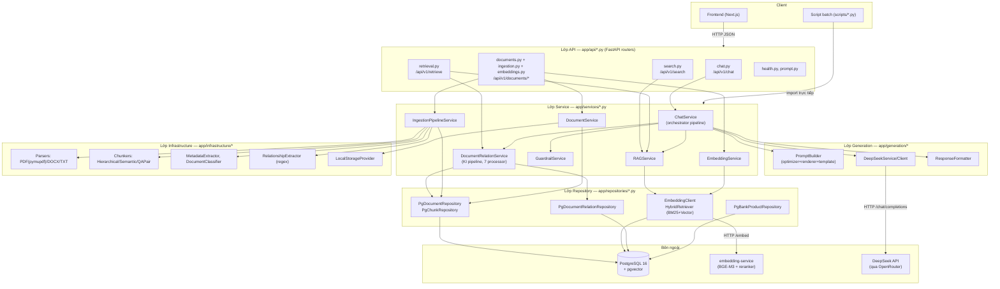
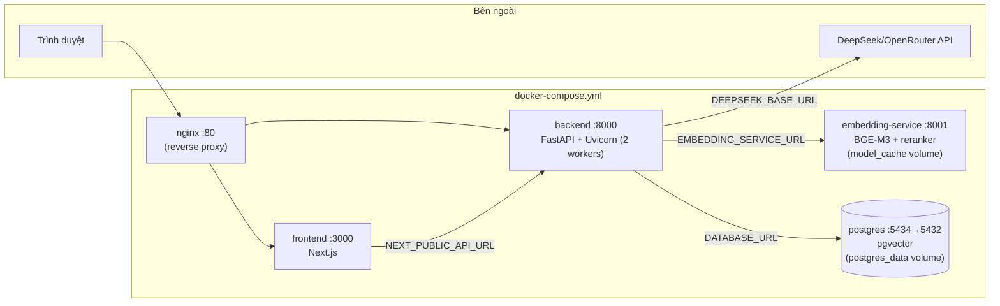
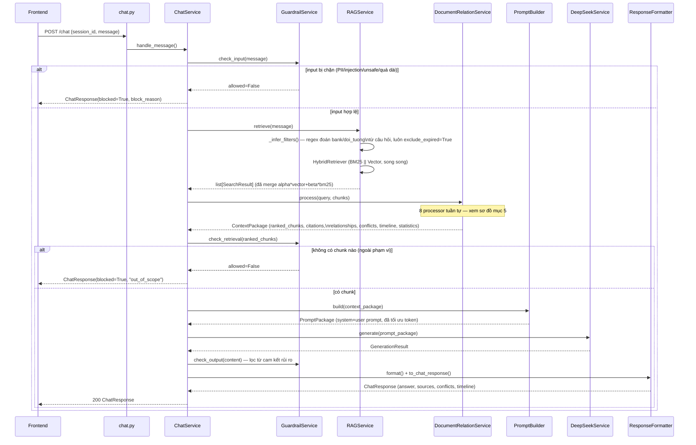
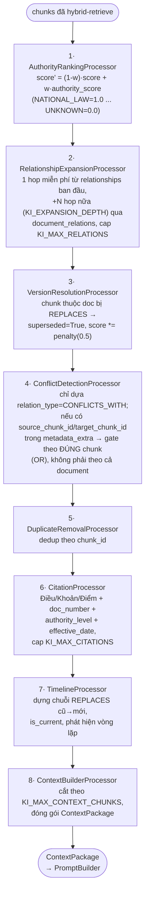
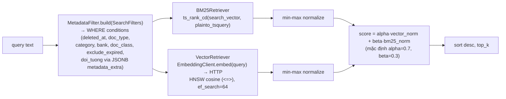
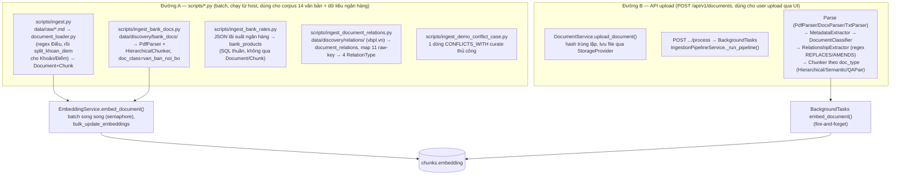
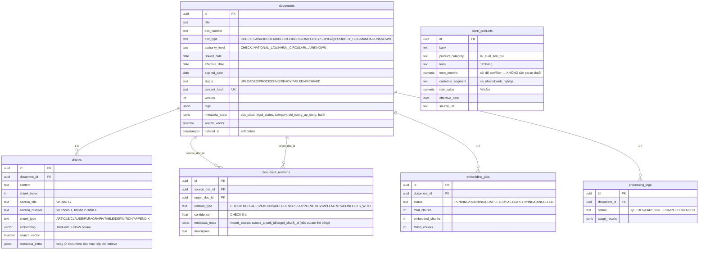

# Kiến trúc Backend — VAIC RAG Tiền Gửi (SHB)

> Tài liệu này mô tả kiến trúc **thật** của `backend/` tại thời điểm viết (đọc trực tiếp toàn
> bộ source, không suy đoán). Xem thêm `doc/KI_Pipeline_Test_Plan.md` (chi tiết 7 xử lý trong
> Knowledge Intelligence pipeline) và `doc/Corpus_Ingestion_Ontology_Plan.md` /
> `doc/Ontology_Implementation_Proposal.md` (lịch sử quyết định ontology).

## 1. Tổng quan

Backend là **1 service FastAPI (Python 3.12, async)**, kiến trúc phân lớp kiểu layered/hexagonal
rút gọn (không dùng framework DI phức tạp, wiring thủ công qua `core/dependencies.py`). Không có
microservice tách biệt cho RAG — chỉ có **1 service phụ trợ** là `embedding-service` (chạy model
BGE-M3 cho embedding + rerank) tách riêng vì cần GPU/RAM lớn và vòng đời model khác với API chính.

| Thành phần | Công nghệ |
|---|---|
| Web framework | FastAPI + Uvicorn (2 workers) |
| DB | PostgreSQL 16 + pgvector (HNSW index, cosine distance) |
| ORM | SQLAlchemy 2.0 async + Alembic (5 migration, 001→005) |
| Embedding | BGE-M3 (1024 chiều), HTTP service riêng (`docker/embedding_server.py`) |
| Rerank | BGE-reranker-v2-m3 (cùng service, endpoint `/rerank` — **có sẵn nhưng chưa được `HybridRetriever` gọi**, xem mục 9) |
| LLM | DeepSeek (qua OpenAI-compatible client), thực tế trỏ qua OpenRouter (`DEEPSEEK_BASE_URL`) |
| Retrieval | Hybrid BM25 (Postgres tsvector) + Vector (pgvector HNSW), trộn điểm có trọng số |
| Logging | structlog, JSON logs ở production |
| Đóng gói | Docker Compose: `postgres`, `embedding-service`, `backend`, `frontend`, `nginx` |

---

## 2. Sơ đồ tổng thể (layered architecture)



**Nguyên tắc phân lớp thật sự đang áp dụng:**
- `api/` chỉ parse request → gọi service → map response, không có logic nghiệp vụ.
- `services/` chứa orchestration + business rule, KHÔNG tự viết SQL (gọi qua `repositories/`).
- `repositories/` là lớp duy nhất chạm SQLAlchemy/DB trực tiếp.
- `models/` tách 3 loại rõ ràng: `entities.py` (domain dataclass, không phụ thuộc DB/HTTP),
  `orm.py` (SQLAlchemy table mapping), `schemas.py` (Pydantic — hợp đồng API). Repository chịu
  trách nhiệm map qua lại `entity ⟷ orm model`.
- `generation/` là lớp riêng cho pha sinh câu trả lời (prompt building, gọi LLM, format response)
  — tách khỏi `services/` vì đây là phần được thêm sau (Wave 4), độc lập với RAG core.

---

## 3. Sơ đồ triển khai (Docker Compose)



`backend` phụ thuộc healthcheck của `postgres` + `embedding-service` (`depends_on: condition:
service_healthy`) trước khi start. Scripts batch (`scripts/*.py`) chạy **từ host**, không đóng gói
trong image `backend` (`docker/backend.Dockerfile` chỉ COPY `app/`, `alembic/`, `alembic.ini` —
không có `scripts/`) — kết nối `localhost:5434`/`localhost:8001` (giá trị mặc định trong
`core/config.py`).

---

## 4. Luồng chính: `POST /api/v1/chat`



`POST /api/v1/chat/stream` giống hệt luồng trên nhưng **bỏ qua bước 7 (output guardrail) và
ResponseFormatter** — trả token thô qua SSE ngay khi LLM sinh ra (`stream_generate`), không lọc
"cam kết lãi suất" ở bản stream.

---

## 5. Knowledge Intelligence Pipeline (7 processor + citation/timeline)

`DocumentRelationService.process()` chạy 1 `KnowledgePipeline` gồm 8 processor tuần tự trên 1
`KnowledgeContext` dùng chung (mỗi processor sửa context tại chỗ):



**Ghi chú quan trọng (đã verify trực tiếp trong code, không phải suy đoán):**
- `DocumentRelationService.detect_conflicts()` (heuristic so khớp `section_title` trùng nhau
  giữa 2 doc khác nhau) **tồn tại nhưng KHÔNG được wire vào pipeline production** — chỉ dùng
  trong unit test. Lý do: corpus có rất nhiều Điều trùng tiêu đề giữa văn bản không liên quan
  ("Điều 1. Phạm vi điều chỉnh") → sẽ false-positive tràn lan nếu bật.
  `ConflictDetectionProcessor` (bản THẬT đang chạy) chỉ đọc `document_relations` với
  `relation_type='CONFLICTS_WITH'` tường minh.
- Corpus 14 văn bản hiện **không có case mâu thuẫn thật nào** giữa 2 văn bản cùng hiệu lực (đã
  rà soát). 1 case demo được curate thủ công qua `scripts/ingest_demo_conflict_case.py`, gắn
  `source_chunk_id`/`target_chunk_id` cụ thể để tránh trigger sai cho câu hỏi không liên quan.
- `apply_amendment()`/`apply_partial_supersession()` là 2 method độc lập trên
  `DocumentRelationService`, **không nằm trong `_build_pipeline()`** — được gọi trực tiếp ở nơi
  khác hoặc chỉ dùng trong test; version resolution thật trong pipeline production là
  `VersionResolutionProcessor` (bước 3 ở trên).

---

## 6. Retrieval: Hybrid BM25 + Vector



`RAGService._infer_filters()` (`app/services/rag_service.py`) làm "intent routing" tối thiểu
bằng keyword/regex trên câu hỏi (không dùng LLM classify): phát hiện tên ngân hàng → set
`filters.bank`; phát hiện "doanh nghiệp/công ty/tổ chức" → `filters.doi_tuong="doanh_nghiep"`;
luôn set `exclude_expired=True`.

**Chưa dùng:** endpoint `/rerank` của embedding-service tồn tại (`docker/embedding_server.py`)
nhưng `HybridRetriever` không gọi nó — không có bước rerank sau khi merge BM25+Vector.

---

## 7. Ingestion — 2 đường độc lập

Có **2 pipeline ingest hoàn toàn tách biệt**, không dùng chung code:



**Khác biệt quan trọng giữa 2 đường:**
- Đường A (batch) là nguồn ingest **thật sự đang dùng** cho corpus pháp lý + dữ liệu 5 ngân hàng
  của demo — không đi qua `IngestionPipelineService`/`RelationshipExtractor` (đó là code cho
  luồng upload user, hiện chưa có dữ liệu thật nào ingest qua đó).
- `RelationshipExtractor` (regex `thay thế .../sửa đổi ...`) chỉ tồn tại ở Đường B, chỉ detect
  được `REPLACES`/`AMENDS`, **không có khả năng detect `CONFLICTS_WITH`** — đây là lý do case
  conflict phải curate thủ công (mục 5).
- Ontology metadata (`doc_class`, `legal_status`, `category`, `doi_tuong_ap_dung`) chỉ được gắn ở
  Đường A (script `ingest.py`/`ingest_bank_docs.py`), lưu trong `metadata_extra` JSONB — **không
  có cột SQL riêng** (quyết định kiến trúc: tránh phình schema, xem
  `doc/Corpus_Ingestion_Ontology_Plan.md`).
- `scripts/ingest.py` idempotent theo **`doc_number`** (không phải `content_hash`) — git checkout
  trên Windows có thể đổi line-ending làm hash lệch giữa các lần chạy.

---

## 8. Schema Database (ERD)



`bank_products` **không có FK** tới `documents`/`chunks` — tách biệt hoàn toàn vì đây là số liệu
có cấu trúc cần so sánh chính xác bằng SQL (`ORDER BY rate_value`), không phải nội dung để
semantic search (nguyên tắc đã chốt khi thiết kế Lớp C, xem
`doc/Ontology_Implementation_Proposal.md` mục 4).

---

## 9. Danh sách API (theo router)

| Router | Prefix | Endpoint chính |
|---|---|---|
| `health.py` | `/health` | `GET /`, `/live`, `/ready` (kiểm tra DB) |
| `documents.py` | `/api/v1/documents` | CRUD: upload (multipart), list (phân trang+filter), get, patch, soft-delete |
| `ingestion.py` | `/api/v1/documents/{id}` | `POST /process` (BackgroundTask), `GET /processing-status`, `GET /chunks`, `GET /relationships` |
| `embeddings.py` | `/api/v1/documents/{id}/embeddings` | trigger, status, list jobs, cancel |
| `search.py` | `/api/v1/search` | `POST /` (hybrid search thô), `POST /preview` (kèm điểm thành phần debug), `GET /rates/compare` (SQL `bank_products`), `GET /health` |
| `retrieval.py` | `/api/v1/retrieve` | `POST /context` (full KI pipeline → `ContextPackage`), `POST /preview` (kèm raw retrieval), `GET /health` |
| `chat.py` | `/api/v1/chat` | `POST /` (full pipeline), `POST /stream` (SSE), `GET /health` |
| `prompt.py` | `/api/v1/prompt` | `POST /build`, `POST /preview` — debug prompt template không cần chạy retrieval thật |

`GET /metrics` (root, không qua router) — uptime/env/version, `include_in_schema=False`.

---

## 10. Cấu hình quan trọng (`app/core/config.py`)

Tất cả field `Settings` đọc từ env var cùng tên (Pydantic Settings, `.env` ở root repo). Nhóm
đáng chú ý cho việc tune hệ thống mà không cần sửa code:

- **Search**: `SEARCH_HYBRID_ALPHA/BETA` (0.7/0.3), `SEARCH_DEFAULT_TOP_K` (10),
  `SEARCH_BM25_TOP_K`/`SEARCH_VECTOR_TOP_K` (20, số ứng viên trước khi merge).
- **KI**: `KI_EXPANSION_DEPTH` (2 hop), `KI_MAX_RELATIONS` (20), `KI_AUTHORITY_WEIGHT` (0.2),
  `KI_CONFLICT_DETECTION_ENABLED`/`KI_TIMELINE_ENABLED`/`KI_CITATION_ENABLED` (bật/tắt từng
  processor mà không sửa code).
- **Embedding**: `EMBEDDING_BATCH_SIZE` (32), `EMBEDDING_MAX_CONCURRENCY` (4, semaphore) —
  **đã gặp vấn đề thật**: văn bản 1276 chunk từng làm embedding-service quá tải, timeout hàng
  loạt batch (668/1276 fail) — không có retry ở mức batch trong `EmbeddingService`, phải chạy
  lại thủ công batch nhỏ tuần tự. Không phải bug đã fix, là giới hạn hạ tầng cần biết khi
  ingest văn bản rất lớn.
- **LLM**: `LLM_MAX_PROMPT_TOKENS` (6000, ngân sách cho `PromptOptimizer` cắt bớt context).

---

## 11. Test suite

`backend/tests/` — 95 test case, chạy độc lập không cần DB/service thật (mock/monkeypatch ở biên
DB, dùng `AsyncMock`/monkeypatch thẳng các hàm `_fetch_*` thay vì giả lập SQLAlchemy result):

- `test_ki_pipeline_processors.py` — 34 case, 7 chức năng KI (xem
  `doc/KI_Pipeline_Test_Plan.md` để biết ma trận đầy đủ).
- `test_document_relation.py` — case bổ sung cho `apply_amendment`/`detect_conflicts` (helper
  không wire vào pipeline).
- `test_chat_service_wave4.py`, `test_response_formatter.py`, `test_prompt_builder.py`,
  `test_deepseek_client.py`, `test_guardrails.py`, `test_main.py`.

---

## 12. Điểm cần lưu ý khi mở rộng (rút ra từ quá trình làm việc thật, không phải lý thuyết)

1. **2 đường ingest không dùng chung code** (mục 7) — sửa `document_loader.py`/chunker không tự
   động áp dụng cho luồng upload API và ngược lại.
2. **`metadata_extra` JSONB là nơi lưu mọi thứ "ontology"** — không có cột SQL riêng cho
   `doc_class`/`category`/`legal_status`/`doi_tuong_ap_dung`/`bank`. Muốn filter thêm field mới
   → sửa `MetadataFilter.build()` + `SearchFilters` dataclass trong `vector_store.py`, không cần
   migration.
3. **`document_id`/`chunk_id` đổi mới mỗi lần re-ingest** (`scripts/ingest.py` xoá document cũ
   theo `doc_number` rồi tạo lại với UUID mới) — bất kỳ dữ liệu nào tham chiếu chunk/document cụ
   thể bằng UUID cứng (vd case conflict demo, mục 5) **phải chạy lại script tương ứng** sau khi
   re-ingest corpus.
4. **Conflict detection theo chunk cụ thể, không theo văn bản** — khi thêm case `CONFLICTS_WITH`
   mới, luôn gắn `source_chunk_id`/`target_chunk_id` vào `metadata_extra`, nếu không sẽ trigger
   sai cho mọi câu hỏi vô tình retrieve trúng 1 trong 2 văn bản.
5. **Reranker có sẵn nhưng chưa dùng** (mục 6) — nếu cần tăng độ chính xác top-k, đây là chỗ mở
   rộng rẻ nhất (`EmbeddingClient` gọi thêm `/rerank`, không cần train/deploy model mới).

---

## 13. Đối chiếu với kiến trúc tham chiếu "Advanced RAG" (enterprise reference model)

Kiến trúc tham chiếu dưới đây là mô hình Advanced RAG cho tri thức doanh nghiệp (10 lớp, do
người dùng cung cấp để đối chiếu). Mục này map từng lớp sang trạng thái **thật** của code hiện
tại — không suy đoán, chỉ ghi nhận những gì đã verify trực tiếp trong source.

```
Enterprise Knowledge Sources
        │
        ▼
Document Processing Layer        (Docling/Marker Parser, OCR, Metadata Extraction, Classification)
        │
        ▼
Knowledge Structuring Layer      (Structure Parser theo loại văn bản, Relationship Extraction)
        │
        ├──────────────┬─────────────────
        ▼                              ▼
Semantic Knowledge Base        Metadata Repository
(PostgreSQL + pgvector + BM25) (Documents/Sections/Relationships/Versions/Authorities)
        │
        ▼
Hybrid Retrieval Engine           (Metadata Filtering, BM25, Vector, Hybrid Ranking, Re-ranking)
        │
        ▼
Knowledge Intelligence Engine     (Authority/Relationship/Version/Amendment/Conflict/Citation/Timeline)
        │
        ▼
Prompt Construction Layer         (Context Assembly theo nguồn: Legal/Policy/SOP/FAQ/Product)
        │
        ▼
LLM Service Layer                 (DeepSeek V3 / GPT / Gemini)
        │
        ▼
Response Generation Layer         (Source-cited Answer, Legal Basis, Related Docs, Timeline,
                                    Confidence Score, Warning/Conflict Alert)
        │
        ▼
React Frontend                    (Chat, Document Viewer, Timeline, Relation Viewer, Search, Admin)
```

### 13.1 Bảng đối chiếu chi tiết

| Lớp tham chiếu | Trạng thái thật trong code | Verdict |
|---|---|---|
| **Enterprise Knowledge Sources** | Có Luật/Thông tư/Nghị định/Quyết định (14 văn bản `data/raw/`) + Product Docs/Internal Policy (`bank_docs/`, `doc_class=van_ban_noi_bo`). Enum `DocumentType.SOP/FAQ/MANUAL` **tồn tại nhưng chưa có dữ liệu thật nào thuộc 3 loại này được ingest** | ⚠️ Một phần |
| **Document Processing — Parser** | Không dùng Docling/Marker. Parser thật: `pymupdf` (PDF, đã fix từ bug `pypdf` thiếu — xem lịch sử), `python-docx` (DOCX), text thường (TXT). Không có layout-aware parsing/table extraction chuyên dụng | ⚠️ Đơn giản hơn tham chiếu |
| **Document Processing — OCR** | `NullOCRProvider` — **stub rỗng**, không OCR thật. PDF scan sẽ ra text rỗng/rác | ❌ Chưa có |
| **Document Processing — Metadata Extraction** | `MetadataExtractor` (regex số hiệu/ngày ban hành) **chỉ chạy ở luồng upload API** (Đường B, chưa có dữ liệu thật đi qua). Luồng batch thật (Đường A, `data/raw/`) dùng header regex riêng trong `document_loader.py`, không tái dùng | ⚠️ 2 cơ chế song song, không hợp nhất |
| **Document Processing — Classification** | Tương tự — `DocumentClassifier` (keyword-based) ở Đường B chưa dùng thật; Đường A dùng `infer_doc_class()` (suy từ chuỗi con trong `doc_id`, vd `"TT-"`→thông tư) trong `scripts/ingest.py` | ⚠️ 2 cơ chế song song |
| **Knowledge Structuring — Structure Parser** | Chỉ có nhánh **Luật/Thông tư**: Điều (`document_loader.py` regex `##`) → Khoản/Điểm (`split_khoan_diem`, heuristic dãy số/chữ tăng dần). **Không có cấp Chương** (Chapter) dù tham chiếu yêu cầu. SOP→Process/Step, FAQ→Question/Answer, Manual→Heading/Section: code chunker tồn tại (`QAPairChunker`, `SemanticChunker`) nhưng **chưa có dữ liệu thật để chạy qua** | ⚠️ Chỉ 1/5 loại có dữ liệu thật |
| **Knowledge Structuring — Relationship Extraction** | Tham chiếu: `REFERENCES/IMPLEMENTS/RELATED/SUPERSEDES/DEPENDS_ON/EXPLAINS` (6 loại). Thật: enum `RelationType` = `REPLACES/AMENDS/REFERENCES/SUPPLEMENTS/IMPLEMENTS/CONFLICTS_WITH` (6 loại, **tên khác, ánh xạ không 1-1** — vd không có `RELATED`/`DEPENDS_ON`/`EXPLAINS` riêng, `CONFLICTS_WITH` là thứ tham chiếu không liệt kê). Nguồn dữ liệu quan hệ thật: `scripts/ingest_document_relations.py` map 11 raw-key từ vbpl.vn → 4/6 giá trị enum (không tự sinh `CONFLICTS_WITH`/`SUPPLEMENTS`); regex extractor (`RelationshipExtractor`, chỉ `REPLACES`/`AMENDS`) chỉ chạy ở Đường B chưa có dữ liệu | ⚠️ Có, nhưng taxonomy khác + 2 nguồn không hợp nhất |
| **Semantic Knowledge Base** | PostgreSQL + pgvector (HNSW cosine) + BM25 (`tsvector`/`ts_rank_cd`) — **khớp đúng tham chiếu** | ✓ |
| **Metadata Repository — Documents** | Bảng `documents` đầy đủ | ✓ |
| **Metadata Repository — Sections** | Không có bảng `sections` riêng — `chunks` kiêm luôn vai trò "section" (1 chunk = 1 Điều/Khoản/Điểm) | ⚠️ Gộp chung, không tách bảng |
| **Metadata Repository — Relationships** | Bảng `document_relations` — khớp | ✓ |
| **Metadata Repository — Versions** | Cột `documents.version` tồn tại nhưng **không có lịch sử phiên bản thật** — re-ingest xoá hẳn document cũ (theo `doc_number`) rồi tạo mới, không giữ bản trước. "Version" thực chất được mô hình hoá qua quan hệ `REPLACES` (`TimelineProcessor`), không qua cột `version` | ⚠️ Cột tồn tại nhưng không phải cơ chế versioning thật |
| **Metadata Repository — Authorities** | `authority_level` là 1 cột enum trên `documents`, **không phải bảng chuẩn hoá riêng** (không có bảng `authorities` với thuộc tính/độ ưu tiên tách biệt — trọng số ánh xạ hard-code trong `_DEFAULT_AUTHORITY_SCORES` của `AuthorityRankingProcessor`) | ⚠️ Đơn giản hoá thành enum + dict hard-code |
| **Hybrid Retrieval — Metadata Filtering** | `MetadataFilter.build()` — khớp | ✓ |
| **Hybrid Retrieval — BM25 / Vector / Hybrid Ranking** | `BM25Retriever`/`VectorRetriever`/`HybridRetriever` — khớp | ✓ |
| **Hybrid Retrieval — Cross-Encoder Re-ranking** | Endpoint `/rerank` (BGE-reranker-v2-m3) **có sẵn trong embedding-service nhưng `HybridRetriever` không gọi** — đã nêu ở mục 6/12 | ❌ Có hạ tầng, chưa nối |
| **Knowledge Intelligence Engine** | Cả 7 mục (Authority Ranking, Relationship Expansion, Version Resolver, Amendment Resolver, Conflict Detection, Citation Builder, Timeline Builder) — **khớp chính xác tên gọi và đã implement đầy đủ**, xem mục 5 + `doc/KI_Pipeline_Test_Plan.md` | ✓ Khớp nhất trong toàn bộ đối chiếu |
| **Prompt Construction — Context Assembly** | `PromptOptimizer` + `PromptRenderer` gộp chunk theo thứ tự điểm số, **không phân nhóm theo nguồn** (Legal Basis/Internal Policy/SOP/FAQ/Product) như tham chiếu — dù mỗi chunk có sẵn `doc_class` trong `metadata_extra` để phân nhóm nếu muốn | ⚠️ Có dữ liệu để làm, chưa tận dụng |
| **LLM Service Layer** | Chỉ 1 provider: `DeepSeekService`/`DeepSeekClient` (OpenAI-compatible), trỏ qua OpenRouter. **Không có lớp abstraction đa provider/fallback GPT/Gemini** — muốn đổi provider phải sửa code, không phải chọn runtime | ⚠️ Đơn provider, không có fallback |
| **Response Generation — Source-cited Answer / Legal Basis** | `sources` (kèm `doc_class`, `bank`) — khớp | ✓ |
| **Response Generation — Related Documents** | `ContextPackage.relationships` được tính trong pipeline nhưng **`ChatResponse` không expose field này** — chỉ `RetrieveContextResponse` (`/retrieve/context`, endpoint debug) có `relationships` | ❌ Có dữ liệu, không trả về ở endpoint chat thật |
| **Response Generation — Timeline** | `ChatResponse.timeline` — đã thêm (phiên làm việc gần đây) | ✓ |
| **Response Generation — Confidence Score** | `ResponseFormatter` **có tính** `confidence_score` (trung bình top-3 điểm chunk) nhưng field này chỉ có ở `AnswerPackage` (nội bộ) và `ChatResponseV2` (**schema tồn tại nhưng không route nào dùng — dead code**, đã verify grep). `ChatResponse` (schema thật đang trả về) không có field này | ❌ Tính ra rồi bỏ, chưa trả về client |
| **Response Generation — Warning/Conflict Alert** | `ChatResponse.conflicts` (kèm `source_title`/`target_title`) — khớp | ✓ |
| **React Frontend — Chat** | `ChatWindow`, `MessageBubble`, `MessageInput`, `ConflictNotice`, `RateTableCard`, `InterestCalculatorCard` | ✓ |
| **React Frontend — Document Viewer** | Không có component nào tương ứng | ❌ Chưa có |
| **React Frontend — Timeline / Relation Viewer** | Backend đã trả `timeline` (chat) và `relationships` (`/retrieve/context`), nhưng **frontend chưa có component hiển thị**, `types/chat.ts` cũng chưa khai báo field `timeline` | ❌ Backend sẵn sàng, frontend chưa nối |
| **React Frontend — Search** | Không có UI search độc lập (chỉ có chat) | ❌ Chưa có |
| **React Frontend — Admin Panel** | `AdminDashboardView`, `AdminSidebar`, `DocumentTable`, `DocumentFormModal` — khớp (CRUD tài liệu) | ✓ |

### 13.2 Tóm tắt khoảng cách (gap) lớn nhất theo mức độ ưu tiên nếu muốn tiến gần hơn tới tham chiếu

1. **Cross-Encoder Re-ranking** — hạ tầng đã có (endpoint `/rerank` chạy sẵn trong
   embedding-service), chỉ cần sửa `HybridRetriever`/`RAGService` để gọi thêm 1 bước sau khi
   merge BM25+Vector. Đây là gap rẻ nhất để đóng.
2. **Confidence Score bị tính rồi bỏ** — `ChatResponse` chỉ cần thêm 1 field
   `confidence_score: float | None`, `ResponseFormatter.to_chat_response()` gán từ
   `answer_package.confidence_score` (đã có sẵn giá trị, không cần logic mới). Có thể xoá luôn
   `ChatResponseV2` (dead code) nếu không có kế hoạch dùng.
3. **Related Documents không trả về ở `/chat`** — tương tự, `context_package.relationships` đã
   có sẵn, chỉ thiếu field + mapping trong `ResponseFormatter` (đã có sẵn `RelationshipResponse`
   schema dùng cho `/retrieve/context`, có thể tái dùng).
4. **2 cơ chế Metadata Extraction/Classification song song không hợp nhất** (Đường A vs B) —
   rủi ro drift lâu dài nếu 1 bên được sửa mà quên bên kia; cần quyết định giữ 1, không phải
   gap tính năng mà là nợ kỹ thuật.
5. **OCR, Document Viewer, Relation Viewer, Search UI** — chưa có, khối lượng công việc lớn
   nhất trong danh sách, không phải "gắn thêm field" mà cần xây mới từ đầu.
6. **Taxonomy quan hệ khác tên** (`RELATED`/`DEPENDS_ON`/`EXPLAINS` không tồn tại) — nếu cần
   khớp đúng tên tham chiếu thì phải đổi `RelationType` enum + migration CHECK constraint +
   toàn bộ nơi map raw-key (`ingest_document_relations.py`), ảnh hưởng rộng hơn các gap khác.
