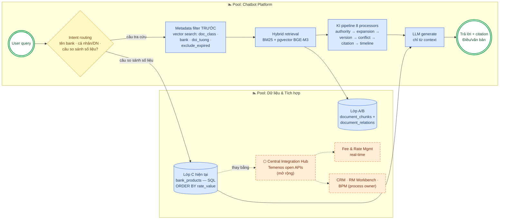

# Cơ chế Ontology trong SHB RAG Chatbot — nó là gì, hoạt động thế nào, và tại sao giúp RAG tốt hơn

> Tài liệu giải thích, đọc kèm `So_sanh_tieu_chi_Knowledge_Intelligence.md`.
> Grounding: thiết kế ontology trong `data/discovery/ontology-tien-gui.md`, validation và
> implementation plan trong `doc/Ontology_Implementation_Proposal.md`, code thật trong
> `backend/app/` (document_loader, vector_store, rag_service, document_relation_service),
> corpus thật `data/raw/` (14 văn bản pháp lý, 474 Điều).

Cập nhật: 2026-07-19.

---

## 1. Ontology là gì (trong ngữ cảnh dự án này)?

**Ontology (bản thể học)** là mô hình hóa tường minh các **khái niệm** của một miền tri thức
(domain), **thuộc tính** của chúng, và **quan hệ** giữa chúng — để máy "hiểu" miền đó theo đúng
cấu trúc thật, thay vì coi mọi thứ là text phẳng.

Với miền tiền gửi ngân hàng, ontology trả lời các câu hỏi nền tảng:

- Một *văn bản pháp lý* gồm những gì? → `VanBanPhapLy` (số hiệu, ngày hiệu lực, cơ quan ban
  hành, trạng thái) chứa `Dieu` → `Khoan` → `Diem` — đúng cấu trúc văn bản pháp luật Việt Nam.
- Một *sản phẩm tiền gửi* là gì? → `SanPhamTienGui` (kỳ hạn, loại lãi suất, điều kiện tất toán
  trước hạn) với các subclass: không kỳ hạn / có kỳ hạn / tiết kiệm / chuyên dụng.
- *Ai* được dùng sản phẩm nào? → `ChuThe` (CaNhan / DoanhNghiep / ToChucTinDung).
- Văn bản *liên hệ với nhau* thế nào? → các quan hệ `thayThe` (supersedes), `amends`,
  `huong_dan` (hướng dẫn thi hành), `cross_reference`.
- Số liệu thị trường *neo vào pháp lý* ở đâu? → `SanPhamCuThe` (lãi suất công bố của từng
  ngân hàng) có quan hệ `tuanThu` trỏ về Điều/văn bản khung (vd trần lãi suất TT 48/2024).

Điểm mấu chốt: **ontology không phải tài liệu trang trí — nó được materialize thành schema
database, metadata trên từng chunk, và filter trong retrieval pipeline.** Đó là khác biệt giữa
"có vẽ sơ đồ" và "hệ thống chạy theo sơ đồ".

---

## 2. Mô hình 3 lớp tri thức

Ontology chia toàn bộ tri thức của hệ thống thành 3 lớp, mỗi lớp có bản chất dữ liệu và cách
lưu trữ/truy vấn khác nhau:

| Lớp | Nội dung | Nguồn | Bản chất | Lưu ở |
|---|---|---|---|---|
| **A — Pháp lý** | Luật, Nghị định, Thông tư NHNN, Pháp lệnh (14 văn bản, 474 Điều) | vbpl.vn, API Bộ Tư pháp | Text có cấu trúc Điều/Khoản + quan hệ giữa văn bản | `document_chunks` + `document_relations` |
| **B — Nghiệp vụ** | Quy định nội bộ, T&C sản phẩm, thủ tục, FAQ | Tài liệu ngân hàng | Text bán cấu trúc, gắn với ngân hàng cụ thể | `document_chunks` với `doc_class='van_ban_noi_bo'` + cột `bank` |
| **C — Thị trường** | Bảng lãi suất, biểu phí của 5 ngân hàng (SHB, BIDV, VietinBank, VCB, Techcombank) | API/PDF chính thức từng ngân hàng | **Số liệu có cấu trúc** — cần lọc/so sánh chính xác | Bảng riêng `bank_products` (bank, term, rate_value, effective_date...) |

Vì sao phải tách lớp? Vì **câu hỏi khác nhau cần cơ chế truy vấn khác nhau**:

- *"Rút trước hạn tính lãi thế nào?"* → semantic search trên Lớp A (văn bản pháp lý).
- *"Ngân hàng nào lãi suất 12 tháng cao nhất?"* → **SQL chính xác** trên Lớp C:
  `SELECT bank, rate_value FROM bank_products WHERE term='12 tháng' ORDER BY rate_value DESC`
  — không để LLM tự đọc số từ nhiều chunk rồi so sánh (rủi ro đọc nhầm/làm tròn).
- *"Thủ tục mở sổ tiết kiệm SHB?"* → semantic search trên Lớp B, filter `bank='SHB'`.

Một hệ thống RAG "vanilla" nhét cả 3 loại vào chung một vector store sẽ làm cả 3 loại câu hỏi
tệ đi cùng lúc.

---

## 3. Ontology được materialize vào hệ thống thế nào?

### 3.1 Chunking theo cấu trúc pháp lý (Điều-level)

Thay vì cắt văn bản theo cửa sổ N token (fixed-size chunking), `document_loader.py` tách theo
**đơn vị ngữ nghĩa pháp lý** — mỗi Điều là một chunk, giữ metadata `section_number`
("Điều 17"), `section_title`, `doc_number`, `effective_date`, `authority_level`. Hệ quả:

- Chunk không bao giờ cắt đôi một Điều → LLM luôn nhận trọn vẹn một đơn vị quy định.
- Citation trả về đúng ngôn ngữ của nghiệp vụ: *"Điều 17, TT 48/2018/TT-NHNN"* — thứ mà
  compliance officer verify được, thay vì "chunk #47".
- Schema đã dành sẵn cột `khoan`/`diem` (nullable) để nâng độ phân giải xuống Khoản/Điểm
  sau hackathon (regex đã thiết kế, quyết định hoãn có chủ đích vì Điều-level đã chạy
  end-to-end với 474 chunks).

### 3.2 Metadata ontology trên từng chunk

Mỗi chunk mang các thuộc tính ontology, suy ra tự động lúc ingest:

- `doc_class`: luat / nghi_dinh / thong_tu / thong_tu_hop_nhat / quyet_dinh / phap_lenh /
  van_ban_noi_bo — infer từ chính số hiệu văn bản (vd "TT-NHNN" → thong_tu, "QH15" → luat).
- `doi_tuong_ap_dung`: `{ca_nhan}`, `{ca_nhan, doanh_nghiep}` — lấy từ nội dung thật của văn
  bản (vd TT 48/2018 Điều 3 chỉ áp dụng cá nhân).
- `bank`: NULL với văn bản pháp lý, tên ngân hàng với tài liệu Lớp B.
- `authority_level`: NATIONAL_LAW > NHNN_CIRCULAR > NHNN_DECISION > INTERNAL_POLICY >
  DEPARTMENT_SOP > FAQ — đầu vào cho Authority Ranking.
- `effective_date` / `expired_date` / `status`: đầu vào cho version resolution và filter
  `exclude_expired`.

### 3.3 Quan hệ giữa văn bản — đồ thị ontology trong PostgreSQL

Bảng `document_relations` lưu các cạnh của đồ thị: `supersedes/REPLACES`, `AMENDS`,
`huong_dan`, `cross_reference/REFERENCES`, `CONFLICTS_WITH` — kèm `confidence`, `description`,
và (với conflict/supersession) `source_chunk_id`/`target_chunk_id` trỏ đến **đúng Điều/Khoản**
liên quan. Nhiều quan hệ lấy trực tiếp từ chính văn bản (vd Điều 22 TT 48/2018 tự khai báo
*"thay thế Quyết định 1160/2004/QĐ-NHNN..."*), không phải suy đoán.

Đây chính là dữ liệu nuôi 4 tính năng KI: cross-reference expansion (BFS trên đồ thị),
amendments, partial supersession, conflict detection.

### 3.4 Lớp C — `bank_products`, nơi số liệu được đối xử như số liệu

Bảng riêng với `rate_value numeric`, `term`, `customer_segment`, `channel`, `effective_date`,
unique constraint chống trùng khi re-ingest, và cột `quy_dinh_boi_*` — hiện thực hóa quan hệ
ontology `SanPhamCuThe --tuanThu--> VanBanPhapLy`: mỗi con số lãi suất biết mình chịu sự điều
chỉnh của văn bản khung nào.

---

## 4. Cách hoạt động lúc trả lời một câu hỏi (BPMN)

Diagram theo ký pháp BPMN (pool/lane, gateway, event). **Quy ước màu:** 🟦 xanh = đang chạy;
🟧 cam viền đứt = điểm mở rộng (chi tiết: `Kha_nang_mo_rong_Extensibility.md`).

Bước quan trọng nhất về mặt ontology: **filter cứng theo metadata chạy TRƯỚC similarity
search** (RPC `match_document_chunks` nhận `filter_doc_class`, `filter_bank`,
`filter_doi_tuong`). Câu hỏi "lãi suất tiền gửi doanh nghiệp" sẽ không bao giờ nhận chunk của
TT 48/2018 (chỉ áp dụng cá nhân) — dù embedding của 2 chủ đề này gần nhau đến đâu.

---

## 5. Tại sao ontology giúp RAG tốt hơn? (vanilla RAG vs ontology-grounded RAG)

Vanilla RAG = cắt document theo token, embed, cosine similarity, đưa top-k vào LLM. Nó thất
bại có hệ thống trên miền pháp lý vì **similarity không mang ngữ nghĩa pháp lý**:

| # | Vấn đề của vanilla RAG | Ontology giải quyết thế nào | Ví dụ cụ thể |
|---|---|---|---|
| 1 | **Retrieve nhầm văn bản hết hiệu lực** — bản cũ và bản mới có embedding gần như giống hệt nhau, bản cũ thậm chí match keyword tốt hơn | `effective_date`/`status` + quan hệ `supersedes` → version resolution tự động, filter `exclude_expired` ngay tầng SQL | TT 48/2018 vs TT 48/2024: vanilla RAG trả cả hai với score ngang nhau; hệ thống này phạt score bản cũ ×0.5 + version note |
| 2 | **Trả lời sai đối tượng áp dụng** — "lãi suất tiền gửi doanh nghiệp" match mạnh với văn bản chỉ dành cho cá nhân | `doi_tuong_ap_dung` filter cứng trước vector search | Câu hỏi doanh nghiệp không bao giờ nhận Điều của TT 48/2018 (chỉ cá nhân) |
| 3 | **Thiếu ngữ cảnh từ văn bản liên quan** — Thông tư dẫn chiếu Luật nhưng Luật không match keyword của query | Đồ thị quan hệ → RelationshipExpansion BFS 2 hops kéo văn bản được tham chiếu vào context | Hỏi về BHTG: tự kéo đủ Luật 06/2012 → NĐ 68/2013 → TT 24/2014 |
| 4 | **Chunk cắt đôi điều khoản** — fixed-size chunking cắt giữa Khoản 1 và Khoản 2, LLM nhận nửa quy định | Chunking theo ranh giới Điều — đơn vị ngữ nghĩa pháp lý trọn vẹn | 474 chunks = 474 Điều nguyên vẹn, không có Điều nào bị cắt đôi |
| 5 | **LLM so sánh số liệu bằng "đọc hiểu"** — đưa 5 chunk bảng lãi suất vào context rồi hy vọng LLM so đúng | Số liệu ở bảng SQL riêng (`bank_products`), câu so sánh route sang SQL chính xác, LLM chỉ diễn đạt kết quả | "Bank nào lãi 12 tháng cao nhất" → 1 câu SELECT, số đúng 100%, kèm effective_date |
| 6 | **Mọi nguồn bình đẳng** — FAQ nội bộ được tin ngang Luật nếu similarity cao hơn | `authority_level` → Authority Ranking boost theo thẩm quyền pháp lý | Khi FAQ vênh Thông tư, Thông tư thắng trong ranking |
| 7 | **Im lặng trước mâu thuẫn** — 2 chunk vênh nhau cùng vào context, LLM chọn ngẫu nhiên 1 phía | Quan hệ `CONFLICTS_WITH` curate ở mức chunk → cảnh báo tường minh cả 2 phía | ConflictNotice trên UI, user thấy cả 2 citation |
| 8 | **Citation mơ hồ** — "theo tài liệu số 3" | Metadata Điều/số hiệu/ngày hiệu lực trên từng chunk → citation chuẩn pháp lý | "Điều 17, TT 48/2018/TT-NHNN, hiệu lực 05/07/2019" |

### Một cách nói ngắn gọn cho pitch

> Vector similarity trả lời câu hỏi *"đoạn text nào **giống** câu hỏi nhất?"*.
> Ontology trả lời câu hỏi *"quy định nào **đúng** để áp dụng: còn hiệu lực, đúng đối tượng,
> đúng thẩm quyền, đủ ngữ cảnh liên quan?"*.
> RAG pháp lý cần cả hai — và ontology là phần mà embedding model không bao giờ tự học được,
> vì hiệu lực văn bản không nằm trong ngữ nghĩa của câu chữ, nó nằm trong **quan hệ giữa các
> văn bản**.

### Bằng chứng ontology là "thật" chứ không phải khái niệm trang trí

1. **Nó đổ ra schema**: migration thêm `doc_class`, `doi_tuong_ap_dung`, `khoan/diem`, bảng
   `bank_products`, RPC filter — tất cả truy vết được trong `backend/alembic/versions/`.
2. **Nó sửa được bug thật**: validation ontology với corpus thật phát hiện 3 bug pipeline
   (dedup theo title làm mất Điều cùng văn bản; cross-reference kéo nguyên 210 Điều vào
   context; conflict giả giữa các văn bản chỉ trùng số Điều) — và cách sửa đúng của cả 3
   chính là dùng metadata + quan hệ ontology thay cho heuristic trên text
   (chi tiết: `Ontology_Implementation_Proposal.md` mục 3).
3. **Nó được test**: KI pipeline có test suite riêng (`test_ki_pipeline_processors.py`, ~740
   dòng) cover các processor tiêu thụ metadata ontology.

---

## 6. Tóm tắt 1 slide

- **Ontology = mô hình miền tiền gửi**: 3 lớp tri thức (pháp lý / nghiệp vụ / thị trường),
  cây VanBanPhapLy→Điều→Khoản→Điểm, các quan hệ thayThe/amends/huong_dan/conflicts, và liên
  kết số-liệu-tuân-thủ-văn-bản (`tuanThu`).
- **Cách hoạt động**: materialize thành metadata trên chunk + đồ thị quan hệ trong PostgreSQL
  + bảng số liệu riêng; lúc query: filter cứng metadata → hybrid search → KI pipeline làm giàu
  và kiểm soát context → LLM chỉ diễn đạt.
- **Tại sao RAG tốt hơn**: đúng hiệu lực (version), đúng đối tượng (filter), đủ ngữ cảnh
  (graph expansion), đúng thẩm quyền (authority), đúng con số (SQL cho Lớp C), minh bạch
  (citation Điều-level + cảnh báo conflict) — toàn bộ là những thứ vector similarity đơn
  thuần không làm được.
- **Tại sao dễ mở rộng**: ontology tách lớp nghĩa là nguồn của từng lớp thay được độc lập —
  Lớp C từ "bảng crawl" nâng thành Central Integration Hub gọi Fee/Rate Management real-time
  qua Temenos open APIs mà Lớp A/B và KI pipeline không đổi; domain mới (tín dụng, thanh toán
  quốc tế) chỉ cần áp lại template `VanBan → Điều → Khoản` + quan hệ `thayThe/huong_dan` —
  ingest corpus mới, không viết lại engine. Chi tiết: `Kha_nang_mo_rong_Extensibility.md`.
