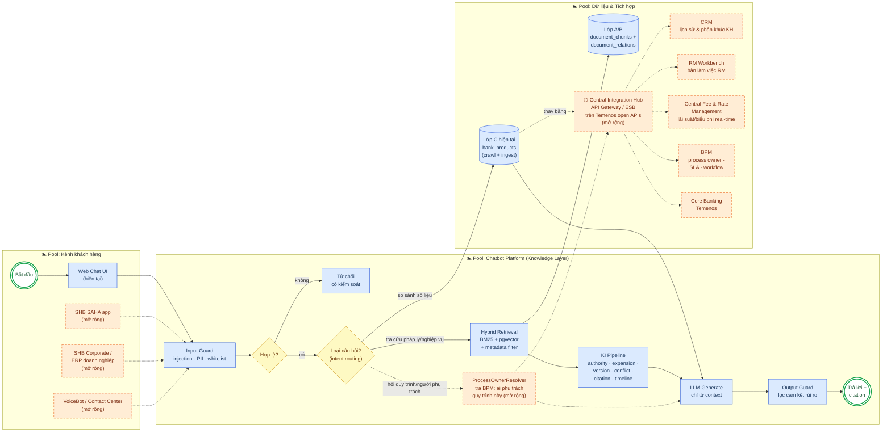
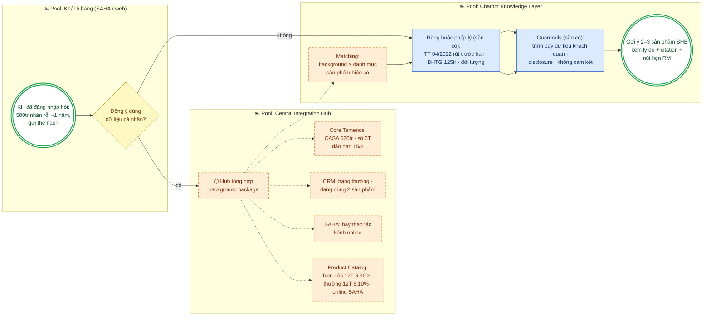
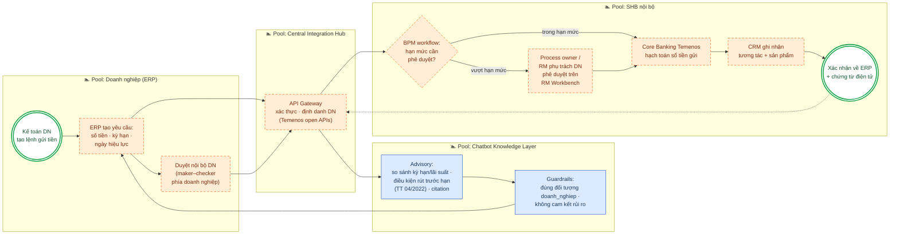

# Khả năng mở rộng (Extensibility) — từ RAG Chatbot đến Knowledge Layer của hệ sinh thái SHB

> Tài liệu trọng tâm về **tính mở rộng** của hệ thống, đọc kèm `Giai_thich_co_che_Ontology.md`
> và `Danh_gia_5_nhom_tieu_chi.md`. Diagram vẽ theo ký pháp **BPMN** (pool/lane, task, gateway,
> event) bằng mermaid.
>
> **Quy ước màu trong mọi diagram:**
> 🟦 **Xanh** = đã build, đang chạy trong repo hiện tại.
> 🟧 **Cam (viền đứt)** = tính năng mở rộng (extension) — thiết kế đã chừa sẵn chỗ cắm.

Cập nhật: 2026-07-19.

---

## 1. Vì sao hệ thống này "sinh ra để mở rộng"?

Ba quyết định kiến trúc ngay từ đầu khiến việc mở rộng là **cắm thêm module**, không phải đập
đi xây lại:

1. **Repository Pattern + Dependency Injection** (Clean Architecture): mọi nguồn dữ liệu nằm
   sau interface. Thay pgvector bằng Qdrant, hay thay "bảng `bank_products` crawl tay" bằng
   "API core banking real-time" — service layer **không đổi một dòng**.
2. **Ontology 3 lớp tách bạch nguồn tri thức**: Lớp A (pháp lý) ổn định, Lớp B (nội bộ) thay
   theo ngân hàng, Lớp C (thị trường/số liệu) thay theo **giờ**. Vì đã tách lớp, nâng cấp
   nguồn Lớp C không ảnh hưởng 2 lớp còn lại.
3. **KI pipeline dạng processor chain**: 8 processors chạy tuần tự qua interface
   `KnowledgeProcessor`, có `add_processor()` — thêm năng lực mới (vd `ProcessOwnerResolver`
   gọi BPM) = thêm 1 processor, không sửa pipeline.

Phía SHB, điều kiện hạ tầng cũng đã sẵn: SHB chọn **Temenos** làm nền tảng core/digital
banking với **kiến trúc mở — open APIs, microservices, Micro Apps** — cho omnichannel
(internet, mobile, chi nhánh, ATM), và đang vận hành hệ sinh thái số **SHB SAHA** (bán lẻ),
**SHB Corporate** (doanh nghiệp), giải pháp thanh toán cho trường học/bệnh viện/hành chính
công. Nghĩa là: **chatbot này không cần SHB xây thêm hạ tầng tích hợp — nó cắm vào đúng lớp
API mở mà SHB đã đầu tư.**

---

## 2. BPMN — Quy trình trả lời hiện tại và các điểm mở rộng

### Đọc diagram này thế nào

- **Toàn bộ luồng xanh** là hệ thống đang chạy end-to-end hôm nay: guard → routing → retrieval
  → KI pipeline → generate → guard → trả lời kèm citation.
- **Điểm mở rộng quan trọng nhất (cam): Central Integration Hub.** Hiện tại Lớp C là bảng
  `bank_products` do pipeline crawl/ingest nạp — đúng cho hackathon, nhưng bản chất là
  snapshot. Bước mở rộng: **mọi truy vấn số liệu không chạy thẳng vào DB nữa mà đi qua Hub**
  (API Gateway/ESB dựng trên chính lớp open API của Temenos mà SHB đã có), Hub tỏa ra:
  - **Central Fee & Rate Management** → lãi suất/biểu phí *real-time, single source of truth*
    thay cho số liệu crawl;
  - **CRM** → cá nhân hóa: biết phân khúc, lịch sử để trả lời đúng ưu đãi của đúng khách;
  - **RM Workbench** → câu hỏi vượt phạm vi bot chuyển thẳng cho đúng RM kèm ngữ cảnh hội thoại;
  - **BPM** → trả lời *"quy trình này ai chịu trách nhiệm, SLA bao lâu, đang ở bước nào"* —
    processor mở rộng `ProcessOwnerResolver` chỉ là thêm 1 mắt xích vào KI chain;
  - **Core Banking Temenos** → dữ liệu tài khoản/giao dịch cho các tác vụ thật.
- **Vì sao Hub chứ không tích hợp điểm-nối-điểm?** Chatbot chỉ biết 1 contract duy nhất
  (Hub API). Thêm/thay hệ thống đích (đổi CRM, thêm hệ thống phí mới) → cấu hình ở Hub,
  **chatbot không cần deploy lại**. Đây là pattern chuẩn của banking integration và khớp
  triết lý Repository Pattern sẵn có trong code.

---

## 3. Sản phẩm đầu ra chủ lực của phần mở rộng: Tư vấn sản phẩm hiện có theo background khách hàng

Đây là use case mở rộng đáng giá nhất — biến chatbot từ "trả lời đúng quy định" thành **máy
tư vấn sản phẩm của chính ngân hàng, đúng người đúng thời điểm**. Nguyên tắc: bot chỉ gợi ý
trong **danh mục sản phẩm hiện có** của ngân hàng, dựa trên **background thật của khách**
(có sự đồng ý), và mọi gợi ý đều kèm căn cứ (lãi suất niêm yết + quy định pháp lý).

### 3.1 Background khách hàng lấy từ hệ thống nào của SHB?

| Background cần cho tư vấn | Hệ thống SHB cung cấp | Dữ liệu cụ thể |
|---|---|---|
| **Danh mục sản phẩm hiện có + lãi suất niêm yết** | Product Catalog / Fee & Rate Management trên **core Temenos** | Tiết kiệm thông thường, Tiết kiệm Trọn Lộc, tiết kiệm online SAHA — kỳ hạn, rate, kênh (số liệu thật trong `data/discovery/bank_docs/shb/`) |
| **Số dư nhàn rỗi (CASA), sổ tiết kiệm đang có, ngày đáo hạn** | **Core banking Temenos** (qua open APIs) | Số dư khả dụng, danh sách sổ đang gửi, kỳ hạn, ngày đáo hạn, lãi suất đang hưởng |
| **Phân khúc & hồ sơ quan hệ** | **CRM** | Hạng khách (thường/ưu tiên), sản phẩm đang dùng, lịch sử tương tác, KYC profile |
| **Hành vi kênh số** | **SHB SAHA** (cá nhân) / **SHB Corporate** (doanh nghiệp) | Sản phẩm xem gần đây, thao tác trong app, kênh ưa thích (online vs tại quầy) |
| **Quy trình & thẩm quyền khi chốt** | **BPM** + **RM Workbench** | Hạn mức cần phê duyệt, RM phụ trách khách này |
| **Ràng buộc pháp lý của gợi ý** | Lớp A/B của chatbot (sẵn có) | Điều kiện rút trước hạn TT 04/2022, hạn mức BHTG 125 triệu, đối tượng áp dụng |

Toàn bộ đi qua **Central Integration Hub** — chatbot không gọi thẳng bất kỳ hệ thống nào,
chỉ nhận một "customer background package" chuẩn hóa từ Hub.

### 3.2 BPMN — luồng tư vấn sản phẩm theo background

### 3.3 Ví dụ đầu ra (mẫu hội thoại)

> **KH:** "Tôi có khoảng 500 triệu nhàn rỗi tầm 1 năm, gửi thế nào cho hợp lý?"
>
> **Bot:** "Dựa trên thông tin tài khoản của anh/chị (đã được anh/chị cho phép sử dụng):
> - Sổ tiết kiệm 6 tháng hiện tại sẽ **đáo hạn ngày 15/8** — anh/chị có thể gộp vào khoản gửi mới để hưởng kỳ hạn dài hơn.
> - Với nhu cầu ~1 năm, 2 sản phẩm SHB hiện có phù hợp: **Tiết kiệm Trọn Lộc 12 tháng — 6,30%/năm** (tại quầy) và **Tiết kiệm online trên SAHA 12 tháng** (anh/chị thường dùng kênh online).
> - Lưu ý theo **Thông tư 04/2022/TT-NHNN**: nếu rút trước hạn một phần, phần rút hưởng lãi không kỳ hạn, phần còn lại giữ nguyên lãi suất. Tiền gửi được **bảo hiểm tối đa 125 triệu đồng** theo QĐ 32/2021/QĐ-TTg.
>
> *Thông tin trên là dữ liệu sản phẩm và quy định hiện hành, không phải khuyến nghị đầu tư. Anh/chị muốn đặt lịch với chuyên viên phụ trách để chốt?* → [nút chuyển RM Workbench]

**Vì sao đây là mở rộng "rẻ" về kỹ thuật:** phần khó nhất (hiểu quy định, citation, guardrails,
so sánh lãi suất) là màu xanh — đã chạy. Phần cam chỉ là connector dữ liệu qua Hub + 1
processor matching. Và vì bot chỉ gợi ý **sản phẩm trong catalog của chính ngân hàng** kèm
disclosure, ranh giới compliance (không khuyến nghị đầu tư cá nhân hóa) được giữ bằng
guardrails sẵn có.

---

## 4. BPMN — Tính năng mở rộng: Doanh nghiệp gửi tiền qua ERP (bonus)

Kịch bản: kế toán doanh nghiệp đặt tiền gửi có kỳ hạn **ngay trong ERP** của họ, chatbot đóng
vai advisory layer, BPM điều phối phê duyệt, core banking hạch toán.

**Vì sao chatbot là mảnh ghép giá trị trong flow này:** phần khó của gửi tiền doanh nghiệp
không phải bút toán — mà là *tư vấn đúng quy định* (kỳ hạn nào, rút trước hạn mất gì theo
TT 04/2022, trần lãi suất nào áp dụng). Đó chính là năng lực Lớp A/B đang chạy (màu xanh
trong diagram — **advisory tái sử dụng nguyên vẹn**, không build mới). Phần cam là orchestration
quanh nó, dựng trên hạ tầng Temenos + BPM sẵn có của SHB.

---

## 5. SHB đang dùng công nghệ gì — và hệ thống này khớp vào đâu

| Hạ tầng SHB (công bố công khai) | Vai trò với chatbot | Trạng thái |
|---|---|---|
| **Temenos** core/digital banking — open architecture: **APIs, microservices, Micro Apps**, omnichannel | Lớp API mở để Central Hub gọi số liệu real-time, đặt lệnh; chatbot có thể đóng gói thành 1 Micro App trong hệ sinh thái Temenos | 🟧 điểm cắm chính |
| **SHB SAHA** (app bán lẻ thế hệ mới) | Kênh nhúng chatbot cho khách cá nhân | 🟧 kênh mở rộng |
| **SHB Corporate** (nền tảng doanh nghiệp) | Kênh cho flow ERP-deposit (mục 3) | 🟧 kênh mở rộng |
| Hệ sinh thái thanh toán trường học/bệnh viện/hành chính công | Các domain tri thức mới → chỉ cần ingest corpus + ontology mở rộng | 🟧 mở rộng domain |
| Chiến lược số 4 trụ cột, mục tiêu top đầu về công nghệ; giải "Ngân hàng chuyển đổi số của năm" | Chatbot knowledge layer khớp trực tiếp trụ cột "hiện đại hóa CNTT & chuyển đổi số" | Bối cảnh chiến lược |

> Lưu ý ranh giới dữ liệu: kiến trúc Temenos/chiến lược số là thông tin SHB công bố công khai;
> danh mục hệ thống nội bộ cụ thể (tên CRM, BPM engine SHB đang dùng) không công bố — vì vậy
> diagram gọi theo **vai trò** (CRM, BPM, Fee Management) chứ không đoán tên sản phẩm. Đây
> cũng chính là lý do Hub có giá trị: chatbot không cần biết SHB dùng CRM nào.

---

## 6. Roadmap mở rộng theo giai đoạn

| Giai đoạn | Nội dung | Nền tảng tận dụng | Effort chính |
|---|---|---|---|
| **Now (đã chạy)** | RAG + Ontology 3 lớp + KI pipeline + guardrails + `/rates/compare` | Repo hiện tại | — |
| **+1. Central Hub** | Thay đường "chạy thẳng vào DB Lớp C" bằng Hub → Fee & Rate Management real-time | Temenos open APIs | Dựng Hub contract; đổi 1 repository implementation |
| **+2. Tư vấn theo background KH** ⭐ | Sản phẩm đầu ra chủ lực (mục 3): Hub gom background từ core Temenos (số dư, sổ đáo hạn) + CRM (phân khúc) + SAHA (hành vi kênh) + Product Catalog → gợi ý sản phẩm hiện có kèm căn cứ; BPM/RM Workbench cho bước chốt | Core Temenos, CRM, SAHA, BPM/RM sẵn có của SHB | Connector ở Hub + 1 processor matching; advisory/guardrails tái dùng |
| **+3. Kênh** | Nhúng SHB SAHA, SHB Corporate, VoiceBot/Contact Center | SAHA, Corporate, omnichannel Temenos | Backend giữ nguyên — chỉ thêm channel adapter |
| **+4. Giao dịch** | ERP-deposit cho doanh nghiệp (BPMN mục 3); các tác vụ khởi tạo khác | Temenos + BPM + maker-checker | Orchestration + phê duyệt; advisory tái dùng 100% |
| **+5. Domain mới** | Tín dụng, thanh toán quốc tế, tài trợ thương mại... — ontology template (VanBan→Điều→Khoản, quan hệ thayThe/huong_dan) áp lại nguyên xi | Pipeline ingest + KI hiện có | Chủ yếu là công sức corpus, không phải code |

**Luận điểm chốt cho pitch:** cái được demo hôm nay không phải "một con chatbot" — nó là
**knowledge layer có kiểm soát** với các điểm cắm đã chừa sẵn (processor chain, repository
interface, ontology tách lớp). SHB đã trả tiền cho phần khó nhất của tích hợp (Temenos open
architecture); hệ thống này là mảnh ghép tri thức mà hạ tầng đó đang thiếu.

---

Sources: [Temenos — SHB Selects Temenos to Deliver Seamless Omnichannel Banking](https://www.temenos.com/press_release/shb-selects-temenos-to-deliver-seamless-omnichannel-banking/), [Finextra — Vietnam's SHB selects Temenos as core bank provider](https://www.finextra.com/pressarticle/92609/vietnams-shb-selects-temenos-as-core-bank-provider), [FinTech Futures — SHB taps Temenos for digital upgrade](https://www.fintechfutures.com/bankingtech/vietnam-s-saigon-hanoi-bank-taps-temenos-for-digital-upgrade), [SHB — chiến lược chuyển đổi số & hệ sinh thái SAHA](https://www.shb.com.vn/shb-ra-mat-may-crm-diem-cham-giao-dich-moi-cho-khach-hang/), [Dân trí — SHB tại Asian Banking & Finance Awards 2026](https://dantri.com.vn/kinh-doanh/shb-duoc-vinh-danh-voi-hai-giai-thuong-ngan-hang-ban-le-tai-asian-banking-finance-awards-2026-20260714101559402.htm)
