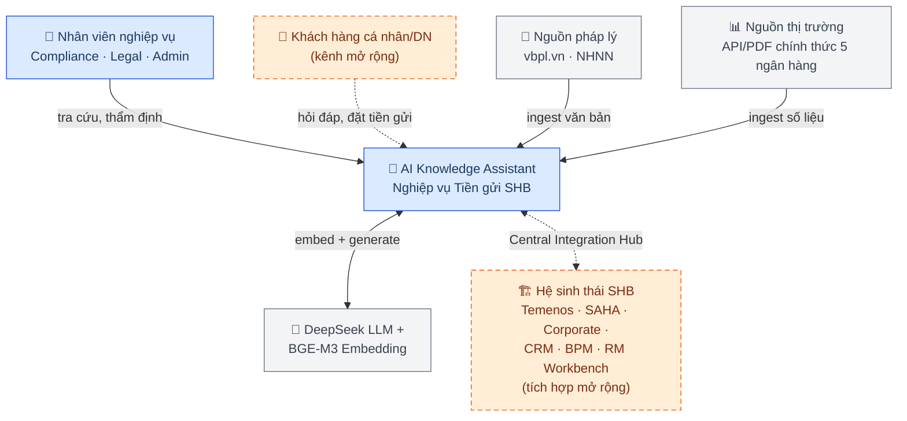
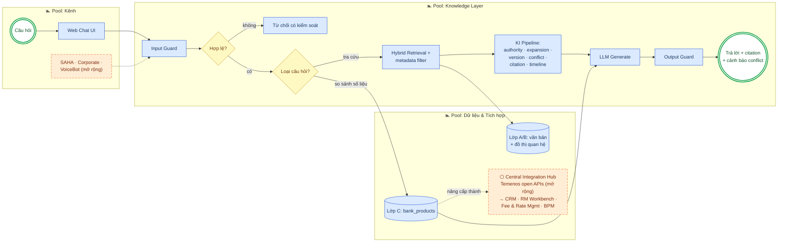
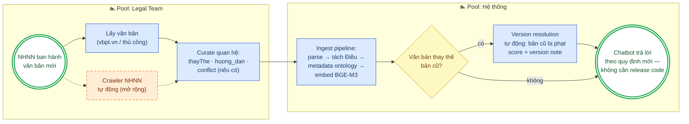
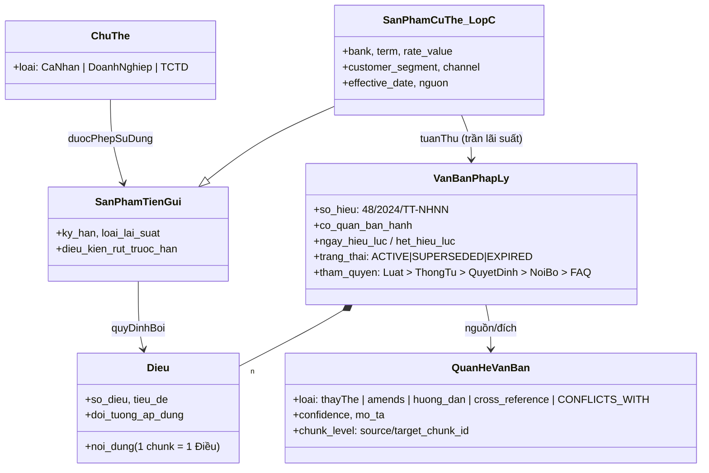

# Tài liệu Phân tích Nghiệp vụ (BA Document) — AI Knowledge Assistant cho nghiệp vụ Tiền gửi SHB

> **Loại tài liệu:** Business Analysis — tổng hợp từ bộ architecture docs (`.ai/architecture/00–14`),
> các tài liệu so sánh/giải thích trong `doc/`, và nghiên cứu công nghệ SHB đang sử dụng.
> **Đối tượng đọc:** BA, Product Owner, giám khảo hackathon, đội ngũ nghiệp vụ & CNTT SHB.
> **Quy ước màu diagram (BPMN):** 🟦 xanh = đã build và đang chạy; 🟧 cam viền đứt = mở rộng
> (extension) trên hạ tầng SHB sẵn có.

Cập nhật: 2026-07-19.

---

## 1. Tóm tắt điều hành (Executive Summary)

Hệ thống là **nền tảng RAG (Retrieval-Augmented Generation) cấp doanh nghiệp cho miền nghiệp
vụ tiền gửi ngân hàng Việt Nam**: cho phép nhân viên và khách hàng tra cứu quy định pháp lý
NHNN, chính sách nội bộ, sản phẩm tiền gửi và số liệu lãi suất thị trường bằng tiếng Việt tự
nhiên — với câu trả lời **đúng văn bản còn hiệu lực, đúng đối tượng áp dụng, đúng thẩm quyền
pháp lý, có trích dẫn đến từng Điều, và cảnh báo khi các quy định mâu thuẫn**.

Khác biệt cốt lõi so với chatbot FAQ của các ngân hàng hiện nay (VCB Digibot, BIDV iBank
chatbot, VietinBank Chatbot AI): hệ thống mô hình hóa được **vòng đời của văn bản pháp lý**
(tham chiếu — sửa đổi — thay thế từng phần — mâu thuẫn) thông qua ontology 3 lớp và tầng
Knowledge Intelligence. Về mở rộng, hệ thống thiết kế sẵn điểm cắm vào **kiến trúc mở Temenos
(open APIs, microservices) mà SHB đang vận hành**.

---

## 2. Bối cảnh & Vấn đề nghiệp vụ

Nhân viên ngân hàng hằng ngày làm việc với hàng trăm Thông tư/Nghị định NHNN cập nhật liên
tục, chính sách nội bộ theo phòng ban, tài liệu sản phẩm và FAQ nghiệp vụ. Bốn vấn đề cốt lõi:

| # | Vấn đề | Hệ quả nghiệp vụ |
|---|---|---|
| 1 | **Thông tin phân tán** — tài liệu nằm nhiều kho | Tra cứu chậm, trả lời khách không nhất quán giữa các chi nhánh |
| 2 | **Xung đột văn bản** — một điều khoản nhiều phiên bản (Thông tư mới thay Thông tư cũ, thay từng phần) | Rủi ro tư vấn theo quy định hết hiệu lực → rủi ro compliance |
| 3 | **Tìm kiếm kém** — keyword search không hiểu ngữ nghĩa pháp lý | Bỏ sót văn bản liên quan (văn bản hướng dẫn, văn bản được dẫn chiếu) |
| 4 | **Không truy vết nguồn** — câu trả lời thiếu citation | Compliance officer không kiểm chứng được, không dám tin để dùng |

---

## 3. Stakeholders & Actors

| Actor | Vai trò nghiệp vụ | Tương tác với hệ thống |
|---|---|---|
| **Giao dịch viên / nhân viên nghiệp vụ** | Trả lời khách tại quầy về sản phẩm tiền gửi, thủ tục, lãi suất | Tra cứu bằng ngôn ngữ tự nhiên, nhận câu trả lời kèm citation Điều/văn bản |
| **Compliance Officer** | Kiểm tra tuân thủ quy định NHNN | Dùng citation + cảnh báo conflict + timeline văn bản để thẩm định |
| **Legal Team** | Cập nhật văn bản pháp lý mới | Đưa văn bản vào pipeline ingest; curate quan hệ thayThe/huong_dan/conflict |
| **IT/Admin** | Quản trị tài liệu, phân quyền | Màn hình admin, quản lý document, theo dõi ingest |
| **Khách hàng cá nhân** *(mở rộng — kênh SAHA)* | Hỏi lãi suất, điều kiện sản phẩm, so sánh | Chat trên app/web |
| **Khách hàng doanh nghiệp / kế toán DN** *(mở rộng — SHB Corporate, ERP)* | Đặt tiền gửi có kỳ hạn, hỏi quy định rút trước hạn | Flow ERP-deposit (mục 7.3) |
| **RM (Relationship Manager)** *(mở rộng)* | Nhận handoff các câu hỏi vượt phạm vi bot | RM Workbench, kèm ngữ cảnh hội thoại |

---

## 4. Phạm vi nghiệp vụ

### 4.1 Miền nghiệp vụ: Tiền gửi (Deposit)

Ontology miền tiền gửi (chi tiết: `Giai_thich_co_che_Ontology.md`) bao phủ:

- **Sản phẩm**: tiền gửi không kỳ hạn / có kỳ hạn / tiết kiệm / chuyên dụng; thuộc tính kỳ
  hạn, loại lãi suất, hình thức trả lãi, điều kiện tất toán trước hạn.
- **Chủ thể**: cá nhân, doanh nghiệp, tổ chức tín dụng — quy định áp dụng khác nhau theo chủ thể.
- **Khung pháp lý** (corpus thật 14 văn bản, 474 Điều): Luật Các TCTD 32/2024/QH15, Luật BHTG
  06/2012 & 111/2025, TT 48/2018 & 48/2024 (lãi suất tiền gửi), TT 49/2018, TT 04/2022 (rút
  trước hạn), nhóm ngoại hối, nhóm bảo hiểm tiền gửi.
- **Số liệu thị trường**: bảng lãi suất/biểu phí 5 ngân hàng (SHB, BIDV, VietinBank,
  Vietcombank, Techcombank) từ nguồn chính thức đã xác thực.

### 4.2 Business Context Diagram

### 4.3 In scope / Out of scope (v1)

| In scope | Out of scope v1 |
|---|---|
| Ingestion pipeline (MD/DOCX/PDF), hybrid retrieval, KI layer, REST API, chat UI, so sánh lãi suất liên ngân hàng, guardrails, Docker deployment | Real-time document sync (crawler NHNN tự động), mobile app, đa ngôn ngữ (cố định tiếng Việt), tác vụ giao dịch core banking |

---

## 5. Use Cases nghiệp vụ

| ID | Use case | Actor | Mô tả & giá trị nghiệp vụ | Trạng thái |
|---|---|---|---|---|
| UC-01 | Tra cứu quy định pháp lý | Nhân viên, KH | Hỏi tự nhiên → trả lời theo văn bản **còn hiệu lực**, citation Điều-level | 🟦 |
| UC-02 | So sánh lãi suất liên ngân hàng | Nhân viên, KH | "Bank nào lãi 12 tháng cao nhất?" → SQL trên `bank_products`, kèm effective_date | 🟦 |
| UC-03 | Cảnh báo quy định mâu thuẫn | Compliance | Chunk trong ngữ cảnh thuộc cặp CONFLICTS_WITH → hiển thị cả 2 phía + confidence | 🟦 |
| UC-04 | Xem lịch sử phiên bản văn bản | Compliance, Legal | Timeline Builder: TT 48/2018 → TT 48/2024, cờ is_current | 🟦 |
| UC-05 | Tính lãi trong hội thoại | KH, Giao dịch viên | InterestCalculatorCard ngay trong chat | 🟦 |
| UC-06 | Nạp văn bản mới khi NHNN ban hành | Legal, Admin | Thêm file → ingest → hệ thống tự resolve version, không cần viết kịch bản | 🟦 |
| UC-07 | Hỏi quy trình & người phụ trách | Nhân viên | "Quy trình mở sổ cho DN ai phụ trách, SLA bao lâu?" → tra BPM qua Hub | 🟧 |
| UC-08 | Cá nhân hóa theo phân khúc KH | KH | Hub → CRM: đúng ưu đãi của đúng phân khúc (Priority/thường) | 🟧 |
| UC-09 | Handoff sang RM | KH, RM | Câu vượt phạm vi → chuyển RM Workbench kèm ngữ cảnh hội thoại | 🟧 |
| UC-10 | Doanh nghiệp đặt tiền gửi qua ERP | Kế toán DN, RM | Advisory (bot) + phê duyệt (BPM) + hạch toán (Temenos) — mục 7.3 | 🟧 |

---

## 6. Business Rules (luật nghiệp vụ hệ thống thực thi)

| Nhóm | Rule | Cơ chế thực thi |
|---|---|---|
| **Hiệu lực pháp lý** | Không bao giờ trả lời theo văn bản hết hiệu lực/bị thay thế | Filter `exclude_expired` tầng SQL + VersionResolution (REPLACES → penalty + version note) |
| **Thay thế từng phần** | Điều khoản bị thay bị loại khỏi câu trả lời; phần còn hiệu lực của cùng văn bản vẫn dùng | Supersession ở mức chunk (`source/target_chunk_id`) |
| **Thẩm quyền** | Khi nguồn vênh nhau: Luật > Thông tư > Quyết định > chính sách nội bộ > SOP > FAQ | AuthorityRanking (trọng số 1.0 → 0.1) |
| **Đối tượng áp dụng** | Câu hỏi doanh nghiệp không nhận quy định chỉ áp dụng cá nhân (vd TT 48/2018) | Metadata filter `doi_tuong_ap_dung` trước vector search |
| **Minh bạch** | Mọi câu trả lời phải kèm citation; mâu thuẫn phải phơi ra cả 2 phía | CitationProcessor + ConflictDetection + ConflictNotice UI |
| **Chống bịa** | Không đủ context liên quan → từ chối, không để LLM suy diễn | Retrieval guard |
| **Compliance tư vấn** | Không tư vấn tài chính cá nhân ("nên gửi hay mua vàng"); không cam kết rủi ro ("chắc chắn lãi") | Input guard (chặn chủ đề) + Output guard (lọc cụm từ cam kết) |
| **An toàn AI** | Chặn prompt injection, PII, unsafe request | Input guard, có test suite riêng (`test_guardrails.py`) |
| **Số liệu** | Số liệu so sánh phải lấy từ truy vấn SQL chính xác, không để LLM tự so số từ text | Route câu so sánh → `bank_products`, kèm `effective_date` |

---

## 7. Quy trình nghiệp vụ chính (BPMN)

### 7.1 Quy trình trả lời truy vấn (đang chạy end-to-end)

### 7.2 Quy trình cập nhật tri thức khi NHNN ban hành văn bản mới (UC-06)

Đây là quy trình tạo khác biệt vận hành lớn nhất so với chatbot kịch bản (họ phải viết lại
intent tay cho mỗi thay đổi quy định):

### 7.3 Quy trình mở rộng: Doanh nghiệp đặt tiền gửi qua ERP (UC-10)

Xem BPMN đầy đủ trong `Kha_nang_mo_rong_Extensibility.md` mục 4. Tóm tắt nghiệp vụ: kế toán
DN tạo lệnh trong ERP → Hub xác thực (Temenos open APIs) → **chatbot đóng vai advisory** (so
sánh kỳ hạn, điều kiện rút trước hạn theo TT 04/2022, kèm citation — năng lực đang chạy, tái
dùng 100%) → BPM gateway theo hạn mức → process owner/RM phê duyệt trên RM Workbench → core
banking Temenos hạch toán → CRM ghi nhận → chứng từ điện tử về ERP.

---

## 8. Mô hình dữ liệu nghiệp vụ (Business Domain Model)

Rút gọn từ `03-domain-model.md` + ontology 3 lớp — góc nhìn nghiệp vụ, không phụ thuộc DB:

Ba lớp tri thức: **Lớp A** (pháp lý — `VanBanPhapLy/Dieu/QuanHe`), **Lớp B** (nội bộ ngân
hàng — văn bản gắn `bank`), **Lớp C** (thị trường — `SanPhamCuThe`, bảng số liệu truy vấn
bằng SQL). Tách lớp để mỗi lớp thay nguồn độc lập — nền tảng của khả năng mở rộng.

---

## 9. Kiến trúc hệ thống (tóm tắt cho BA)

- **Style**: Clean Architecture 4 tầng (Presentation → Application → Domain → Infrastructure),
  Repository Pattern + Dependency Injection — mọi nguồn dữ liệu nằm sau interface, thay
  implementation không đụng business logic.
- **Stack**: Python 3.12+ / FastAPI async / SQLAlchemy + Alembic; **một PostgreSQL duy nhất**
  (pgvector cho vector, tsvector cho BM25, bảng quan hệ cho graph — không Redis/Neo4j/
  Elasticsearch → vận hành đơn giản, chi phí thấp); BGE-M3 embedding (tối ưu tiếng Việt);
  DeepSeek LLM; Next.js 14 frontend; Docker Compose, CI GitHub Actions (Ruff/MyPy/Pytest),
  deploy GCP VM + Railway.
- **Luồng query**: guard → metadata filter → BM25 + vector song song → hybrid fusion → KI
  pipeline 8 processors → prompt builder → LLM → output guard (sequence chi tiết:
  `.ai/architecture/01-system-architecture.md`).
- **Chất lượng**: 9 test files (KI pipeline ~740 dòng), structured logging đo latency từng
  processor, KI bật/tắt/tinh chỉnh qua settings không cần sửa code.

---

## 10. Tích hợp với công nghệ SHB đang sử dụng

SHB đã công bố chọn **Temenos** làm nền tảng core/digital banking — kiến trúc mở với **open
APIs, microservices, Micro Apps**, phục vụ omnichannel (internet, mobile, chi nhánh, ATM);
đồng thời vận hành hệ sinh thái số **SHB SAHA** (bán lẻ), **SHB Corporate** (doanh nghiệp) và
các giải pháp thanh toán trường học/bệnh viện/hành chính công. Chiến lược số của SHB đặt trụ
cột "hiện đại hóa CNTT & chuyển đổi số" với mục tiêu top đầu về công nghệ.

Hệ thống này khớp vào đó theo nguyên tắc **một điểm cắm duy nhất — Central Integration Hub**:

| Hệ thống SHB (theo vai trò) | Chatbot dùng để làm gì | Use case |
|---|---|---|
| **Temenos open APIs / core banking** | Số liệu tài khoản, đặt lệnh tiền gửi, đóng gói chatbot thành Micro App | UC-10 |
| **Central Fee & Rate Management** | Lãi suất/biểu phí real-time thay cho snapshot crawl — Lớp C nâng cấp | UC-02 |
| **CRM** | Phân khúc & lịch sử KH → cá nhân hóa câu trả lời | UC-08 |
| **RM Workbench** | Handoff câu hỏi vượt phạm vi, kèm ngữ cảnh hội thoại | UC-09 |
| **BPM** | Trả lời "quy trình này ai phụ trách, SLA, đang ở bước nào" | UC-07 |
| **SHB SAHA / SHB Corporate** | Kênh nhúng chatbot cho KH cá nhân / doanh nghiệp | Kênh |

> Ghi chú phương pháp: tên hệ thống nội bộ cụ thể của SHB (CRM/BPM engine nào) không công bố
> công khai — tài liệu gọi theo **vai trò**. Đây chính là lý do chọn pattern Hub: chatbot chỉ
> biết 1 contract; SHB đổi hệ thống đích → cấu hình tại Hub, chatbot không deploy lại.

---

## 11. KPIs & Tiêu chí thành công

| Nhóm | Metric | Target |
|---|---|---|
| Chất lượng AI | Retrieval Precision@5 | ≥ 85% |
| Chất lượng AI | Answer Faithfulness (grounded) | ≥ 90% |
| Chất lượng AI | Conflict Detection accuracy | ≥ 80% |
| Hiệu năng | Latency P95 / query | ≤ 5s |
| Vận hành | Ingestion throughput | ≥ 50 docs/giờ |
| Nghiệp vụ (đề xuất đo sau triển khai) | Thời gian tra cứu trung bình của giao dịch viên; % câu hỏi tự phục vụ không cần tổng đài; số sự cố tư vấn sai quy định | Baseline sau pilot |

---

## 12. Roadmap (tóm tắt)

| Giai đoạn | Nội dung | Chi tiết |
|---|---|---|
| Now | RAG + Ontology 3 lớp + KI + guardrails + so sánh lãi suất | Repo hiện tại |
| +1 | Central Integration Hub → Fee & Rate real-time | `Kha_nang_mo_rong_Extensibility.md` mục 5 |
| +2 | CRM / BPM / RM Workbench qua Hub | UC-07/08/09 |
| +3 | Kênh SAHA, Corporate, VoiceBot | Channel adapter, backend giữ nguyên |
| +4 | ERP-deposit doanh nghiệp | UC-10, BPMN mục 7.3 |
| +5 | Domain mới (tín dụng, TTQT...) + crawler NHNN + RBAC-aware retrieval | Ontology template áp lại, công sức chủ yếu là corpus |

---

## 13. Tài liệu tham chiếu

| Tài liệu | Nội dung |
|---|---|
| `.ai/architecture/00–14` | Bộ architecture docs gốc (overview, system, domain, DB, API, ingestion, retrieval, KI, LLM, security, deployment, roadmap) |
| `doc/Giai_thich_co_che_Ontology.md` | Cơ chế ontology 3 lớp, vì sao RAG tốt hơn |
| `doc/So_sanh_tieu_chi_Knowledge_Intelligence.md` | 4 tính năng KI: cross-reference, amendments, partial supersession, conflicts |
| `doc/So_sanh_chatbot_5_ngan_hang.md` | Bảng so sánh với chatbot 4 ngân hàng |
| `doc/Danh_gia_5_nhom_tieu_chi.md` | Đánh giá CX, chính xác, tác vụ, bảo mật, vận hành |
| `doc/Kha_nang_mo_rong_Extensibility.md` | BPMN mở rộng, Central Hub, ERP-deposit, công nghệ SHB |

Nguồn công nghệ SHB: [Temenos — SHB Selects Temenos](https://www.temenos.com/press_release/shb-selects-temenos-to-deliver-seamless-omnichannel-banking/), [Finextra](https://www.finextra.com/pressarticle/92609/vietnams-shb-selects-temenos-as-core-bank-provider), [FinTech Futures](https://www.fintechfutures.com/bankingtech/vietnam-s-saigon-hanoi-bank-taps-temenos-for-digital-upgrade), [SHB.com.vn — chiến lược chuyển đổi số](https://www.shb.com.vn/shb-ra-mat-may-crm-diem-cham-giao-dich-moi-cho-khach-hang/)
